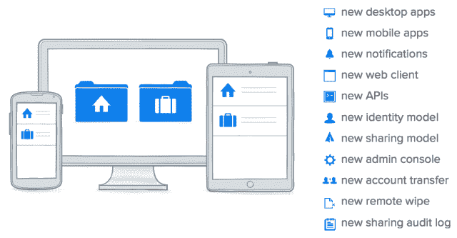
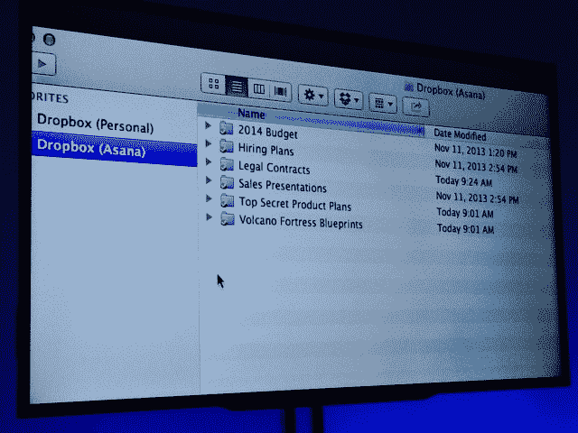
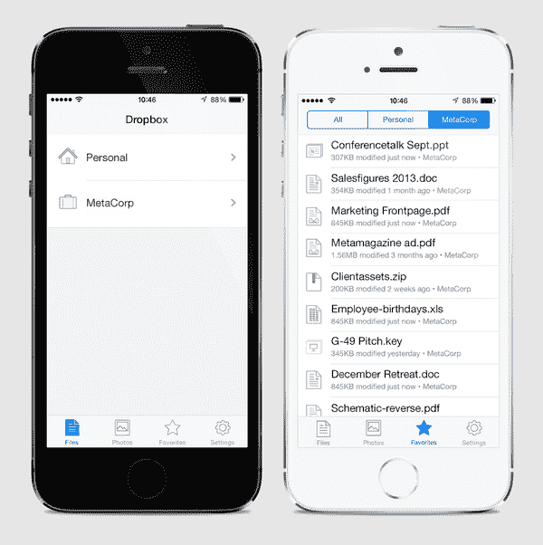
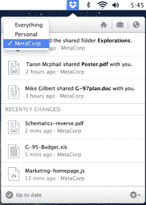
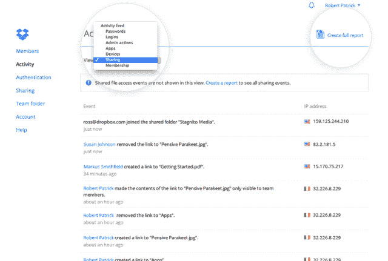

# Dropbox 拥有 2 亿用户，推出新的“商业”客户端，将工作和个人文件结合在一起

> 原文：<https://web.archive.org/web/https://techcrunch.com/2013/11/13/dropbox-hits-200-million-users-and-announces-new-products-for-businesses/>

首席执行官德鲁·休斯顿今天宣布，Dropbox 的用户数量已经从 7 月份的 1.75 亿增加到了 2 亿。他后来透露，新的 [Dropbox For Business](https://web.archive.org/web/20230326024753/https://www.dropboxatwork.com/2013/11/meet-the-all-new-dropbox-for-business/) 客户端安全地将用户的个人和工作文件分开存放，但在一个选项卡式界面中。

今天所有的新产品都旨在最大限度地提高安全性，并让企业相信 Dropbox 不仅仅是一个花哨的消费者工具。Dropbox 已经为 400 万家企业和 97%的财富 500 强企业提供服务，但它渴望获得更多套装。

今天的新闻聚焦于企业，而 Dropbox 在 5 月份的最后一次新闻发布会聚焦于开发者，并宣布其用户数量已经从 2012 年 11 月的 1 亿增加到[1 . 75 亿。在那次活动中](https://web.archive.org/web/20230326024753/https://techcrunch.com/2013/07/09/dropbox-dbx-conference/)[它发布了](https://web.archive.org/web/20230326024753/https://techcrunch.com/2013/07/09/dropbox-launches-datastore-api-and-drop-ins-to-sync-data-to-and-from-apps/)Datastore API，让应用开发者将元数据保存到云中，比如用户在应用中的状态(比如他们在游戏中完成了多少关)。它还推出了 Drop-Ins API，让第三方应用程序获取用户的 Dropbox 文件。

## 双重生活的痛苦

休斯顿以讲述 Dropbox 起源的故事开始了今天的活动。他试图在公共汽车上工作，但忘记了他的拇指驱动器，发现自己无法工作。他接着说，他希望有很多事情我们很快就不用做了，比如“带着我们的小 u 盘…备份我们的电脑…[和]给我们自己发电子邮件。”

然后，休斯顿请来了时尚公司 BCBG 的首席信息官纳德·卡利米来解释没有 Dropbox 保持公司数据的完整性有多难。他详细介绍了该公司如何使用 Dropbox 安全地共享法律文件。

Drew 开始解释在同一个帐户上同时拥有个人和工作信息的烦恼。Dropbox 最初认为它只会提供账户切换，但很快意识到，如果每次都需要 15 秒，而且它有 2 亿用户，那么它每天将浪费用户 1000 年的时间。

“人们认为这是 Dropbox 的消费者版本，这是 Dropbox 的企业版本，我们认为这很荒谬。应该只有一个，”休斯顿说。“要真正做到这一点，你必须重建 Dropbox。但后来我们认为我们已经雇佣了所有这些优秀的人，让他们尽情发挥吧。现在，我很高兴向大家介绍全新的 Dropbox for Business。我们重建了一切。”

## 面向企业的全新 Dropbox

新的 Dropbox For Business client 将于明年初推出，企业可以在[注册提前使用](https://web.archive.org/web/20230326024753/https://www.dropbox.com/business/two-dropboxes)。没有提到 Dropbox 改变其定价，从目前的 5 个用户每年 795 美元和每个额外用户每年 125 美元。

有了它，用户可以在一个标签中查看他们的个人文件，在另一个标签中查看他们的工作文件，而不必使用多个窗口。如果人们已经有单独的企业和个人账户，他们可以将它们与新工具配对。在一篇 博客文章 中，联合创始人休斯顿和首席技术官阿拉什·菲尔多西解释说，“这就像把你家的钥匙和你的工作钥匙卡放在同一个钥匙链上。”

新的通知栏允许您查看两组文件的警报，或者过滤以仅查看一个类别。Dropbox 重新设计了移动商务客户端，提供了一个类似于网络的界面以保持一致性。开发者还可以使用 Chooser 和 Saver APIs 让用户访问他们在第三方应用中的任何文件。

此次更新非常重视首席信息官和 IT 团队的控制。新的共享审计日志功能向管理员准确显示了谁在何时与谁共享了什么。安全团队可以轻松阻止在特定团队之外共享某些文件，或者阻止员工在其工作计算机上访问其个人文件。

另一个名为账户转移的新功能可以帮助企业在员工离开公司或更换团队时删除对某些文件的访问权限。管理员可以选择该员工文件的继承人，允许他们将某人业务文件夹中的所有内容转移给新的人。远程擦除功能还可确保员工无法访问其任何设备上的任何旧业务文件，并在设备被盗时保护数据。

缺少的是其他地方可用的更多协作工具，但 Dropbox 的移动和商业产品负责人 Ilya Fushman 承认这一点，并表示团队合作功能是路线图上的下一个目标。

很高兴看到 Dropbox 继续专注于简单性，而不是附加一堆无关的产品。我把它比作日本铸剑中的折叠钢铁艺术——让 Dropbox 成为更强大、更纯粹的单一武器，而不是让它变得更大或向其武库中添加更多刀片。

工程副总裁告诉我“当人们问我 Dropbox 的产品理念是什么时，我告诉他们就是这个。这是一个要做好的大问题。”该公司查看了其产品中摩擦最大的地方，发现管理多个账户是一项巨大的痛苦，并删除了这一杂质。

如果改进后的产品大受欢迎，它可能会提高 Dropbox 在利润丰厚的企业客户中的地位。每个企业用户每年可以赚 125 美元，这比它的免费消费者层和 99 美元的高级个人账户要快。

Dropbox enterprise 的竞争对手包括微软、谷歌、box，以及截至今天，[亚马逊的新工作区](https://web.archive.org/web/20230326024753/https://techcrunch.com/2013/11/13/amazon-launches-workspaces-a-virtual-desktop-service-on-aws/)虚拟桌面企业云产品。但自从 Dropbox 以消费品闻名以来，许多企业都对它打了折扣，转而采用专用的企业解决方案。

实际上，直到今天，Dropbox For Business 还没有足够的权限和安全控制来真正取得成功。企业云之战变得更加有趣了。