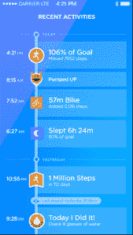

# Jawbone 的 UP 健身带终于与 UP24 TechCrunch 实现无线连接

> 原文：<https://web.archive.org/web/http://techcrunch.com/2013/11/13/jawbones-up-fitness-band-finally-goes-wireless-with-up24/?utm_source=dlvr.it&utm_medium=feed>

虽然 Jawbone 的 UP fitness 追踪腕带似乎一直都相对受欢迎(至少在这些地区)，但它是这样做的，尽管有一个明显的怪癖:在一个充满无线同步竞争对手如耐克 Fuelband 和 Fitbit 的世界里，UP 需要插上电源才能同步。

不再是了。今天早上，Jawbone 推出了名为“UP24”的新版 UP，蓝牙同步是其主打功能。

从美学上来说，UP24 和原来的 UP 在根本上是一模一样的。见鬼，从几英尺远的地方，你可能看不出区别，除非你知道要找什么——即使那样，也可能有点挑战。尺寸几乎完全相同。唯一直接明显的区别是 UP24 的质地；虽然最初的 UP 一直以其表面上的来回之字形图案为特色，但其新的无线兄弟的图案看起来有点像耙拖过禅沙花园后留下的痕迹。(见上图？原来的 UP 在中间，两边各有一个 UP24。)

加入蓝牙意味着 UP24 的电池寿命会受到一点影响。虽然最初的 UP 声称每次充电 10 天，但 UP24 承诺持续 7 天左右。

即使有了新发现的无线功能，UP24 仍然有原来的耳机插孔式插头，仅用于连接表带和充电器。坏处呢？这意味着它仍然有弹出(因此很容易丢失)端盖。奇怪的是，Jawbone 已经将插孔从 3.5 毫米切换到 2.5 毫米，并告诉我通过插头同步不再有效——所以它是蓝牙或什么都没有。

UP24 目前只作为 iOS 设备推出，Android 支持“正在路上”。Jawbone 将 Android 的延迟归咎于复杂性；由于 Android 耳机种类繁多，他们需要更长时间来为该平台做好准备。

新的乐队将与原来的乐队一起售价 149 美元，原乐队仍将保持 129 美元的价格。它有两种颜色:缟玛瑙色或柿子色(当然，这是黑色或橙色的花哨营销用语。)今天[可以直接通过 Jawbone](https://web.archive.org/web/20230129221901/http://jawbone.com/store/buy/up24) 购买，并将于 11 月 19 日在百思买/苹果商店上架。

### 上涨 3.0

与此同时，Jawbone 今天也发布了 UP 3.0，这是其 iOS 版 UP 伴侣应用的新版本。

蓝牙的加入给 UP 的工作方式带来了根本性的转变。UP24 不只是在你故意把它插入手机时才更新，而是全天同步。

因此，UP 3.0/UP24 配对侧重于实时反馈。如果你离你的每日目标只有几步之遥，它会给你发送一个推送通知，鼓励你站起来多走一点。当你醒来时，它会向你的手机发出提醒，告诉你你睡了几个小时。(不要担心:您可以单独关闭每种通知类型。)你还可以通过无线方式设置 UP24 的智能闹钟或检查电池寿命。

新的应用程序也为当前的 UP 用户带来了一点改变。有一个新的“今天我会”系统，它分析你的数据，并试图让你致力于某些健康的目标(如“今天我会走至少 5000 步”或“今天我会睡 6 个多小时”)，以及一个新的条纹/里程碑系统(阅读:成就)，当你连续多天达到目标或走了 X 百万步时，它会为你鼓掌。