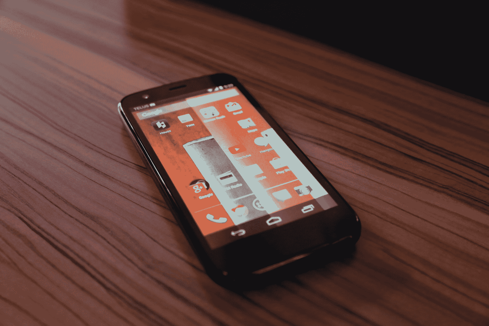

# 摩托罗拉正式推出 Moto G，这是一款起价 179 美元的“高端”手机

> 原文：<https://web.archive.org/web/https://techcrunch.com/2013/11/13/motorola-makes-the-moto-g-official-a-premium-phone-at-a-price-more-can-afford/>

摩托罗拉今天举行了一场特别活动，发布其新款 Moto G，这是 Moto X 的精神兄弟，也是谷歌旗下智能手机制造商以更实惠的价格向更多消费者展示定制移动设备未来愿景的一种方式。“现在我们把目光投向世界，”这是摩托罗拉首席执行官丹尼斯·伍德赛德在今天的活动中所说的。

伍德赛德指出，如今大多数人都买不起 500 美元或 600 美元的手机，全球平均价格在 200 美元左右。然而，根据伍德赛德的说法，这些手机提供了非常糟糕的体验，使用旧技术，在运行现代应用程序时表现尤其糟糕。伍德赛德以 Galaxy Fame 手机为例，说明这是一款制造不良的廉价手机，上一代手机是唯一的选择。

“我们相信 5 亿人应该得到更好的，”伍德赛德在宣布 Moto G 之前说道。据伍德赛德称，Moto G 提供的体验甚至可以与 Galaxy S4 和其他现代高端超级手机相媲美。

根据摩托罗拉的说法，4.5 英寸的显示屏，720p，329 PPI 的分辨率是这款手机的“英雄特色”，它的性能超过了 iPhone 5s。它拥有高通骁龙 400 1.2 GHz 处理器和 1GB 内存，并提供“全天”电池寿命。这意味着 3G 网络的通话时间约为 14 小时，而 iPhone 5s 的通话时间为 10 小时。它搭载了 Android 4.3，并保证在 2014 年 1 月之前升级到 Android 4.4。机上没有 LTE，考虑到目标市场(增长中的发达国家，LTE 供应有限或不存在)，这是有意义的。

摩托罗拉也将定制作为产品的关键，像更昂贵的前代产品一样定制外壳，还有保护屏幕和背面的新翻盖外壳。

Moto G 上的软件旨在从纯 Android 构建，为谷歌的香草操作系统增加价值，并为用户提供更多功能。摩托罗拉移动 Punit Soni 的产品管理副总裁摩托罗拉特别指出了给 Android 添加复杂皮肤的愚蠢之处。这是一个可以预见的立场:Moto 现在是谷歌的子公司，显然，Soni 来自谷歌。

Soni 还表示，他们在优化软件时专注于基础，而不是试图塞进一堆功能。这使得它“比竞争对手的体重高出一大截”。索尼指出，Moto G 在启动时间、浏览器启动、返回主页、打电话等方面都优于 Galaxy S4，这向团队证明了专注于基础比用皮肤复杂化更重要。

添加了一些软件，包括摩托罗拉辅助，这是一种预测软件功能，试图开发一个如何使用手机的配置文件，以预测您对最佳性能的需求。他们还试图专注于相机软件，索尼说，该软件能够在任何可能的环境下拍摄出优秀的照片。然而，证据就在布丁里，所以我将保留判断，直到我有机会检验它。

Moto G 的购买者可以免费获得 50GB 的 Google Drive 存储空间(除了这项服务附带的 15gb)。手机中还有一个调频接收器，用于“获取免费音乐”，并在特定市场支持双卡。索尼说，这种将价值和功能结合起来的方法是摩托罗拉和谷歌共同努力的结果。

美国的 8GB 无锁版和无合约版仅售 179 美元。16GB 版本仅售 199 美元，所以仍然低于 200 美元。以这样的价格，谷歌和摩托罗拉可能会抢走一大块低成本功能手机市场，微软的目标是通过收购诺基亚转移到 Windows Phone。它今天在巴西和欧洲部分地区销售，并将在未来几周内在欧洲其他地区、加拿大(本月内在 Telus 和 Koodo)等地推出。它将于明年初在美国和其他一些国家推出。