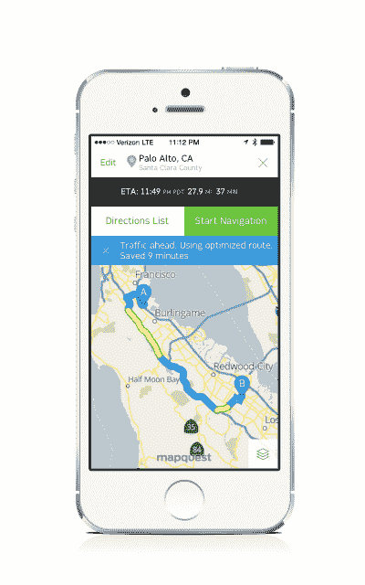

# MapQuest 更新了其 iPhone 应用程序，改进了制图和路线，以应对谷歌和苹果地图 TechCrunch

> 原文：<https://web.archive.org/web/https://techcrunch.com/2013/11/14/mapquest-iphone-app-update/>

在 iPhone 上，苹果地图和谷歌地图应用程序在过去几年中占据了所有的头条，但 [MapQuest](https://web.archive.org/web/20230129064316/http://www.mapquest.com/) 仍然存在，尽管这些年来缺乏真正的创新。今天，该公司推出了其 iOS 移动应用的巨大更新，为现任者提供了一个美丽的新选择。

根据 comScore 的数据，MapQuest 仍然是排名第三的移动应用，也是排名第二的桌面用户地图服务。截至 9 月份，该公司的月度独一无二用户总数超过 4，000 万，其中包括 3，070 万桌面用户，1，400 万移动用户和平板用户。它还有 430 万多平台用户——那些同时使用桌面和移动设备的用户。(作为 AOL*的一部分，MapQuest 表示，如果它的流量从母公司中分离出来，它将独自成为排名前 35 的网络资产。)

但是 MapQuest 团队认为他们可以做得更好。事实上，它知道它可以。因此，它回到了绘图板，完全重新构想了它的移动应用程序应该是什么样子，应该如何工作。

更新后的 MapQuest 应用程序设计得比以前的版本更快，反应更灵敏，也更容易使用。该团队完全重新绘制了地图，使街道更容易描绘，方向更容易跟随。该应用采用了 iOS 7 的扁平化设计理念和简化的字体。

它还按照传统纸质地图的做法，用颜色清楚地标出了不同类型的街道。高速公路用蓝色粗线标出，主干道用黄色表示，单行道上加了箭头。

许多变化纯粹是装饰性的，但在引擎盖下 MapQuest 从头开始重建了它的地图堆栈。这使得整个程序能够快速渲染，而不必每次打开应用程序时都要加载一堆图块。一旦打开并使用，地图就会被缓存起来，这样用户就可以在以后回来加载它们，甚至在他们离线的时候。

 导航也有了很大的改进:现在当你输入一个地点并开始你的旅程时，应用程序会在路线的顶部显示一个滑块，清楚地显示你走了多远，以及你到达的估计时间和你还剩多少时间。该应用程序还显示了您预计会看到流量的区域，以黄色和红色显示。

通过实时交通数据，该应用程序还可以在发现有机会通过使用不同的路线来节省时间时，自动为用户重新安排路线。在这种情况下，在倒计时并开始显示新方向之前，会弹出一个通知来提醒他们发生了变化。

虽然许多人将主要使用该应用程序进行导航，但 MapQuest 也添加了许多本地发现功能，允许用户快速找到附近的各类企业。更重要的是，他们不仅可以看到附近的餐馆、酒吧和咖啡馆，还可以定义和突出对他们来说最重要的类别。

只需点击一下，咖啡爱好者就可以将星巴克加入他们的发现范围，并立即看到最近的咖啡连锁店在哪里。或者素食主义者可以添加这个类别，并快速找到附近适合他们饮食的餐馆。

MapQuest 还改进了其搜索功能，将用户地址簿、类别和位置的数据结合起来，以一种旨在突出对他们来说最重要的地址和地点的方式混合在一起。这可能意味着他们朋友的地址，或者在其他 MapQuest 用户的搜索中占据显著位置的位置。如果搜索一家连锁餐厅或一类场所，该应用程序将能够在地图上显示所有附近的位置。

由于设计的扁平化，新的 MapQuest 应用程序将只适用于已经升级到 iOS 7 的用户。目前，许多场馆和导航数据仅限于北美用户。尽管如此，对于那些可以使用它的人来说，新的应用程序是一个巨大的进步，用户甚至可能会发现他们更喜欢它而不是竞争。

==
*美国在线还拥有 TechCrunch，尽管有时该公司可能会后悔。