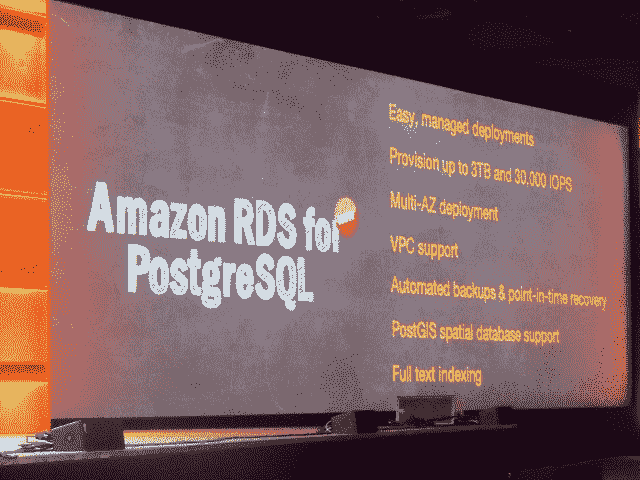

# 亚马逊关系数据库服务| TechCrunch 现已推出 PostgreSQL

> 原文：<https://web.archive.org/web/https://techcrunch.com/2013/11/14/postgressql-now-available-on-amazons-relational-database-service/>

# PostgreSQL 现在可以在亚马逊的关系数据库服务上使用

亚马逊网络服务(AWS) [在亚马逊 RDS 上推出](https://web.archive.org/web/20230326030334/http://aws.typepad.com/aws/2013/11/amazon-rds-for-postgresql-now-available.html?utm_source=feedburner&utm_medium=feed&utm_campaign=Feed%3A+AmazonWebServicesBlog+%28Amazon+Web+Services+Blog%29) [PostgreSQL](https://web.archive.org/web/20230326030334/http://www.postgresql.org/) ，显示了开源数据库的实力及其市场成熟度。

首席技术官沃纳·威格尔在 AWS re:Invent 大会上表示，数据库产品符合云服务提供的服务范围。沃格尔斯表示，该服务能够提供高达 3tb 的容量和每秒 30，000 IOPs。

PostgreSQL 是一个对象关系数据库系统，根据他们的网站，它可以在所有主要的操作系统上运行，包括 Linux、Unix、OS X、Solaris、Tru64 和 Windows。它完全符合 ACID，包括大多数 SQL:2008 数据类型。它还支持存储二进制大对象，包括图片、声音和视频。

亚马逊 RDS [于 2009 年推出](https://web.archive.org/web/20230326030334/http://aws.typepad.com/aws/2009/10/introducing-rds-the-amazon-relational-database-service-.html)，支持 MySQL。AWS 在 [2011](https://web.archive.org/web/20230326030334/http://aws.typepad.com/aws/2011/01/coming-soon-oracle-database-11g-on-amazon-rds-1.html) 增加了 Oracle 数据库，在 [2012](https://web.archive.org/web/20230326030334/http://aws.typepad.com/aws/2012/05/net-support-for-aws-elastic-beanstalk-amazon-rds-for-sql-server-.html) 增加了 Windows SQL Server。根据 AWS 的博客，这种支持是在接到数百个客户的请求后提供的。

自从 Oracle 收购了 Sun Microsystems 并控制了 MySQL 以来，PostgreSQL 变得越来越流行。从那时起，Oracle 就不再关注该技术的开源能力，从而推动了关系数据库的兴起。