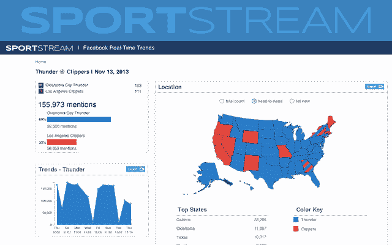
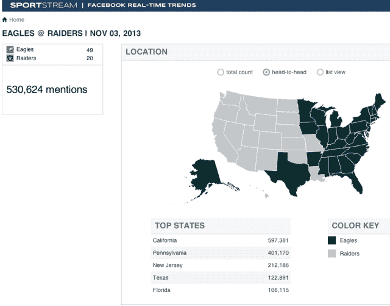

# 脸书选择 SportStream 为新闻媒体增强实时体育数据 TechCrunch

> 原文：<https://web.archive.org/web/https://techcrunch.com/2013/11/18/facebook-sports-data/>

你发布“目标！！！！11!!"但是谁得分了呢？脸书正在努力主持更多的体育谈话，并在新闻中展示其趋势，因此今天它与[sports stream](https://web.archive.org/web/20221007154857/http://sportstream.com/)合作，构建、增强和理解其杂乱的实时数据。

sports stream 将为广播公司和体育团队提供一个搜索界面，用于搜索[脸书的关键词见解和公共提要 API](https://web.archive.org/web/20221007154857/https://beta.techcrunch.com/2013/09/09/your-conversations-are-the-product/)，利用其关于团队、球员、联赛和比赛的元数据的“体育库”,让人们了解谁在谈论田径运动中的最重要时刻。

脸书知道像体育这样的实时全球事件的聊天是一个巨大的参与机会，但许多人将这个话题带到了 Twitter 上。通过让电视、印刷和网络新闻渠道以及运动队本身分享脸书体育聊天趋势，脸书希望用户将它作为他们观看大型比赛的饮水机。

问题在于杂乱的数据。当你写“RG3 触地得分”时，你是指罗伯特·格里芬第三次为华盛顿红人橄榄球队触地得分。脸书无法解析，但 SportStream 可以。

去年 6 月推出的[sports stream](https://web.archive.org/web/20221007154857/https://beta.techcrunch.com/2012/06/14/evri-sportstream-ipad-series-a/)监控每一场主要比赛、组织和球员以及他们所有的社交媒体账户，以了解比赛中发生的事情。它会将这些内容分解成关于特定比赛或竞争的供稿，新闻媒体可以参考，体育团队可以嵌入到他们的网站上。起初，该公司制作消费者应用，但已将重点转向数据提供商。

到目前为止，SportStream 主要关注脸书的公共页面、Instagrams 和 Twitter 账户，但它与脸书的新合作关系使它能够访问关键字洞察 API，该 API 匿名汇总脸书用户私下发布的趋势，以及公共馈送 API，该 API 是用户在公共帖子中专门分享的内容的消防站。

它现在为这些 API 发布了一个搜索接口，使得构建查询变得容易，比如“这个国家的哪个地方谈论足球最多？”、“年轻人谈论科比·布莱恩特还是勒布朗·詹姆斯多一些”、“哪个家乡城市谈论波士顿红袜队对纽约扬基队的比赛多一些？”SportStream 随后将这些数据以图形和地图的形式可视化，作为电视新闻的剪辑或新闻网站的嵌入内容。

SportStream 已经筹集了 350 万美元，拥有 10 名员工，并为大约 50 个团队和媒体机构提供服务，因此能够许可访问其充满脸书数据的平台可能是一个巨大的福音。

通过使其体育数据更容易理解，脸书可能会得到更多的渠道和团队来使用它。脸书希望，它是实时事件聊天之家的概念将渗透到用户中。

但它不是为这种谈话而建的。新闻提要是根据相关性进行算法排序的，而不是按照时间顺序对最新信息进行反向排序。脸书一直在测试这个问题的解决方案，如果它识别出你在发布关于实时事件的消息，它会以正确的时间顺序显示更新，但这种格式修改还没有准备好。

尽管脸书想成为一个公开谈论世界大事的地方，但它是为与朋友分享你自己生活的更新而建的。脸书让你在网上做你的离线自我，但现在这项服务正遭遇成长的烦恼，因为它试图[定义自己的身份](https://web.archive.org/web/20221007154857/https://beta.techcrunch.com/2013/08/06/facebook-the-moment/)。

*[图像](https://web.archive.org/web/20221007154857/http://www.sportsprocessing.com/)*