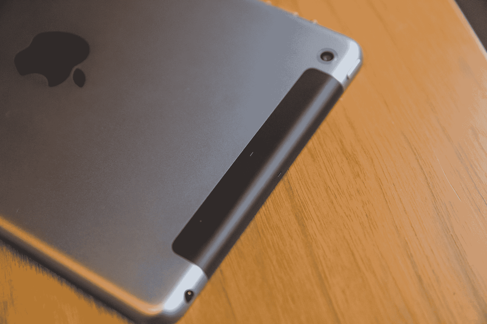

# 配备 Retina 显示屏的 iPad Mini 评论:市场上最好的平板电脑 TechCrunch

> 原文：<https://web.archive.org/web/https://techcrunch.com/2013/11/18/ipad-mini-retina-display-review/>

苹果 2013 年的新 iPad mini 引入了最常被要求的功能，这是最初版本中所没有的:高分辨率视网膜显示屏，可以超清晰地呈现文本和图像。苹果增加了这种屏幕，但没有在电池寿命、尺寸(无论如何都很大)和便携性方面进行权衡。这是每个人都想入手的 iPad mini，现在它来了，这是金钱能买到的最好的平板电脑。

## 视频评论

## 基础

*   2048 x 1536 7.9 英寸 Retina 显示屏
*   16GB、32GB、64GB 和 128GB
*   A7 处理器
*   802.11n 双通道 Wi-Fi，蓝牙 4.0
*   10 小时 Wi-Fi 一般使用，9 小时手机使用
*   起价 399 美元

## 赞成的意见

*   超薄、轻便、便携的超高分辨率屏幕
*   A7 的所有处理能力

## 骗局

*   尺寸上的微小变化意味着第一代配件可能不合适
*   与第一代设备相比价格上涨

## 设计

Retina iPad mini 基本上保留了与其前代产品相同的设计，并根据代间差异做了一些细微的改变。从外观角度来看，最值得注意的变化是增加了空间灰色饰面，取代了黑色版本，并在原始外壳规格的基础上增加了一点点尺寸和重量。

[gallery ids="916407，916408，916409，916410，916411，916412，916413，916414，916415"]

然而，在任何人过于担心尺寸和重量增加之前，请放心，这与第一代和第二代之间增加的 9.7 英寸 iPad 的腰围完全不同。苹果在那一代增加了体重，以便为 iPad 3 的视网膜显示屏提供额外的电池。这一次，它还不得不稍微改变尺寸，但差异可以忽略不计:它只增加了 0.3 毫米的厚度，比原来苗条的比例增加了 29 克的重量。

实际上，这对你如何看待 mini 没有任何影响。握在手里的感觉还是一样的，单手使用也和前代一样舒服。据我所知，最初的 iPad mini 为平板电脑设计设立了标杆，新版本保持了这一点。在功能方面，外观设计也有一些小但重要的调整:第二个麦克风输入有助于检测和补偿背景噪音，使 FaceTime 通话和 Siri 更有效。

## 显示

 配备视网膜显示屏的 iPad mini 就是最后一点——“配备视网膜显示屏”——所以从很多方面来说，屏幕都是这场秀的真正明星。它提供了出色的性能。在我们的审查模型中，照片非常出色。将它们与在第一代 iPad mini 显示屏上观看的照片进行比较，可以发现以前看不到的细节层次。随便看一眼，原始设备所有者可能会觉得清晰度有如此大的提高，好像他们在过去的一年里一直需要眼镜，只是从来不知道而已。

我们的审查单元上的显示器在测试中运行良好，没有显示任何似乎影响一小部分用户的图像滞留使用。这款屏幕最令人惊叹的地方在于，它是如何使用一种在其他方面都很相似的外壳设计来实现这些效果的:将两倍的像素装入与第一代相同的屏幕空间，这是一个不小的壮举，苹果在这样做的时候基本上实现了一个令人惊叹的魔术。

最初的 iPad mini 很快取代了我的 iPad 3，成为我在大多数情况下的首选平板电脑。但缺乏视网膜显示屏是一颗难以下咽的药丸，每次我回到 Mac、iPhone 或 9.7 英寸 iPhone 上使用视网膜屏幕时，我都觉得 mini 缺乏同样的技术。苹果现在已经交付了唯一阻碍 ur-mini 的东西，很难低估它的价值。

## 特征

根据我的测试，这款 Retina iPad mini 提供了我之前提到的出色的隔音技术，这要归功于其麦克风的定位，这为 FaceTime 通话带来了巨大的好处。它还为 Wi-Fi 天线提供了新的 MIMO 功能，这确保了你的 iPad 应该有更可靠的 Wi-Fi 连接，在比以前更远的范围内可用(只要你有一个支持 MIMO 的无线路由器，如果你在过去几年里买了一个，你应该有一个)。很难准确地测试这一点，但我肯定地发现，在各种网络测试中，Mini 的 Wi-Fi 连接都很稳定。

 我测试的版本是带有蜂窝连接的 iPad mini，LTE 无线电在整个测试过程中也运行得非常好。我只能在加拿大的网络上测试它，但 Retina iPad 获得了与 iPad Air 相同的多波段 LTE 无线电，这意味着它可以轻松应对世界各地的 4G 网络。在测试 Air 时，我发现它在美国、英国和加拿大之间运行得非常完美，我预计配备 Retina 的 iPad mini 也不会例外。

## 表演

配有 Retina 的 iPad mini 有一个全新的华丽显示屏，但它也有一个 A7 处理器和 M7 协处理器，与 iPad Air 中的处理器一样强大。这意味着一件事:这款设备在性能上比它的前辈有了巨大的提升，可以处理你可能想到的任何类型的创造性任务。

> 就性能而言，这款设备比上一代有了巨大的提升。

苹果在 iPad mini 中放置 M7 活动跟踪芯片似乎是一个奇怪的选择，因为与 iPhone 5s 相比，这是一个不太可能一直放在你口袋里的设备，但它实际上有一些巧妙的技巧。例如，它可以告诉你在数字日志中记录东西的第一天你在做什么类型的活动，提供更多的背景信息。显而易见，收集你使用 iPad 时发生的事情的上下文数据也可以用于其他用途。

不过，A7 的动力确实令人敬畏。当你运行像 iMovie 这样的应用程序时，你可以几乎即时地将剪辑与插入的视频合成，然后让它们渲染和回放，几乎没有等待时间，很明显这不仅仅是计算中的一个进化步骤。它比我在主视频编辑 Mac 上使用 Final Cut Pro X 时更快，并且它可以由任何人在任何地方完成。此外，iPad mini 的摄像头虽然只有 500 万像素，但仍优于大多数旗舰智能手机。由于苹果自动改进的多帧重组技术，后置摄像头得到了提升，前置摄像头也得到升级，由于像素更大，能够更好地处理低光情况。

## 电池

苹果已经设法大幅增加了电池的容量，同时没有大幅增加尺寸。但它得到了回报:Retina iPad mini 在充满电的情况下获得了与其前代产品相同的持久电池寿命。在混合使用的情况下，在我的测试中，一次充满电平均可以用 8-10 个小时。

电池仍然是 iPad 的强项，也是它相对于竞争对手的一大优势。例如，iPad mini 在这一点上轻松击败了与其实力相当的竞争对手 Nexus 7，它能够在保持与 iPad mini 相同的使用时间的同时，既拥有 A7 出色的处理能力，又非常出色。

## 案例

[gallery ids="916423，916424"]

与 iPad Air 一样，苹果为配备 Retina 显示屏的 iPad mini 提供了两种不同的保护套选项，包括智能保护套和智能保护套。盖子保护屏幕，非常轻，由聚氨酯制成，而智能外壳保护背部和显示屏，但也增加了一点厚度。在这两者中，我更喜欢 iPad mini 的智能外壳，因为皮革外壳握在手中感觉很好，它可以让你安心，同时还能保持 iPad mini 的便携性。

## 结果

配备 Retina 显示屏的 iPad mini 是我一直在等待的 iPad mini，因为这个概念在很多年前就已经提出了。你将支付额外的价格来获得它，但这不仅会让你拥有华丽的屏幕，还会让你拥有 A7 处理器的强大功能。由于它提供了 64 位处理和功能，开发者才刚刚开始探索，这也是一款未来的 iPad，可能比之前的任何设备都更好，它几乎是完美的，但肯定会随着时间的推移而变得更好。