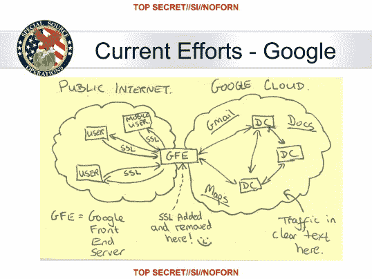

# 雅虎将跟随谷歌加密数据中心流量，客户数据流由 Q1 的 14 | TechCrunch

> 原文：<https://web.archive.org/web/https://techcrunch.com/2013/11/18/yahoo-will-follow-google-in-encrypting-data-center-traffic-all-traffic-between-company-and-customers-by-q1-14/>

雅虎今天早上宣布，它将通过 2014 年的 Q1 对其数据中心之间的所有流量进行加密。在此之前，谷歌等其他公司也采取了这样的行动，因为最近对美国国家安全局数据收集的披露引发了关注和愤怒。

雅虎首席执行官玛丽莎·梅耶尔(Marissa Mayer)发布的声明概述了一项对其内部数据中心之间移动的所有数据进行加密的计划。雅虎最近宣布计划在 2014 年 1 月 8 日之前在雅虎邮箱中使用 2048 位密钥 SSL 加密。该公司的其他加密计划包括在 2014 年 Q1 会议结束前为雅虎与其客户之间的所有数据传输提供加密。雅虎表示，它将与所有联合品牌的国际邮件合作伙伴合作，以确保至少基本的 HTTPS 协议是启用的。

“正如你所知，在过去的六个月里，有许多关于美国政府在包括雅虎在内的科技公司不知情的情况下秘密获取用户数据的报道，”梅耶尔说。“我想重申我们过去说过的话:雅虎从未向美国国家安全局或任何其他政府机构开放我们的数据中心。永远不会。”

今天的声明是在[谷歌做出类似举动](https://web.archive.org/web/20230403133215/http://articles.washingtonpost.com/2013-09-06/business/41831756_1_encryption-data-centers-intelligence-agencies)(去年开始)之后发布的。在 NSA 和 GCHQ 的一个名为 MUSCULAR 的联合项目曝光后，谷歌开始加密其数据中心之间的流量，该项目概述了一个系统，其中它将自己拼接到该公司服务器之间的通信中，以收集监控对象的数据。爱德华·斯诺登获得并被《华盛顿邮报》曝光的政府文件显示，[这个庞大的项目也直接瞄准了雅虎](https://web.archive.org/web/20230403133215/http://www.washingtonpost.com/world/national-security/nsa-infiltrates-links-to-yahoo-google-data-centers-worldwide-snowden-documents-say/2013/10/30/e51d661e-4166-11e3-8b74-d89d714ca4dd_story.html)。

该计划概述了一个程序，可以拦截雅虎或谷歌(或其他拥有大量用户数据的大型科技公司)服务器组之间的 SSL 通信，以收集数亿用户账户的信息，包括国内外账户。WaPo 报告称，每天有数百万条记录被从雅虎和谷歌网络中截获:

> 根据一份日期为 2013 年 1 月 9 日的绝密会计报告，NSA 的采购理事会每天从内部雅虎和谷歌网络向该机构位于马里兰州米德堡总部的数据仓库发送数百万条记录。报告称，在此前的 30 天里，实地收集者处理并发回了 181，280，466 条新记录——包括“元数据”，这将表明谁在何时发送或接收了电子邮件，以及文本、音频和视频等内容。

本月早些时候，谷歌[工程师布兰登·唐尼](https://web.archive.org/web/20230403133215/https://plus.google.com/108799184931623330498/posts/SfYy8xbDWGG)发表了一份关于 WaPo 事件的个人(非公司)声明，直言不讳地说:

> 去他妈的这些家伙。
> 
> 在过去的十年里，我一直在努力保护谷歌的用户免受谷歌面临的各种威胁。
> 
> 我见过大量使用谷歌的机器。我见过蠕虫利用谷歌在别人的软件中寻找漏洞。我见过犯罪团伙破解恶意软件。我见过间谍软件伪装成工具栏，厚到可以破坏电脑，因为它干扰了其他间谍软件。
> 
> 我甚至看到暴虐的政府利用国家支持的黑客攻击来攻击持不同政见者。
> 
> 但即使我们怀疑这是真的，这仍然让我非常难过。这让我很难过，因为我相信美国。

谷歌宣布，其加密所有内部通信的努力去年获得批准，但在斯诺登的爆料引发对数据窃听的担忧后，这一努力在 6 月份“加速”。

在被 Register 询问其加密做法后，数据密集型巨头微软表示，它没有加密服务器到服务器的流量，并且“最近的披露表明，我们需要投资保护客户的信息免受各种威胁，如果指控属实，其中包括政府。我们正在评估可能有利于进一步保护客户数据的其他更改。”

加密服务器到服务器的流量似乎是显而易见的，但雅虎并不是唯一一个急于将其付诸实施的公司。最可悲的是，这里缺乏行动很大程度上是因为我们自己的政府对隐私的期望，而不是对外部“恶意行为者”的恐惧。