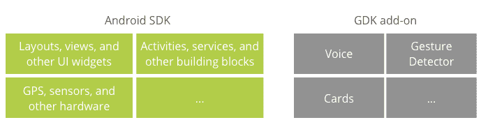

# 谷歌发布眼镜开发套件“先睹为快”和 5 个已经使用它的新眼镜应用程序 TechCrunch

> 原文：<https://web.archive.org/web/http://techcrunch.com/2013/11/19/google-releases-glass-development-kit-sneak-peek-and-5-new-glass-apps-that-already-use-it/>

# 谷歌发布了眼镜开发工具包“先睹为快”和 5 个已经使用它的新的眼镜应用程序

今天谷歌发布了[眼镜开发套件](developers.google.com/glass) (GDK)，作为开发者的[先睹为快。任何人都可以使用它，但它缺乏一个谷歌眼镜模拟器，所以在没有实际拥有谷歌眼镜的情况下测试应用程序几乎是不可能的。](https://web.archive.org/web/20230128100809/https://developers.google.com/glass/develop/gdk/sneak-peek)

通过发布 GDK，谷歌已经将谷歌眼镜从一个整洁的玩具变成了一个平台，一个成熟的开发平台，并向公众开放。目前阻碍 Glass 的瓶颈是其有限的物理分布，今天在野外可能只有五位数的耳机数量。

[https://web.archive.org/web/20230128100809if_/https://www.youtube.com/embed/oZSLKtpgQkc?feature=oembed](https://web.archive.org/web/20230128100809if_/https://www.youtube.com/embed/oZSLKtpgQkc?feature=oembed)

视频

尽管如此，谷歌对安卓开发者的推销还是很简单:带上你的[安卓应用](https://web.archive.org/web/20230128100809/https://techcrunch.com/2013/07/26/google-asks-glass-developers-to-start-working-on-android-based-apps-ahead-of-glass-development-kit-launch/)，重用大部分代码，把它们放到谷歌眼镜上，然后优化它们的界面。简而言之，通过将谷歌眼镜与安卓系统捆绑在一起，该公司几乎可以确保，在普通消费者接近应用程序时，谷歌眼镜将会充满应用程序。

今天还发布了一些使用 GDK 建造的玻璃的新应用。谷歌今天早上向媒体、一批开发人员和谷歌眼镜探索者演示了它们。我也得到了一些关于时间的信息，我在下面列出了一些笔记。[新申请](https://web.archive.org/web/20230128100809/http://www.google.com/glass):

*   Allthecooks:一款帮助你不用手就能读懂食谱的烹饪应用。
*   拼字游戏:一种拼词游戏。
*   GolfSight:当你穿着傻傻的裤子，对着小圆物体挥舞棍子的时候，用来计算距离之类的工具。
*   Strava:一款跑步追踪应用。
*   Wordlens:将印刷文字翻译成你能理解的语言。

Wordlens 太不可思议了。它不是简单地在现存的脚本上添加新的文本，这会很难阅读。相反，它不知何故(魔法？)*删除*原文，比如西班牙语，并用您选择的语言替换它。我被吹走了。这有点类似于拆除语言障碍，就好像它们根本不存在一样。基本上，不再在德国地铁里迷路了。

GDK 只是作为一个非常早期的预览。会改变的。你现在在它上面建立的东西将会被它内部以后的变化所破坏。但是没关系。谷歌正在做的是向谷歌眼镜敞开大门，以便全球开发社区的创造性思维可以帮助它达到作为一项技术的最高水平。我知道我在某个时候会得到一副眼镜，但在今天的演示之后，我想我想尽快得到一副眼镜。*顶级图片致谢:[Flickr](https://web.archive.org/web/20230128100809/http://www.flickr.com/photos/69730904@N03/)*