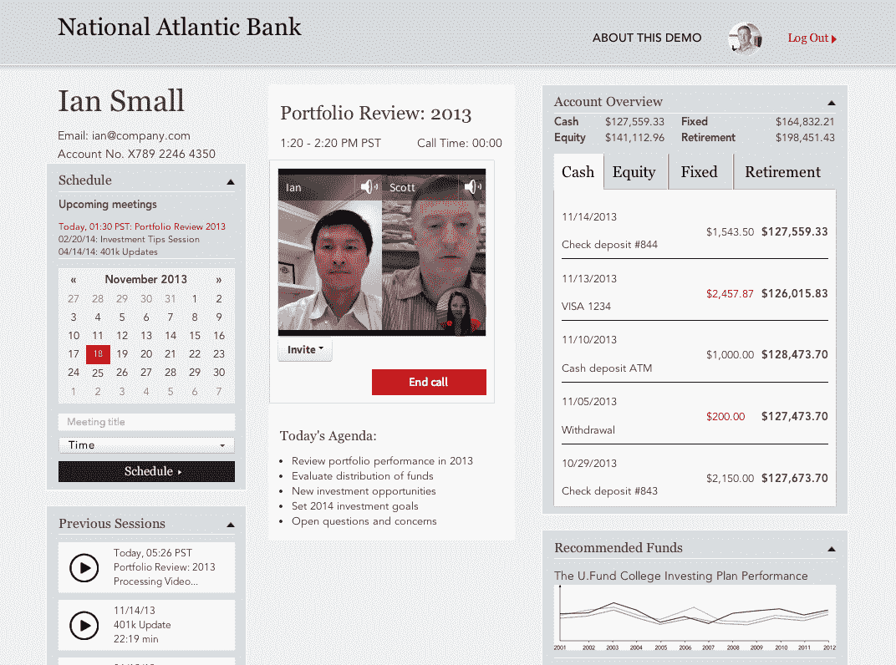

# TokBox 将其 WebRTC 平台引入原生 Android 应用，推出 WebRTC 归档技术

> 原文：<https://web.archive.org/web/https://techcrunch.com/2013/11/19/tokbox-brings-its-webrtc-platform-to-native-android-apps-launches-webrtc-archiving/>

# TokBox 将其 WebRTC 平台引入原生 Android 应用，推出 WebRTC 归档

TokBox 今天宣布，它正在扩展其 OpenTok WebRTC 平台，以支持构建原生 Android 应用程序。这标志着使用 OpenTok 的开发者首次可以将实时视频和音频聊天添加到他们的原生 Android 应用程序中。该公司还宣布，开发者现在可以使用该平台来存档视频，并在他们的应用程序中播放这些视频。

该公司表示，这些功能是其开发者社区最积极要求的工具之一。值得注意的是，TokBox [几乎在一年前](https://web.archive.org/web/20230131033355/http://www.tokbox.com/blog/opentok-for-android/)推出了安卓 SDK [的早期版本](https://web.archive.org/web/20230131033355/http://www.tokbox.com/blog/opentok-for-android/)。然而，这个早期版本实际上并没有使用 WebRTC。

该公司告诉我，存档功能将把对话保存在一个 H.264/AAC MP4 文件中，然后允许开发者下载并通过他们选择的任何播放器播放。

除了这两个特性，TokBox 还在其平台上增加了两个新的质量增强特性。在这个版本中，OpenTok 现在允许开发人员实时为视频流分配帧速率，以允许他们更好地管理带宽资源，这是 WebRTC 本身所不允许的。此外，TokBox 正在增加 TURN over TCP 支持，这将允许 WebRTC 应用程序在以前由于公司防火墙而受到限制的环境中运行。

随着 WebRTC 博览会和会议在本周举行，我们有机会在未来几天听到更多关于这项新技术的消息。例如，weemo[今天早些时候宣布](https://web.archive.org/web/20230131033355/https://techcrunch.com/2013/11/19/weemo-brings-its-webrtc-powered-video-chat-solution-to-ios-android-and-phonegap-apps/)支持原生 iOS 和 Android 应用，尽管技术相似，但该公司的商业模式与 TokBox 略有不同，因为该公司主要是在追求软件供应商，而不是开发者。