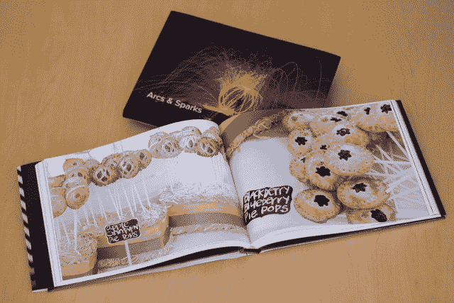
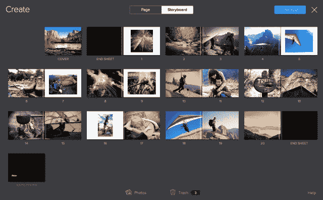
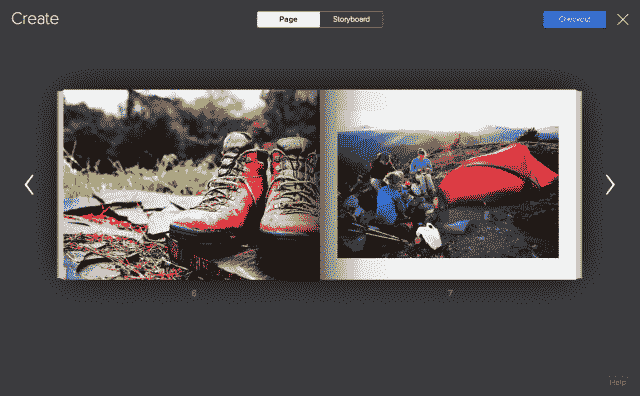

# 雅虎 Flickr 的复兴继续带来漂亮的相册，但对布景的依赖可能会受挫

> 原文：<https://web.archive.org/web/https://techcrunch.com/2013/11/19/yahoos-flickr-resurgence-continues-with-handsome-photo-books-but-reliance-on-sets-could-stumble/>

今天，Flickr[宣布能够](https://web.archive.org/web/20221209001128/http://yahoo.tumblr.com/post/67493364270/bring-your-photos-to-life-with-flickr-photo-books)直接从照片分享网站订购相册。这是去年年底开始的一系列公告和收购的延续，标志着雅虎继续投资重建这个曾经占主导地位的平台。

作为首批让照片上传和分享变得极其容易的网站之一，Flickr 在早期收获颇丰。但缺乏关注和资源导致了停滞，因为其他网站和服务蜂拥而至，开始争夺用户在线照片的“一个真正的存储库”。这些竞争对手包括来自各种领域的产品，包括脸书、Google+和 Dropbox。

自去年年底 iPhone 应用程序更新以来，Flickr 经历了一系列更新，包括完全重新设计其网站，推出 Android 应用程序，以及向每个用户赠送 1tb 的免费存储空间。它还收购了该领域的几家公司，包括[幽灵鸟](https://web.archive.org/web/20221209001128/https://beta.techcrunch.com/2013/06/12/yahoo-acquires-advanced-ios-photography-app-maker-ghostbird-software/)、[智商引擎](https://web.archive.org/web/20221209001128/https://beta.techcrunch.com/2013/08/23/yahoo-acquires-image-recognition-startup-iq-engines/)和 [LookFlow](https://web.archive.org/web/20221209001128/https://beta.techcrunch.com/2013/10/23/yahoo-acquires-startup-lookflow-to-work-on-flickr-and-deep-learning/) 。无论人们对雅虎新任首席执行官玛丽莎·梅耶尔有什么评论，似乎很明显，她对“作为平台的 Flickr”进行了新的投资。

这就是这些新相册的本质。Flickr 以前允许外部网站提供“启用 Flickr”的图书创作，但今天宣布的是一个内部工具。

“我们正在努力让 Flickr 再次变得伟大，”Flickr 副总裁汤姆·休斯告诉我。这包括努力使相册易于使用，快速清洁的经验。可用性实验室测试被用来确保最终结果是平滑和简单的。

为此，相册过程非常简单。你只需将鼠标悬停在 Flickr 相册上，点击“创建”即可生成一本相册。Flickr 产品管理总监 Rajiv Vaidyanathan 告诉我，布局以“全出血”图像为中心，因为他们觉得“Flickr 全是照片”，整页图像是展示照片的最佳方式。

如果你曾经制作过一本相册，那么你会知道最大的麻烦之一是“装订线”或者书的装订部分。它经常会模糊图像中的焦点或人脸。Vaidyanathan 说，为了防止这种情况，Flickr 正在使用聚焦和熵算法，以及面部检测，来找出图像中“重要”的部分，并相应地进行裁剪。这应该确保面孔不会太靠近书籍页面的装订线或边缘。如果重要的东西靠近两边，图像会自动从完全出血状态捕捉，并带有保留这些元素的边框。

垂直图像以简单的边框呈现。这些书本身是硬皮的，封面上印有图像，可以选择黑色、白色或彩色封底。背景颜色会自动从您在封面上选取的图像中嗅出，让您可以创建一个互补的背景。

故事板模式将允许你从你的整个 Flickr 库中挑选出单独的图片，并把它们放到你的书中。你也可以在这里随意移动图片或将它们从书中“删除”。

8.5 英寸 x 11 英寸的书 20 页 34.95 美元，附加纸张 50 美分一页，与苹果公司 iPhoto 书 29 美元的价格相比相当不错。它们打印在“光电”纸上，而不是真正的感光乳剂，但 Flickr 产品负责人马库斯·斯皮林告诉我，它们“接近照片质量”，因为你可以不使用相纸。它们都配有印花防尘外套。目前，你可以在世界任何地方订购它们，但雅虎只把它们运送到美国。

整个过程中可能遇到的一个小问题是，如果你已经将照片组织成一组，那么这真的很容易。对于“set 用户”来说，图书的一键式本质使这个过程变得非常低摩擦，但对于那些用 Flickr 应用程序自动上传图片或使用该服务作为在线“所有”照片存储库的人来说，这似乎要低得多。苹果的 Photos.app 或 iPhoto 应用程序的自动图像分组，或者谷歌的 Google+ Photos 系统似乎是这种功能的天然伴侣。Flickr 的整体图像排序和分组工具几乎没有什么改进，即使雅虎重新开始关注它。有很多手动拖放和大量的点击操作。基于日期、地点、算法检测的主题或其他因素来制作自动布景的简单能力，可能会大大有助于使像相册这样的“基于布景”的活动得到更广泛的采用。

我们询问了与 Flickr 用户数量相关的指标，这些用户目前正在利用 sets，但截至发稿时尚未收到回复。也许是一吨人？

斯皮林说，目标是让 Flickr 再次成为“你所有图片的家”。将书籍添加到产品中似乎是朝着这一目标迈出的一大步，但该团队也可以很好地改善其自动图像处理和分类。尽管如此，简单的“一键”全出血的书籍看起来还是很不错的。