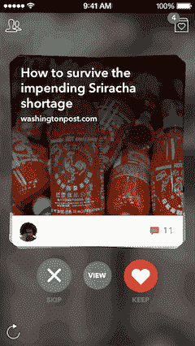

# 链接共享服务 Potluck 的新应用结合了消息和新闻，包括原创内容 TechCrunch

> 原文：<https://web.archive.org/web/http://techcrunch.com/2013/11/21/link-sharing-service-potlucks-new-app-combining-messaging-and-news-including-original-content/?utm_source=dlvr.it&utm_medium=twitter>

现在一切都是一个消息应用程序！社交会话服务[分支](https://web.archive.org/web/20230130231315/http://branch.com/)背后团队的链接共享服务 Potluck ，最初是一个简单的工具，允许用户在一个社区分享他们在网络上的有趣发现，这里的重点不是分享的人，而是内容。如今，随着 Potluck 版本的发布，这款应用正在转变为一种混合消息和新闻服务，人们可以围绕他们想要讨论的话题发表评论。

这与 Potluck 的核心理念并不完全不同——根据[互联网 1%规则](https://web.archive.org/web/20230130231315/http://en.wikipedia.org/wiki/1%25_rule_(Internet_culture))，只有一小部分人会参与内容创作，所以 Potluck 希望成为大多数所谓“潜伏者”的网络在最初的版本中，只有少数人会发布一个链接，而更多的人会喜欢或评论这个链接。从高层来看，这种体验在 2.0 版本中并没有太大的改变。这在很大程度上仍然是分享链接和来自人群的评论。

但是改变的是用户界面，现在感觉更像消息传递。正如 Branch 首席执行官兼联合创始人 Josh Miller [今天](https://web.archive.org/web/20230130231315/https://medium.com/p/860c889eb9b8)解释的那样，在更新的应用程序中，对话是基于主题，而不是人。他说，也就是说，“不是敲敲你室友或同事的名字来开始谈话，而是敲敲你感兴趣的话题——比如‘班克斯的纽约之旅’，或者‘阿姆的新专辑’。”"

他说，该应用的早期版本有一个非常活跃的核心社区，但增长不是很快。“每个人每次访问网站平均花费 7.5 分钟，我们最上瘾的用户每天访问 8 次，”米勒告诉我们。

这种设计上的转变让 Potluck 成为了一个试图为自己开辟一个利基市场的类别，它位于 Digg 或 Reddit 这样的社交新闻网站和 Whatsapp 这样的移动通讯应用之间。但最终，它可能不得不与之竞争的服务是 Twitter。在 Twitter 上，用户经常发布链接，其他人用他们的简短评论回复他们。事实上，Twitter 最近甚至试验了如何更好地突出这些对话，引入了一条蓝线 T1(现在是灰色的)，颠倒了网络默认的反向时间顺序，这让用户很不喜欢。

但在 Potluck 上，你可以输入多少字符没有限制，用户的头像也更小——吸引你的是故事，而不是分享故事的人。

那么，或许把 Potluck 更好地描述为介于 Twitter 和像 [Medium](https://web.archive.org/web/20230130231315/https://medium.com/m/welcome) 这样更强大的博客平台之间的产品——一个像 Branch 这样的产品，它由 Twitter 创始人的孵化器 [The Obvious Corporation](https://web.archive.org/web/20230130231315/https://techcrunch.com/2013/04/05/the-obvious-corp-takes-backseat-as-ev-williams-biz-stone-and-jason-goldman-shift-focus-to-individual-startups/) 支持，后来创始人决定[让位于它资助的个别项目](https://web.archive.org/web/20230130231315/https://techcrunch.com/2013/04/05/the-obvious-corp-takes-backseat-as-ev-williams-biz-stone-and-jason-goldman-shift-focus-to-individual-startups/)。

**家常便饭约上，增加原创内容**

pot luck 2.0 的另一大变化是分行团队创作的原创内容。这也许是更大的焦点转移。类似于大约在的[这样的新闻应用，该团队将分享新闻文章和其他主题的简短摘要，旨在花费不超过 20 秒阅读。事实上，它甚至可能是比你在 Circa 上看到的更短的新闻，因为 Potluck 的新闻版本只有三张幻灯片深。](https://web.archive.org/web/20230130231315/http://cir.ca/)

米勒说，这些幻灯片或卡片的灵感来自 Tinder，他从朋友那里听说这款约会应用被列为他们最喜欢的导航应用。如今，新版 Potluck 允许你在一叠卡片中刷卡，点击每一张卡片就会显示内容(标题背后的摘要)，以及你可以选择评论的对话。文章也可以跳过，或者分别点击“X”或心形图标来保留——有点像新闻的“热门与否”。

根据人们喜欢、跳过或点击的内容进行数据收集的潜力可能会暗示 Potluck 接下来会走向何方，并提供更个性化的新闻推荐。但是，澄清一下，这不是今天发布的一部分。

有趣的是，看看 Potluck 是否能从一系列服务中借鉴这么多更好的想法，从消息和新闻应用程序中借鉴，并将这些想法与最佳设计理念相结合，从而为自己找到空间。

你可以在这里抓取更新的百乐 app [。](https://web.archive.org/web/20230130231315/https://itunes.apple.com/us/app/potluck-links-with-friends/id669745934)