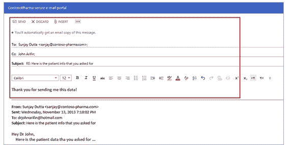

# 微软于 2014 年初将邮件加密引入 Office 365 TechCrunch

> 原文：<https://web.archive.org/web/http://techcrunch.com/2013/11/21/microsoft-bringing-message-encryption-to-office-365-in-early-2014/?utm_source=dlvr.it&utm_medium=twitter>

# 微软在 2014 年初将邮件加密引入 Office 365

微软正在给 Office 365 带来消息加密。该系统将允许电子邮件自动加密，即使是发送给非 Office 365 用户。因此，你可以在任何电子邮件服务上对任何人使用这种保护。

在这个政府机构无孔不入地绑架数据的时代，保护你的私人物品隐私是一个越来越重要的问题。因此，在 Office 365 中添加消息加密功能是很有意义的，而且可能非常有用。

这个系统很简洁:一旦管理员打开它，发送的电子邮件在发送出去之前都会被加密，这意味着他们只有在穿上夹克后才能离开家。收件人收到一封带有加密附件的电子邮件。这就是信息。

附件将在浏览器窗口中打开，收件人将使用他们的 Microsoft 或 Office 365 帐户进行身份验证。然后他们可以在浏览器中查看邮件，界面类似于 Outlook.com 的布局: 

有趣的是:所有的回复都是加密的，所以系统保持了它的安全性。

另一个问题是:美国国家安全局正在努力结束我们所知的加密，所以这不是很好。尽管如此，微软已经建立了一个系统，普通人可以享受加密保护他们的信息。它很笨重，但这是因为它需要与其他电子邮件系统兼容。

最后一点:它要到 2014 年第一季度才会上市。

那么，它的成本是多少，谁得到它？如果你是 Office 365 的 E3 或 E4 用户，它将是免费的。此外，如果你是 Windows Azure 权限管理的独立客户，你可以免费获得它。我不知道这些词是什么意思，所以我已经要求微软把他们的那段话翻译成英语。当我得到更多，我会把它包括在这里。

对所有人加密是一件好事。Microsoft，请让所有 Office 365 用户都可以使用它。

*Top Image Credit:[Flickr](https://web.archive.org/web/20230209131544/http://www.flickr.com/photos/vestman/)*