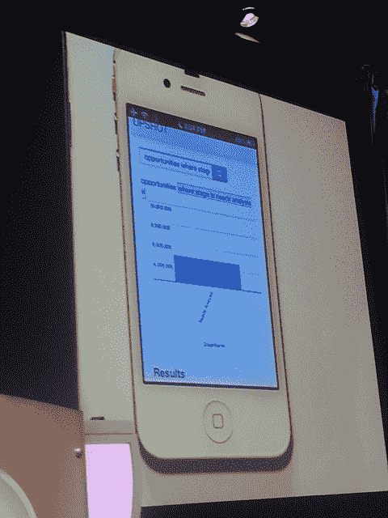

# 两名哈佛大学校友在 Dreamforce 赢得有争议的 sales force 100 万美元黑客马拉松奖

> 原文：<https://web.archive.org/web/https://techcrunch.com/2013/11/21/two-harvard-university-alum-win-salesforce-1m-hackathon-prize-at-dreamforce-for-mobile-service-to-create-reports/>

# 两名哈佛大学校友在 Dreamforce 赢得有争议的 sales force 100 万美元黑客马拉松奖[更新]

15 年前在哈佛大学相遇的两位开发人员赢得了 Salesforce.com 100 万美元的黑客马拉松，因为他们的服务为使用 Salesforce.com 平台的销售人员创建了移动报告。

这款名为 Upshot 的应用由 Thom Kim 和 Joseph Turian 开发。该服务用简单的英语分析数据，通过 API 连接，然后为智能手机或平板电脑用户呈现结果。

用户也可以使用谷歌的语音功能进行查询。

*【编者注:这篇文章最初忽略了一个事实，即获胜的团队中至少有一人曾是 Salesforce 的长期员工。*

*这是在舞台上透露的，作者在这篇文章的结尾自我透露是黑客马拉松的评委。*

*这是一个严重的遗漏，我们已经更新了帖子。Salesforce 还为评委提供了五名决赛选手，并且没有透露该应用已经上线数月——通常黑客马拉松不允许这样做。*

在这篇[博客文章](https://web.archive.org/web/20230316161016/http://blogs.developerforce.com/developer-relations/2013/11/addressing-questions-about-the-salesforce-1-million-hackathon.html)中，Salesforce 解释了自己的观点。参与者之一艾丽西娅·刘(Alicia Liu)在博客上讲述了她对这里经历的失望。]

其他获奖者是:

*   Healthcare.love 位居第二，因其帮助人们选择健康计划的服务赢得了 5 万美元。
*   25，000 美元的三等奖被 Hirebase 获得，这是一项允许用不同颜色和注释突出简历的服务。
*   第四名 10，000 美元的奖金被 Salesfetch 获得，这是一项跨不同服务查找信息的服务，可以获得线索的完整信息。
*   2lemetry 获得了 5000 美元的五等奖，因为它可以在人们走近贸易摊位时检测他们的身份和背景。这项服务使用 Raspberry Pi 和低功耗蓝牙设备进行检测。

Kim 和 Turian 做了一个演示，展示了一个应用程序，它允许通过对特定信息点的深入研究来创建报告。查询可以通过输入到移动设备或谷歌语音即时完成。

黑客马拉松于周一随着 Dreamforce 活动的开始而开始。几十个队参加了。根据团队的创新、客户体验、商业价值和 Salesforce 平台的使用情况对团队进行评判。透露一下，我是黑客马拉松的评委之一。