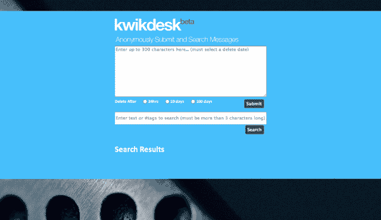
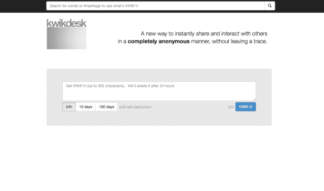

# 短暂的信息平台 KwikDesk 正在考虑引入比特币

> 原文：<https://web.archive.org/web/http://techcrunch.com/2013/11/22/kwikdesk-an-ephemeral-messaging-platform-mulls-introducing-bitcoin/>

本周，一个名为 KwikDesk 的有趣想法冒了出来，它自称为“Snapchat 遇上 Twitter”

这项服务允许任何人向以太网发送带有标签的自毁消息，这些标签可用于以后在搜索中重新挖掘它们。它是完全匿名的，没有发件人的 IP 日志或个人用户的记录。发件人可以选择让邮件存活 24 小时、10 天或 100 天。

创始人 Kevin Abosch 告诉 TechCrunch，这项服务计划整合比特币的传输，并刚刚组建了一个团队。

这是一个挠头。比特币现在被许多实体接受为合法货币，但 KwikDesk 增加的匿名层让它尝起来有丝绸之路的味道。

Abosch 表示，他从未想过这个问题，但他对比特币运动以及如何将其应用到他最近似乎失败的艺术项目上颇感兴趣。

“当我看到美国政府正在拍卖丝绸之路公司扣押的比特币资产时，我认为这是对这种货币的认可，”阿博施说。“我喜欢这个想法，我的小艺术项目最终可能成为流通这种新货币的最简单方式。比特硬币的整个底层结构是匿名和尊重隐私。”

看，Abosch 实际上是一个[专业摄影师](https://web.archive.org/web/20230316045300/http://kevinabosch.com/)(也是一个投资者，Summly 的顾问)，他开发了 KwikDesk 作为一个概念艺术项目。

他是这样向我解释的:

> Kwikdesk 过去是，现在也是我创建的一个概念艺术项目，它是对所有社交媒体噪音的一种反应……登录、cookies、趋势、提要、杂乱……然后奇怪的事情发生了。人们开始以多种方式使用它…通过创造性地使用#标签和不带空格地写消息来传递秘密消息。用寻宝式的游戏将它游戏化，把 is 作为一种忏悔。
> 
> 我自筹资金，然后随着它变得越来越特别，我带了我的两个有才华的朋友大卫·科利尔和康纳·墨菲一起兼职帮忙。
> 
> 对我来说，Kwikdesk 与我拍摄的人物肖像没有什么不同，它是从不同的角度拍摄的人类“肖像”。

这个想法确实很有趣，但它能持久吗？

你发送信息却得不到任何反馈，这与其他形式的社交网络(甚至 Snapchat)不同。对一些人来说，这可能是一种宣泄——你怪异想法或忏悔的无底洞——就像 90 年代 13 岁女孩的赞加。

但是，如何轻松、重复地消费消息呢？你必须搜索某些词或标签才能看到这些短暂的推文。

Abosch 解释说，人们在发信息时变得越来越有创意，使用像#09485wedks0932 这样的特殊标签，或者写没有空格的信息，从基本单词(而不是标签)搜索中取消该信息。但是你需要这个特殊的标签，通过其他形式的通信来检索你的信息。

尽管如此，人们似乎对 KwikDesk 很感兴趣。

Abosch 报告在过去的 48 小时内发送了 50，000 条消息。然而，公平地说，阿布施的朋友，连线杂志的大卫·罗文两天前在推特上发布了关于这家初创公司的消息。

昨天，它被 [TheNextWeb](https://web.archive.org/web/20230316045300/http://thenextweb.com/apps/2013/11/21/kwikdesk-twitter-meets-snapchat-hidden-public-timeline-ephemeral-messages/) 选中。

今天，Abosch 已经重新设计了网站，并承诺将每天实现改进和新功能。

之前:

之后:

[IMG via [蓝色那边](https://web.archive.org/web/20230316045300/http://www.flickr.com/photos/blueyonder/)