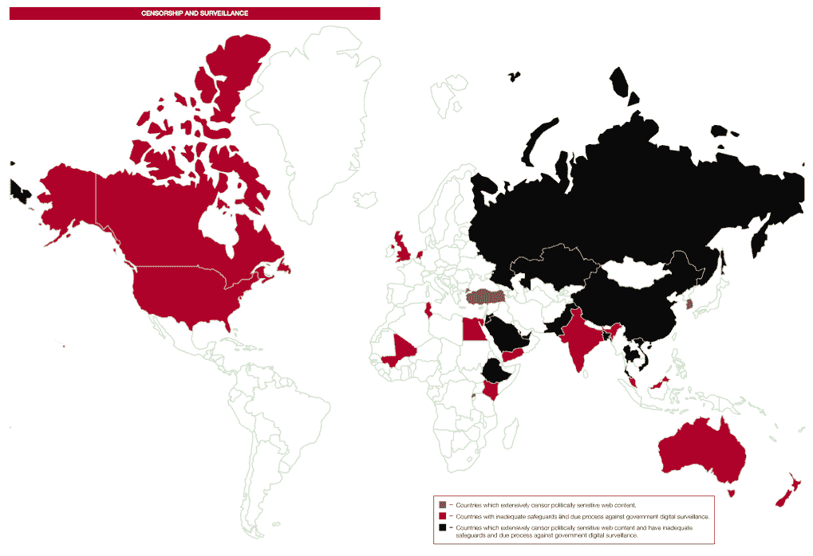

# 蒂姆·伯纳斯·李爵士抨击在线监控的“阴险、寒蝉效应”,称我们应该保护像斯诺登这样的告密者

> 原文：<https://web.archive.org/web/http://techcrunch.com/2013/11/22/sir-tim-berners-lee-blasts-insidious-chilling-effects-of-online-surveillance-says-we-should-be-protecting-whistleblowers-like-snowden/?utm_source=dlvr.it&utm_medium=twitter>

万维网(World Wide Web)的发明者今天表示，在线监控浪潮的兴起，以及政府缺乏保护个人免受监控的措施，对互联网的发展和未来的影响产生了灾难性的影响，甚至可能超过审查制度。蒂姆·伯纳斯·李爵士(Sir Tim Berners Lee)在万维网基金会(World Wide Web Foundation)发布的年度研究项目“网络指数”发布会上发表讲话，称监控的影响“令人心寒”且“阴险”(他过去也用这个词[来形容这种做法](https://web.archive.org/web/20230129214222/http://www.thetimes.co.uk/tto/technology/internet/article3800472.ece))。

然而，伯纳斯-李回避了关于他是否认为他和其他早期互联网先驱可以开发不同的东西，以提供更好的保护措施，防止窥探的问题。相反，他指出，像爱德华·斯诺登这样的人是如何改变信息收集方向的重要组成部分——这意味着他们应该凌驾于现有法律之上。

“每个人都非常感谢参与其中的举报者，”他说，“因为没有举报者，我们不可能意识到这一点，也不可能进行这样的对话。(当)我们的制衡体系崩溃时，我们必须保护和尊重它们。”

英国和美国在网络指数排行榜上分别排名第三和第四，该排行榜对各国的“全球发展和人权贡献”进行了排名排名考虑了互联网接入等指标；自由开放；相关内容；和赋权。

WWWF 首席执行官安妮·杰利马(Anne Jellema)指出，今天发布的排名明年可能会有很大不同:这项研究是在 9 月至 9 月期间编制的，这意味着它没有考虑到最近披露的美国国家安全局等组织收集信息的方式。

该报告指出，在报告审查的 81 个国家中，超过 30%的国家进行了监控(被称为“中度至广泛阻止或过滤政治敏感内容”)。也许更令人担忧的是，监控正变得越来越复杂和有创造性，越来越多地使用看似“合法”的网络犯罪和反恐立法来证明行动的正当性。调查发现，在网络索引中，94%的国家“不符合制衡政府拦截电子通信的最佳实践标准。”

监视的后果不仅仅是指像美国国家安全局这样的组织监视你的所作所为。WWWF 认为，越来越多的不信任可能会导致在线“参与鸿沟”的扩大——这意味着人们可能会接入互联网，但由于使用互联网的负面影响，他们不会选择将其用于积极的目的，如改善沟通。

在发布这份报告时，维基百科的联合创始人吉米·多纳尔·威尔士还指出，民主国家的行动在其他国家的宽容方面产生了更广泛的影响，这些国家过去在信息自由方面表现出了更强的压制性。当他与中国的某人坐下来，告诉他们监视和审查他们的用户是多么糟糕时，他说，“当我们做同样的事情时，这听起来有点空洞。”

伯纳斯-李和威尔士指出，监控的一个大问题是，它比审查要微妙得多。

“关于监视的事情是，它是安静的，在幕后，”威尔士指出。“这不影响你的生活。如果英国屏蔽了维基百科的一个页面，人们会感到不安。但如果你只是窥探人们在读什么，那就很微妙了。但这种事情正在发生，我们有能力阻止它。我们有能力组织这些。”

就其本身而言，维基百科正在经历一个对不同语言的维基百科页面进行加密的过程，以此来帮助保护用户的隐私。威尔士告诉我，由于维基百科页面链接到许多其他网站，它可能不会完全保护用户的隐私，“但这是一个开始，让国家安全局等组织更难跟踪你的所作所为。你在维基百科上看到的应该是隐私。”

他还指出，“年轻人越来越意识到隐私确实很重要。这就是 Snapchat 如此受欢迎的原因，”他说。“我认为我们应该利用这一点。”

完整的报告显示，斯堪的纳维亚国家占据了前 10 名的排名，正如他们在国际电信联盟(ITU)等[组织的类似评估中所做的那样。总体而言，菲律宾是排名最高的发展中国家。你可以在这里看到完整的报道](https://web.archive.org/web/20230129214222/https://techcrunch.com/2013/10/07/itu-6-8b-mobile-subs-by-end-of-2013-nearly-as-many-people-as-there-are-on-earth-2-7b-on-any-kind-of-internet/)。