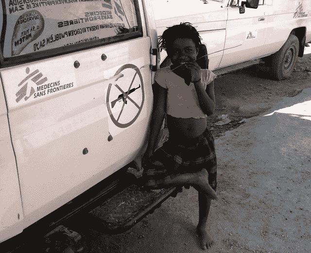

# 让我们消灭援助行业

> 原文：<https://web.archive.org/web/http://techcrunch.com/2013/11/23/lets-kill-the-aid-industry/?utm_source=feedburner&utm_medium=feed&utm_campaign=Feed:+Techcrunch+(TechCrunch>)

乔恩·埃文斯是工程咨询公司 HappyFunCorp 的首席技术官；六部小说、一部漫画小说和一本游记的获奖作者；自 2010 年以来一直是 TechCrunch 的周末专栏作家。

More posts by this contributor

长期以来，我对援助行业抱有一种健康的蔑视。在过去十年的大部分时间里，我在这个星球上四处游荡，乘坐当地公共交通穿过贫穷和/或不稳定的国家 ¹ ，我不断遇到穿着亮闪闪的白色品牌四轮驱动车的援助人员，但几乎总是不为所动。正如我在别处写的:

> 大多数发展援助都是有害的。以低于生产成本的价格销售商品是倾销，这种商业行为被谴责为掠夺性的；援助只是价格为零的倾销。
> 
> 恐怖故事数不胜数。捐赠的衣服摧毁了当地的纺织工业。建筑物的外壳、淤塞的大坝和未完成的“试点项目”点缀着非洲的风景。年轻的白人涌向昂贵的酒店参加无用的“会议”,相当于带薪的异国度假。和平队的“野胡”花了很大的代价飞来教西方美容……但援助的最糟糕的后果是延续和扩大了那种认为变化必须来自外部的态度。我的朋友 Gavin Chait 称之为“通过援助对非洲的再殖民”

需要澄清的是，我批评的是每年花费在发展援助上的 1200 亿美元，而不是灾难援助，灾难援助是至关重要的，可以拯救很多人的生命；此外，许多医疗危机，如撒哈拉以南非洲的艾滋病毒和疟疾，基本上是持续的慢性灾难。这些人:

 
( *图片来源:*你真诚的，海地太子港，2007)

绝对是站在天使一边的。

我认为，我们富裕的西方国家既有道德义务，也有实际动机去帮助世界上极度贫困的人。(毕竟，你不能和一个破产的人交易。)我绝不是第一个批评发展援助行业的人，我注意到，与大多数行业相比，这是一个浪费和官僚主义的温床，主要致力于自我延续。我承认一些单独的援助项目是有益的，而且该行业的一些人最近一直在尝试创新；特别是，在一些特殊情况下，向简单的[给有需要的接受者现金](https://web.archive.org/web/20230323203801/http://www.csmonitor.com/layout/set/r14/World/Africa/2008/0604/p01s02-woaf.html)发展。

这是一个开始。但现在是加快完成这项工作的时候了:也就是说，取消我们所知的援助，支持直接把钱发给穷人，让他们随心所欲地花。这既是道德上的要求，也是最有效地使用援助资金的方式。

还是那句话，我[远没有](https://web.archive.org/web/20230323203801/http://kenopalo.com/2013/11/02/on-direct-cash-transfers-a-look-at-us-domestic-politics-of-aid-giving-2/)先[后](https://web.archive.org/web/20230323203801/http://opinionator.blogs.nytimes.com/2013/08/28/the-benefits-of-cash-without-conditions/)到[作](https://web.archive.org/web/20230323203801/http://www.slate.com/articles/technology/future_tense/2011/02/money_to_the_people.html)这个[论证](https://web.archive.org/web/20230323203801/http://www.economist.com/news/international/21588385-giving-money-directly-poor-people-works-surprisingly-well-it-cannot-deal)。但我没有看到其他人注意到的是，我们正在迅速接近技术最终大规模实现这一点的时候。

运行数字。据估计，有 24 亿人每天的生活费不到 2 美元。如果我们简单地把今天的援助款直接发给他们，一个六口之家每年将会额外收到 300 美元——相对于他们的极端贫困底线而言，这是一笔巨款。那么为什么*不会*我们呢？如果直接转移支付和“我们所知的援助”都是可行的选择，那么“我们所知的援助”实质上就是从那些最需要的人那里拿走钱，然后把钱交给非选举产生的援助行业，代表他们的利益去消费。这怎么可能是合理的？

唯一的答案归结为光顾新殖民主义:“那些弱小/无知/愚蠢的穷人不知道如何花钱，所以我们必须为他们花钱。”这是一个非常流行的论点。幸运的是，最近的证据——特别是包括[麻省理工学院在西肯亚](https://web.archive.org/web/20230323203801/http://www.npr.org/blogs/money/2013/11/08/243967328/episode-494-what-happens-when-you-just-give-money-to-poor-people) ( [PDF](https://web.archive.org/web/20230323203801/http://web.mit.edu/joha/www/publications/Haushofer_Shapiro_Policy_Brief_UCT_2013.10.22.pdf) )的一项研究——强烈表明事实并非如此:

> 转移支付使贫困家庭能够积累资产……转移支付减少饥饿……转移支付不增加烟酒支出……转移支付增加了对牲畜和小企业的投资和收入……转移支付增加了接受者及其家庭的心理健康……我们发现有暗示性的证据表明，现金转移支付减少了家庭暴力，增加了接受者家庭和同一村庄其他家庭的女性赋权。

我认为，即使是大多数援助工作者也会同意，如果受到压力，向(根据定义)最需要钱的人提供现金转移，要比随意的援助项目(可能有帮助，也可能没有帮助)和/或支持腐败的政府/官僚多边机构好得多。但是我们真的能做到吗？当然，在肯尼亚的一个小村庄进行的精心设计的研究中，这可能行得通，但是[1280 亿美元](https://web.archive.org/web/20230323203801/http://www.oecd.org/dac/stats/50yearsofofficialdevelopmentassistance.htm)的问题是——正如这些天经常发生的那样——*这个规模如何？*

实际上，在国家层面上，它已经*成规模了。巴西的 [Bolsa Familia](https://web.archive.org/web/20230323203801/http://en.wikipedia.org/wiki/Bolsa_Fam%C3%ADlia) 是一个备受赞誉的直接现金转移支付项目，金额估计达到 4600 万英镑。今年早些时候，印度推出了一项与其独特的生物识别系统相关的直接转账计划；已经有数亿人注册了。如果这两个以暴躁著称的国家能够实施直接现金转移，那么为什么不能延伸到国际援助呢？*

在许多地方，工具已经到位。从技术上来说，你真正需要的是一个移动银行网络——肯尼亚的 M-Pesa 是最著名和最成功的例子，但是世界上还有无数其他的移动银行—结合像 [Xoom](https://web.archive.org/web/20230323203801/https://www.xoom.com/) 或 [Stripe](https://web.archive.org/web/20230323203801/https://stripe.com/global) 这样的国际支付处理器。

我想，如果你担心普遍的欺诈，你会想要增加生物识别，例如在 M-Pesa 摊位上进行一次性的触控 ID 注册。但在很大程度上，我们真正需要做的是跟踪移动电话，因为它们在世界各地转移到甚至最贫穷的人手中，并在移动银行尚未像肯尼亚的 M-Pesa 那样普及的国家扩展移动银行的覆盖范围。

让我提出一些可能的异议:

*   请记住，我们谈论的是每年 1200 亿美元的援助总额；相对于这个数目，直接传输的建立和维护成本根本不会令人望而却步。
*   转移支付应该是有条件的(例如只给那些让孩子继续上学的家庭)还是无条件的？这是一个理性的人可能不同意的问题，但我站在无条件阵营一边，因为结果的差异似乎相当小，无条件转移支付更容易推广。
*   诚然，我们将取消由援助建立的基础设施项目——但如果同样数量的资金开始从穷人那里涌出，而不是从富人那里慢慢流下，社区和政府将能够自己为这些项目融资。(我也可以确信，用直接现金转移取代对非政府组织和政府的援助，但不考虑世界银行的捐款，将是一个良好的开端。)
*   是的，接受国政府将能够对这笔钱征税——但与大多数贫穷国家相比，腐败和中间人的层次会更少，直接现金转移会更加透明。如果太多的钱被征税和浪费，捐赠者可以可信地威胁关掉资金水龙头。此外，政府对收入征税并不是坏事，只要他们对民众有所交代……而依赖于实际上来自公民的钱，而不是直接来自外国政府的钱，将极大地增强这种责任感。
*   更重要的是，这也将改善人们对富裕世界的看法；公民不会看到西方的钱支持他们经常腐败的政府，这些钱会直接流向他们。
*   收件人的生物识别和主帐户列表是令人担忧的潜在监控工具，但这可以通过正确的技术来缓解(例如，在我的脑海中，用密码散列指纹，并存储这些散列而不是实际的指纹。)
*   为了防止潜在的当地货币恶性通货膨胀(我在津巴布韦的最后一段时间里目睹了价格在几周内翻了一番，至今仍心有余悸)，我倾向于研究转移资金的可能性，并保持外币/硬通货账户。或者，好吧，好吧，真正的信徒，也许有一天*比特币或类似的东西，但要等到它安定下来。*
*   当然，这种变化会对一些人不利，尤其是救援人员。问题是这对整个世界来说是否是一个重大的好处。

[软件正在蚕食世界](https://web.archive.org/web/20230323203801/http://online.wsj.com/news/articles/SB10001424053111903480904576512250915629460)；我们时代的技术咒语。就我个人而言，我支持它尽快吃掉那个被称为援助行业的大笨象

—当我们谈到这一点时，让我们认真、努力、严肃地看看在西方也实施一个[无条件](https://web.archive.org/web/20230323203801/http://marginalrevolution.com/marginalrevolution/2013/11/what-are-some-of-the-biggest-problems-with-a-guaranteed-annual-income.html) [基本](https://web.archive.org/web/20230323203801/http://www.slate.com/blogs/business_insider/2013/11/17/american_basic_income_an_end_to_poverty.html) [收入](https://web.archive.org/web/20230323203801/http://www.nytimes.com/2013/11/17/magazine/switzerlands-proposal-to-pay-people-for-being-alive.html)计划。效率——和道德义务——可能不是从家里开始的……但让我们希望它最终会回到这里。

*图片来源:*维基媒体。

我乘坐破旧的出租车、吱嘎作响的殖民时代的火车、拥挤不堪的小巴和载满牲畜的皮卡车，途经阿尔巴尼亚、哥伦比亚、刚果、埃塞俄比亚、危地马拉、海地、马里、缅甸、巴布亚新几内亚、卢旺达、西藏和津巴布韦，仅举几个国家，排名不分先后。