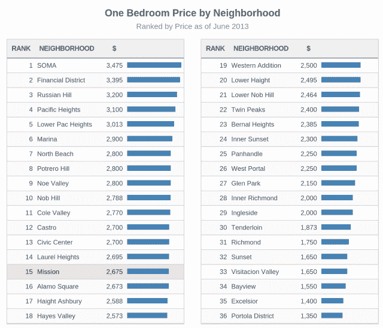

# Priceonomics 转储价格指南，与它的真爱、博客(和数据抓取)联姻

> 原文：<https://web.archive.org/web/http://techcrunch.com/2013/11/26/priceonomics-data-services/?utm_source=dlvr.it&utm_medium=twitter>

停下你正在做的事情，读读“[钻石是狗屁](https://web.archive.org/web/20230320002141/http://blog.priceonomics.com/post/45768546804/diamonds-are-bullshit)或者“[被偷的自行车会怎么样？](https://web.archive.org/web/20230320002141/http://blog.priceonomics.com/post/30393216796/what-happens-to-stolen-bicycles)”。这就是内容营销，Priceonomics 非常擅长。好到今天 Y Combinator 初创公司[宣布](https://web.archive.org/web/20230320002141/http://priceonomics.com/introducing-the-priceonomics-business-model-data/)将从价格指南转向博客，或者更准确地说，是为博客提供信息的网络搜集和研究。

要是我们都能辞掉肮脏的工作，做自己喜欢的事情就好了。Priceonomics 联合创始人罗欣·达尔(Rohin Dhar)就是这么做的。他于 2011 年 12 月创办了初创公司，其使命是为世界带来新信息。它为 70 多种旧货提供价格指南。现在买一台旧 iPhone 4S 应该多少钱？我的 Bianchi Pista fixie 自行车应该卖多少钱？这个想法是，如果它是人们研究大宗购买的地方，它可以从赞助搜索结果、传统展示广告或附属链接中获利。

但是，在试图为其价格指南增加流量的过程中，Priceonomics 找到了自己真正的使命:[博客](https://web.archive.org/web/20230320002141/http://priceonomics.com/?s=popular)。这家初创公司会调查一个主题，比如 [Airbnb 价格](https://web.archive.org/web/20230320002141/http://priceonomics.com/hotels/)、[葡萄酒价格](https://web.archive.org/web/20230320002141/http://priceonomics.com/is-wine-bullshit/)、[情侣见面的地方](https://web.archive.org/web/20230320002141/http://priceonomics.com/the-surprising-places-married-couples-meet/)，以及[邻近城市的租金](https://web.archive.org/web/20230320002141/http://priceonomics.com/living-in-oakland/)。然后，它会写一篇关于它的数据驱动的博客文章，希望病毒式传播会发生，并为它的指南带来新的用户。

问题是，归根结底，是谷歌决定了 Priceonomics 的命运。它需要出现在关于二手商品价格查询的搜索结果的顶部。Dhar 告诉我,“价格指南起作用的唯一方式是我们主导搜索引擎优化。我们认为，一种由我们掌控自己命运的商业模式，而不是依赖谷歌为我们带来流量，是我们感觉更好的东西。”

正如 Dhar 在今天宣布转向的一篇[帖子中所写的，“自从我们抓取了如此多样的数据源，我们开始构建从网络中提取数据的通用工具，这样我们的生活会更容易。我们非常擅长抓取数据。”因此，“今天，我们将推出](https://web.archive.org/web/20230320002141/http://priceonomics.com/introducing-the-priceonomics-business-model-data/) [Priceonomics 数据服务](https://web.archive.org/web/20230320002141/http://priceonomics.com/data-services/)，这是我们新的数据部门，帮助公司从网络上抓取和构建数据。如果你是一家需要从网上获取数据的公司，我们可以提供帮助。”

考虑到 Priceonomics 仍然拥有从 Andreessen Horowitz 和 SV Angel 银行筹集的 150 万美元种子资金，这似乎是一个明智的举动。它已经比以往任何时候在价格指南上赚得都多。达尔写道，由于客户包括其 Y Combinator brothers 和通常每月 1000 美元至 5000 美元的合同，“一个月内，我们的(年化)收入超过了六位数。”

达尔用某些术语描绘了他的公司的未来:

> “那么这一切对这个博客意味着什么呢？好东西！我们只需要写一些聪明的东西，希望一小部分观众会雇佣我们提供数据相关的服务。制作好的内容对我们来说很重要，我们打算[加倍努力](https://web.archive.org/web/20230320002141/http://priceonomics.com/join-team-priceonomics-as-a-writer/)。这对我们最初的二手产品消费者价格指南意味着什么？坏事！我们一个多月前就把它处理掉了。相对于这个博客，它的流量和参与度很小，相对于我们的数据抓取服务，它的收入可以忽略不计。”

但是，如果网络爬行业务必须与每个客户单独合作，它能成为投资者的全垒打吗？达尔声称它可以。“通常，公司获取数据的方式每次都是从头开始。他们曾经有一两个工程师全职从事这项工作。这就是我们正在做的，但后来我们开始构建工具，使其更具可扩展性。”

Priceonomics 数据服务将与竞争对手竞争，比如 PromptCloud 和 Scrapinghub。不过，它认为自己的服务有很多使用案例，比如投资者跟踪大型上市公司的所有微小举动。达尔告诉我，“人们正在像使用彭博一样使用(价格经济数据服务)，以做出更好的投资决策。”

结构化数据抓取工具可能没有帮助人们购买下一部 iPhone 或出售上一部 iPhone 那么有魅力。或许对这家初创公司及其投资者来说，其新 B2B 模式的最佳情况并不那么有利可图。但在某些时候，你必须知道 A 计划何时会失败，并听从你的直觉。达尔总结道:“这是将新信息带入世界的一种表现，但对企业而言。”

*我最喜欢的一些[价格经济学博客文章](https://web.archive.org/web/20230320002141/http://priceonomics.com/?s=popular) :*

[钻石都是扯淡](https://web.archive.org/web/20230320002141/http://blog.priceonomics.com/post/45768546804/diamonds-are-bullshit)

[以收集易拉罐为生](https://web.archive.org/web/20230320002141/http://priceonomics.com/making-a-living-collecting-cans/)

[失窃的自行车会怎么样？](https://web.archive.org/web/20230320002141/http://blog.priceonomics.com/post/30393216796/what-happens-to-stolen-bicycles)

[Airbnb Vs 酒店](https://web.archive.org/web/20230320002141/http://priceonomics.com/hotels/)

你的肮脏工作。我以写作为生，我喜欢这样。