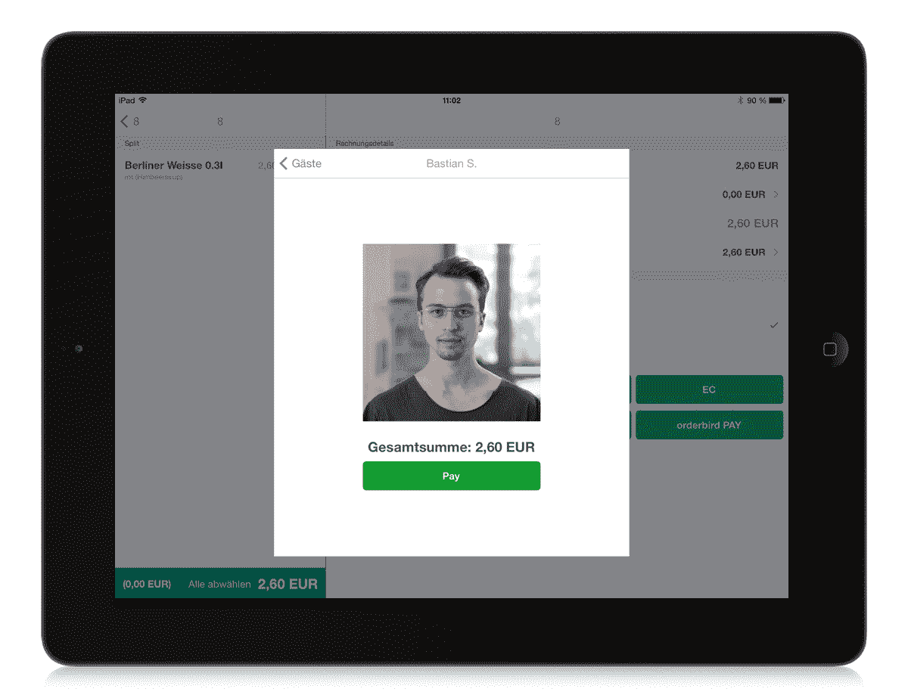

# PayPal 与德国 Orderbird 合作推出手机入住和支付服务 TechCrunch

> 原文：<https://web.archive.org/web/https://techcrunch.com/2013/11/27/paypal-looking-for-more-mobile-business-in-europe-launches-a-check-in-and-payments-service-with-orderbird-in-germany/>

PayPal 一直看好通过利用智能手机日益增长的使用来推动其支付业务，本周该公司[在德国推出了一项服务](https://web.archive.org/web/20221006204122/https://www.paypal.de/blog/berlin-paypal-checkin-pilot-gestartet/)以进一步扩展到欧洲。它正在与柏林的一家初创公司 [Orderbird](https://web.archive.org/web/20221006204122/http://www.orderbird.com/) 合作，为商家提供基于 iPad 的销售点服务，当用户走进参与的商家时，该服务将识别用户，然后使用这些客户资料，让他们自动从他们的 PayPal 账户支付商品和服务。

Orderbird 的首席执行官和创始人 Jakob Schreyer 告诉我，最初的试点将是在柏林的一些咖啡馆和餐馆，以获得更多的用户反馈，消除缺陷，并可能增加更多的功能。(Schreyer 向我描述了一个额外的功能:向用户提供参与餐馆和咖啡馆的“菜单卡”,这样用户可以通过手机预订他们想要的任何东西。)

如果一切顺利，我们的目标是在德国、奥地利和瑞士已经使用 Orderbird 的 1700 家商户中推广其他类型的商户，以及 Orderbird 将在这些国家和其他国家推出的未来客户。他告诉我，首先进入新市场的将是英国，其次是西班牙、法国和爱尔兰。

Orderbird 已经与 PayPal 达成协议有一段时间了——事实上，早在 2012 年 5 月[日](https://web.archive.org/web/20221006204122/https://beta.techcrunch.com/2012/05/02/berlin-based-orderbird-gets-3-5m-for-its-ios-based-restaurant-ordering-solution/)的时候，我写了一篇关于其 350 万美元融资的文章，并问 Schreyer 是否曾与 PayPal 有过交集，因为听起来他们可能会用到它。当时，时间还早，所以他不准备发表任何官方评论。

如果 PayPal 致力于与无缝支付相联系的零售签到的想法听起来很熟悉，那是因为它是:这家易贝所有的支付公司希望将同样的购买流程纳入其 [Beacon 产品](https://web.archive.org/web/20221006204122/https://beta.techcrunch.com/2013/09/09/paypal-debuts-its-newest-hardware-beacon-a-bluetooth-le-enabled-device-for-hands-free-check-ins-and-payments/)——一种硬件(像苹果的 iBeacon 一样)与蓝牙低能耗(BLE)技术一起工作，当客户走进参与的商店、餐厅或其他他们可能购买的空间时，向他们推送警报。

这家初创公司的发言人告诉我，Beacon“目前”还不是 Orderbird 试点项目的一部分。(PayPal 表示，其 Beacon 服务将于 2014 年初开始提供，但还没有具体的国家路线图。)目前，Orderbird 已经将 check-in 集成到其 POS 系统中，这意味着已经使用 Orderbird 的商家将能够使用 PayPal 身份验证和支付服务，而无需购买或集成任何新的 Beacon 技术。如果 Beacon 后来被合并，那么登记过程将会自动进行，并且更加准确。

PayPal 与 Orderbird 合作背后的逻辑是双重的。

首先，PayPal 及其所有者易贝长期以来一直遵循一种模式，即先在特定的本地市场开发服务，然后再在更大范围内发布(注意，PayPal 首批手机值机和支付服务实际上是在澳大利亚的)。其次，PayPal 已经找到了将他们的平台与当地消费者和商家已经在使用的任何东西整合的方法。

拥有 1，700 名客户的 Orderbird 在这两方面都是理所当然的合作伙伴。该公司的移动支付服务 PayPal 在美国、英国、加拿大、澳大利亚、日本和香港上线，但不包括德国。与此同时，作为一个整体，德语国家对易贝来说是一笔大生意。德国是易贝仅次于美国的第二大市场。它是欧洲最大的单一经济体。因此，PayPal 希望建立在这两个事实之上是有道理的(另外，顺便提一下，PayPal 的负责人 David Marcus 是瑞士人)。

然而，与此同时，如果 PayPal 单干，它将不得不从零开始，在德国建立一个有效的移动支付业务。

还有一个问题是他们能给商人提供什么。Gartner [估计](https://web.archive.org/web/20221006204122/http://www.gartner.com/newsroom/id/2504915)移动支付业务在 2013 年是一个 2350 亿美元的机会，但是那些在销售点工作的人发现他们的服务很难达到临界质量。

PayPal、Square、iZettle、Payleven 和其他在移动支付领域竞争的公司的卖点之一是，他们为没有卡系统的商家提供了一种接受卡的方式。但对于成千上万已经接受使用传统系统的卡的人来说，进行转换已经明显不那么令人信服了。

“转换的好处需要对零售商来说足够大，而且足够有趣，让消费者使用它，”Schreyer 指出。这转化为更多的增值商业服务，例如那些与会计系统和菜单相关联的服务，让客户分割支票，接受现金等等——这些服务是 Orderbird 已经创建并向其客户提供的。(这也是促使 Groupon 收购销售点服务 Breadcrumb 并将其整合到自己的移动商务业务中的原因，尽管该服务目前仍仅限于美国。)

据我们所知，PayPal 正在与其他市场的其他潜在本地合作伙伴进行谈判，Orderbird 也在与电子商务领域的其他一些合作伙伴进行谈判——例如，涵盖送货等领域。这表明，随着移动商务领域的不断成熟，我们不仅看到了本地化的不断发展，还看到了服务整合，以增加交易的吸引力，让商家和客户更有兴趣购买。

