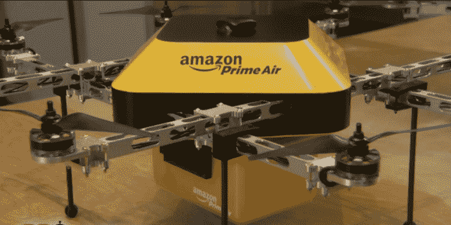

# 亚马逊正在试验自动飞行送货无人机 TechCrunch

> 原文：<https://web.archive.org/web/https://techcrunch.com/2013/12/01/amazon-is-experimenting-with-autonomous-flying-delivery-drones/>

# 亚马逊正在试验自主飞行送货无人机

【YouTube = http://www . YouTube . com/watch？v=98BIu9dpwHU&w=853&h=480]

在发起慈善友好购买计划、宣布周日送货以及为第一波疯狂的假日购物者做准备之间，亚马逊在过去几周一直很忙。但这并没有阻止首席执行官杰夫·贝索斯在《60 分钟》节目中花大量时间与查理·罗斯谈论一些新东西。

《60 分钟》非常乐意用一个片段来戏弄揭幕仪式，贝佐斯带领罗斯走进一个房间，向他展示了一些东西，引起了“哦，我的上帝！”来自资深电视记者。感叹似乎来自一个快乐的地方，而不是担心，但片段刚刚播出，真相是出来了。

那么，众所周知，贝佐斯有什么锦囊妙计呢？[亚马逊 Prime Air](https://web.archive.org/web/20221209005052/http://www.amazon.com/b?node=8037720011) 无人机可能被用作自主送货车辆。听这位首席执行官说，那些电动无人机——或者他称之为“八翼直升机”——可以让送货时间缩短至 30 分钟。自然，这些无人机的尺寸意味着它们可以携带的货物量有严格的上限，但贝佐斯表示，它们可以携带重达 5 磅的包裹往返 10 英里。对亚马逊来说，谢天谢地，这意味着它携带的近 86%的商品可以绑在它的一个空中快递员身上。

只是不要指望很快就能看到他们中的一个来到你的门前。美国联邦航空局仍然没有批准国内无人机(尽管它最近刚刚为这种情况提出了愿景[，这意味着亚马逊能够合法地将 Prime Air 上线的最早时间是 2015 年——贝佐斯说这是一个最乐观的推出窗口。也没有消息表明亚马逊正在与哪家公司(如果有的话)合作开发其无人机舰队，但在现阶段，并不缺少渴望将无人机带入商业世界的玩家。](https://web.archive.org/web/20221209005052/http://www.forbes.com/sites/ryancalo/2013/11/09/the-faas-drone-privacy-plan-actually-pretty-sensible/)

该报告的其余部分并没有对亚马逊的运作提供太多额外的说明，尽管它确实让我们这些凡人更近距离地了解了其庞大的履行中心是如何工作的。它们是惊人的大型效率模型——60 分钟参观的一个是 120 万平方公里。制成工人们将产品包装成包裹的速度非常快。

遗憾的是，由于该片段的拍摄持续了一个月，对于最近 BBC 针对亚马逊英国仓库工作条件可能导致“精神疾病和身体疾病”的报道[没有任何官方回应。](https://web.archive.org/web/20221209005052/http://www.bbc.co.uk/news/business-25034598)

*亚马逊 Air Prime 的更多信息:*

[无人机交付的租赁可能会使所有权过时](https://web.archive.org/web/20221209005052/https://beta.techcrunch.com/2013/12/02/nirvana-brought-to-you-by-robots/)

[我，无人机](https://web.archive.org/web/20221209005052/https://beta.techcrunch.com/2013/12/01/i-drone/)