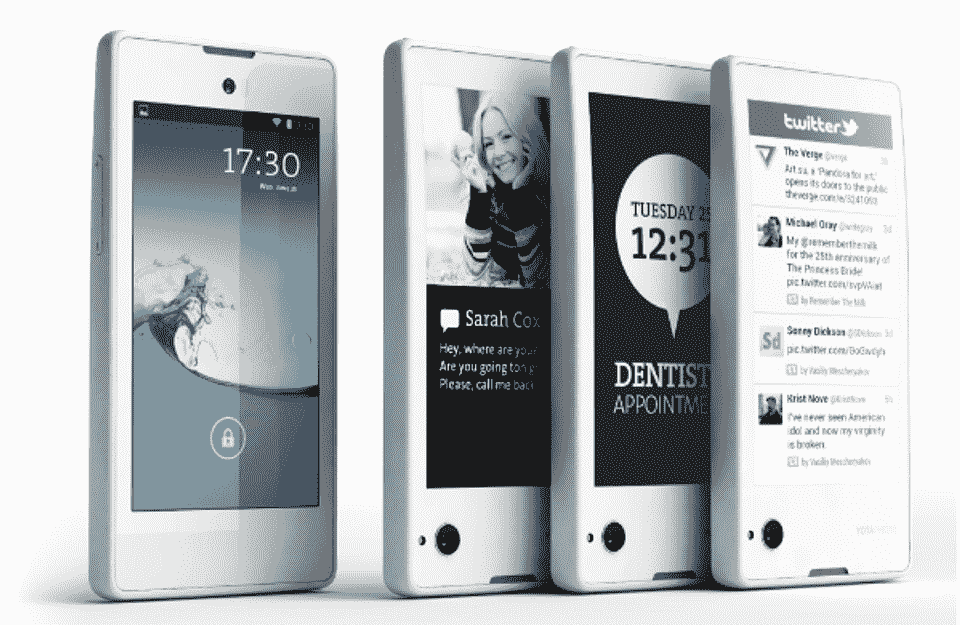

# Android 驱动的双屏 YotaPhone 在俄国及更远的地方为€499 TechCrunch 发布

> 原文：<https://web.archive.org/web/https://techcrunch.com/2013/12/03/yotaphone-official-launch-europe/>

# 安卓驱动的双屏 YotaPhone 在俄国和更远的地方为€499 推出

还记得 [YotaPhone](https://web.archive.org/web/20221226042141/https://techcrunch.com/tag/yotaphone/) 吗？令人愉快的古怪的俄罗斯智能手机，将普通标准的液晶显示屏与 eInk 显示屏配对在一起？几个月来，它一直被取笑，但其背后的公司刚刚在莫斯科的一次新闻发布会上透露了消息:YotaPhone 将于今天在俄罗斯和欧洲推出[，并确定了€499/19，990 的价格标签，这与今年早些时候流传的谣言一致。](https://web.archive.org/web/20221226042141/http://www.yotaphone.com/)

俄罗斯、奥地利、法国、西班牙和德国的智能手机发烧友渴望得到一款有点与众不同的设备，现在他们可以要求拥有自己的 YotaPhones 了，与太设备公司正在努力争取在 2014 年 Q1 奥运会到来之前在欧洲和中东的总共 20 个市场销售这种设备。

令人沮丧的警告:美国没有通过第一轮推广，也没有官方消息表明这种分裂人格的智能手机何时(如果有的话)会出现在美国。

请记住，与太设备公司已经在 YotaPhone 的概念上花了一年多的时间，所以里面滴答作响的组件并不完全是你所见过的最新产品。它有一个 1.7GHz 的双核骁龙 S4 芯片(尽管该公司没有具体说明是哪种型号)，以及 2GB 的内存，4.3 英寸 720p 前置显示屏和一个令人惊讶的小 1800mAh 电池，以保持工作。如果你只是从一张纸上读这些规格，听起来就像你在描述去年的旗舰智能手机(惊喜惊喜)，尽管作为一个整体，该设备仍然有足够的魅力跟上用户的日常工作。

但说真的，我不知道有谁会根据 YotaPhone 的规格表的强度对它虎视眈眈；不过，这场展览的真正明星是安装在 YotaPhone 后端的 4.3 英寸 eInk 显示屏，取代了更传统的背板。将内容放到第二个屏幕上似乎很简单——在正面屏幕上用双指向下滑动会将你正在看的任何内容的截图发送到纸质的背面显示屏上——但只有少数应用程序从一开始就真正为这项任务进行了优化。早期的列表包括一个组织者、一个社交 feed/RSS 阅读器和一个语言学习工具，我们得到消息，与太设备公司将在短期内向好奇的开发人员开放必要的 API。

这些天来，几乎每个原始设备制造商都叫嚣着要提供最时尚、最快、最高分辨率的智能手机，看到一家公司停下来思考一种更智能的方式来增加智能手机的价值，这有点令人耳目一新。当然，这并不是说 YotaPhone 会一夜成名。其发布范围有限意味着手机背后的公司正在失去在至关重要的亚洲和美国市场的牵引力，而且很难否认这款手机散发出的令人难以置信的小众氛围。尽管我很喜欢 YotaPhone，但它几乎肯定不会受到大多数潜在智能手机消费者的欢迎，与太设备公司不可能没有意识到这一点。如果不说别的，该公司选择的道路是一条有趣的之路，在智能手机千篇一律的海洋中，你不能完全忽视一个大胆想法的价值。

想要多一点吗？查看以下活动的现场直播(由 [CNET](https://web.archive.org/web/20221226042141/http://news.cnet.com/8301-1035_3-57614178-94/watch-the-yotaphone-e-ink-smartphone-reveal-live-on-cnet/) 提供):

【YouTube = http://www . YouTube . com/watch？v=rqn4eyqVNEY&w=853&h=480]