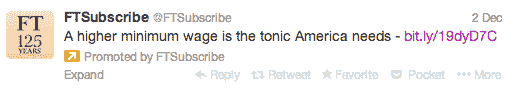
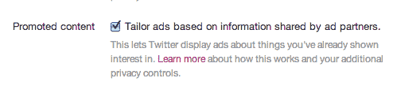

# Twitter 即将正式推出重定向广告[更新:已确认]

> 原文：<https://web.archive.org/web/https://techcrunch.com/2013/12/04/twitter-retargeted-ads/?utm_source=feedburner&utm_medium=feed&utm_campaign=Feed%3A+Techcrunch+%28TechCrunch%29>

消息人士证实，Twitter 准备推出由浏览器 cookies 驱动的重定向广告。Twitter 可能最早于明天宣布这一消息，将重定向广告扩展到 7 月份开始的“实验”阶段之外。Twitter 重新定位的秘诀是将你的账户用作跨设备身份层，允许它根据你在网络上的位置在移动设备上定向广告。**更新**:确认，现在推特[公布了节目](https://web.archive.org/web/20221005222056/https://blog.twitter.com/2013/more-relevant-ads-with-tailored-audiences)。

~~公告的一些细节还不清楚。据说这是一种“软发布”，因为所有的广告商可能不会立即有资格购买广告，他们可能不会向所有用户显示。几乎可以肯定的是，重新定位的推广推特广告将可以购买，尽管还不清楚推广账户是否也可以。我也没有听说 Twitter 是否会[扩展电子邮件地址目标](https://web.archive.org/web/20221005222056/https://beta.techcrunch.com/2013/07/03/twitter-will-soon-start-showing-more-targeted-ads-based-on-user-account-information/)。Twitter 拒绝对此事发表评论。~~

[ **更新** : Twitter 已经[确认了](https://web.archive.org/web/20221005222056/https://blog.twitter.com/2013/more-relevant-ads-with-tailored-audiences)我们的独家新闻，并宣布了[量身定制的受众](https://web.archive.org/web/20221005222056/https://beta.techcrunch.com/2013/12/05/twitter-announces-tailored-audiences-for-ad-retargeting/)——这是重定向广告的名称。通过一系列 adtech 创业合作伙伴，全球所有广告商都可以使用广告技术，广告商将能够通过重新定位的推广推文和推广账户来锁定其网站的新访客。虽然我们敲定了大部分细节，包括推出日期和定制受众如何工作，而不是像我们期望 Twitter 在继续重定向 alpha 计划时那样直接向广告商出售重定向广告，但它将通过合作伙伴 [Adara](https://web.archive.org/web/20221005222056/http://adaramedia.com/) 、 [AdRoll](https://web.archive.org/web/20221005222056/http://features.adroll.com/twitter-retargeting/) 、 [BlueKai](https://web.archive.org/web/20221005222056/http://bluekai.com/) 、 [Chango](https://web.archive.org/web/20221005222056/http://www.chango.com/resources/whitepapers/twitter-tailored-audiences-handbook) 、 [DataXu](https://web.archive.org/web/20221005222056/http://www.dataxu.com/) 、 [Dstillery](https://web.archive.org/web/20221005222056/http://dstillery.com/tailoredaudiences) 、 [Lotame](https://web.archive.org/web/20221005222056/http://lotame.com/) 、[]](https://web.archive.org/web/20221005222056/http://lotame.com/)

Cookie 重定向广告可以确保你在 Twitter 上看到的广告是你真正想要的东西。例如，如果我访问了英国《金融时报》订阅的定价网页，它可能会在稍后用这条推广推文重新定位我，我很可能会点击它，因为我已经在考虑购买订阅。

起初，Twitter 可能会继续与广告商直接合作，就像今年夏天在小规模的[重新定位阿尔法项目](https://web.archive.org/web/20221005222056/https://beta.techcrunch.com/2013/07/03/twitter-will-soon-start-showing-more-targeted-ads-based-on-user-account-information/)中所做的那样。但最终它可能会从被称为需求侧平台的重新定位专家那里获得帮助，这些专家可以出售其广告并处理实时投标过程。它可能挖掘的广告技术初创公司包括 [TellApart](https://web.archive.org/web/20221005222056/http://www.crunchbase.com/company/tellapart) 、 [AdRoll](https://web.archive.org/web/20221005222056/http://www.crunchbase.com/company/adroll-semantic-sugar-inc) 和 [Triggit](https://web.archive.org/web/20221005222056/http://www.crunchbase.com/company/triggit) 。这些是脸书在 2012 年 6 月推出其重新定位的广告交易所 FBX 时合作过的一些合作伙伴。

但是 Twitter 正在向脸书一直小心翼翼的东西发起冲击。Twitter 将目标转移到了手机上。

## 没有饼干，没问题

Twitter 的用户是手机用户。其 70%的广告收入已经来自小屏幕，这可能意味着大部分参与也是在移动设备上。这意味着，要真正推动销售，使收入超过 2013 年第三季度的 1.69 亿美元，新的广告产品必须在移动设备上发挥作用。

从历史上看，重定向在移动设备上并不奏效。这是因为手机和平板电脑不会像笔记本电脑和台式机那样保存你访问过哪些网站的痕迹。

通常，重定目标是这样发生的。你访问一个网站，比如说一个旅游预订网站，然后查看一个购买去夏威夷航班的页面。你在最后一刻临阵退缩，没有购买，并导航离开，但该网站已经在你的浏览器上放了一个夏威夷航班页面的 cookie。然后，当你访问其他运行重定向广告的网站或社交网络时，它们会检测到该 cookie，旅游网站会向你显示一则广告，上面写着“旧金山很冷。去夏威夷度假不是很好吗？”试图让你扣动扳机，买下你已经感兴趣的航班。

但是如果移动设备上没有 cookies，你就不能在那里重新定位…

…除非您能够将移动用户的身份与他们在计算机上所做的事情联系起来。而 Twitter 可以。这是少数几个非常受欢迎的服务之一，个人可以从多种类型的设备上访问。

我们的消息来源称，为广告创建这个统一的身份层是 Twitter 能够在移动设备上显示重定向广告的关键。本质上，当你在全尺寸电脑上登录你的账户时，Twitter 将分析你浏览器中的 cookies，以查看你在非移动网络上的位置。然后，当你在移动设备上登录同一个帐户时，它仍然可以使用你的网络 cookies 向你发送重定向广告。

正如重定向广告初创公司 [Triggit](https://web.archive.org/web/20221005222056/http://www.triggit.com/) 的首席执行官扎克·科利厄斯告诉我的，“Twitter 处于一个独特的位置，因为人们同时通过网络和电话登录。这真的很重要，因为手机没有设置 cookies 的能力，所以你不能重新定位。(Twitter 的方法)给了它一个巨大的优势，使他们能够在手机上提供相关的定向广告。”

相关广告带来点击量，从而为 Twitter 带来收入。这种“相关性”也可能被一些隐私爱好者视为“令人毛骨悚然”。去年，当戈库尔·拉贾拉姆(Gokul Rajaram)还是脸书广告公司的负责人时，我与他交谈时，他说脸书希望在将该项目扩展到移动设备或将其与脸书的标准传记定位功能结合之前，确保它能够处理好重新定位的隐私问题。脸书直到最近才开始允许在手机上播放重定向广告，而且只能通过与 FBX 不同的[“定制受众”](https://web.archive.org/web/20221005222056/https://www.facebook.com/facebookforbusiness/news/custom-audiences)定向项目。

幸运的是，人们在 Twitter 上做的大多数事情都是公开的，所以它不会引发像脸书那样的隐私问题。Twitter 还在其安全和隐私设置页面上的[推广内容下提供了一个退出重定向的选项。另外，对于在浏览器中启用了](https://web.archive.org/web/20221005222056/https://twitter.com/settings/security)[的用户，它不会跟踪](https://web.archive.org/web/20221005222056/https://support.twitter.com/articles/20169453%20)。事实上，Twitter 对广告隐私的处理受到了 EFF 的称赞。

## 有意图的推特

重新定位是 Twitter 寻求成为广告巨头并验证其 43.69 美元股价提出的 238 亿美元估值的重要垫脚石。9 月，它以 3.5 亿美元收购了移动广告网络 MoPub。它最近还开放了[关键词定位](https://web.archive.org/web/20221005222056/https://beta.techcrunch.com/2013/04/17/advertisers-can-now-target-twitter-users-by-keywords-from-their-tweets/)，这样广告商就可以接触到那些在推特上发布过某些词的人。

在关键词定位和 cookie 重定向之间，Twitter 正在突破需求挖掘，进入谷歌搜索广告业务所在的广告漏斗中利润丰厚的需求满足部分。如果你能给广告商提供愿意购买他们产品的人，他们愿意出高价。没有什么比最近访问过一个网站并几乎已经完成购买更好的迹象了。对 Twitter 来说，饼干可能非常美味。

*【图片鸣谢:[Flickr/goaliej 54](https://web.archive.org/web/20221005222056/http://www.flickr.com/photos/goaliej54/6374031629/)*