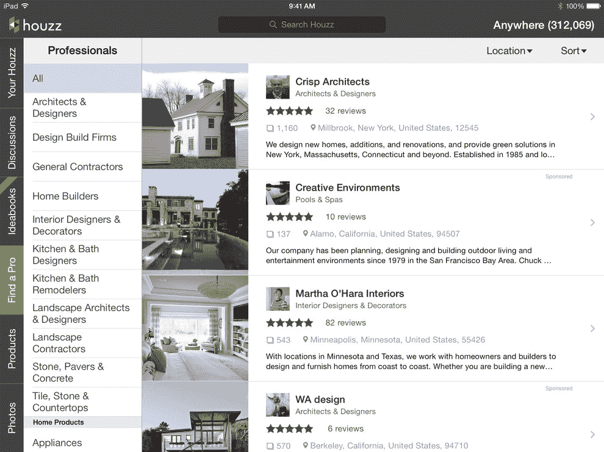
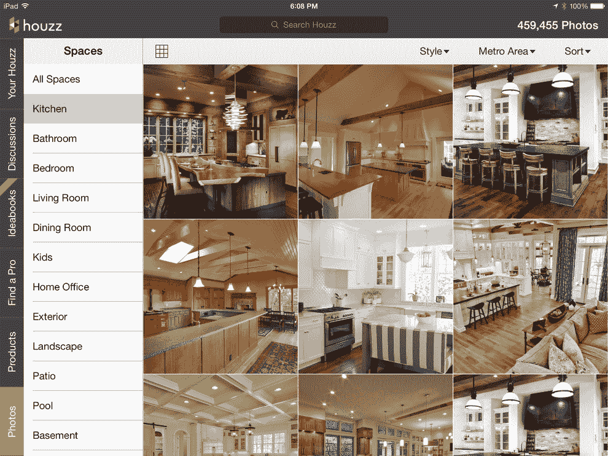

# 经过 1200 万次下载后，Houzz 发布了重新设计的 iOS 应用程序，全屏显示图像，导航更方便

> 原文：<https://web.archive.org/web/https://techcrunch.com/2013/12/05/after-12m-downloads-houzz-launches-redesigned-ios-app-with-full-screen-images-easier-navigation/>

广受欢迎的家居改造和设计在线平台 Houzz ，今天为 [iPhone 和 iPad】发布了一款完全重新设计的 iOS 应用。新版本具有符合苹果 iOS 7 设计准则的更新外观和感觉，但也改进了导航，支持隔空投送，并强调全屏照片。](www.AppStore.com/Houzz)

正如 Houzz 的总裁兼联合创始人阿龙·科恩(Alon Cohen)告诉我的，该团队考虑在推出 iOS 7 后迅速发布一个新版本。然而，最后, Houzz 决定克制自己，在 iOS 上改用新的扁平化设计语言，让这款应用不仅仅是改头换面。

“iOS 7 出现了，我们可以选择要么只是快速更新，要么利用这个机会彻底改造用户界面，支持 iOS 7 的一些特定功能，”他告诉我。这意味着该应用程序现在具有许多 iOS 7 引入的新图形效果，例如，利用了动态类型和更新后的操作系统中相对较少使用的新隔空投送功能。

科恩对隔空投送的功能尤其兴奋。例如，现在这允许瓷砖展厅中的某人快速与那里的设计师分享来自 Houzz 的图像(或任何其他东西)，这在以前有点麻烦。

然而，正如他强调的那样，像 Houzz 这样受欢迎的应用程序，现在已经达到了 1200 万次下载，每月传输超过 600 的数据，必须确保不会因为过于激进的更新而疏远用户。科恩说:“我们已经看到我们的移动应用程序得到了令人难以置信的采用，55%的用户通过移动设备用 Houzz 改造了他们的房子，”该团队显然不想用糟糕的重新设计来扰乱这些用户。不过，新版本无疑简化了导航，而且增加了全屏图像，必要时还会几乎完全隐藏。

不过，该团队做出了另一项重大改变。科恩告诉我，在新的应用程序中，导航的重点发生了变化。现在团队已经尝试把内容放在导航之前。例如，这意味着你在浏览应用程序时不必先选择房间。相反，你先看图片，然后根据房间、风格和位置缩小选择范围。

科恩还指出，在新的设计中，找到承包商、设计师、园艺师和其他专业人士的评论变得更加容易。这项服务目前在网站上有超过 30 万名专业人士，他们上传了超过 240 万张照片。对于 Houzz 来说，这也是一个主要的收入来源，因为许多专业人士都注册了其付费的[专业+服务](https://web.archive.org/web/20230403113125/https://techcrunch.com/2013/03/12/houzz-launches-new-analytics-tool/)，为特定领域的用户突出他们的工作。

