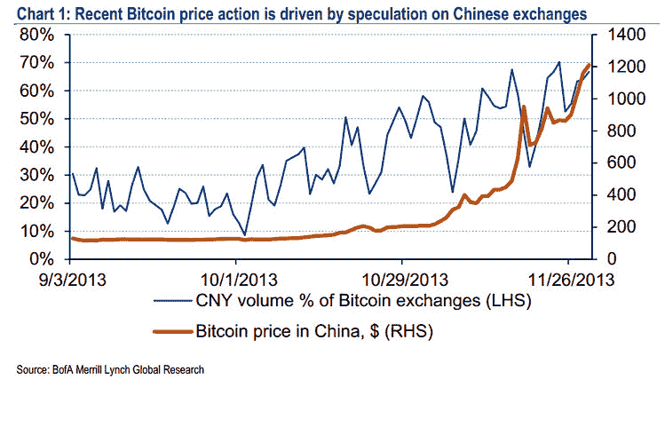
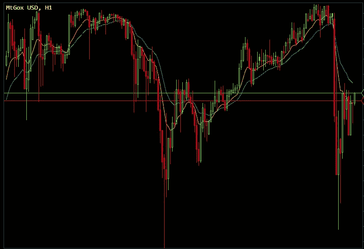

# 在中国的禁令、美国银行的评论和格林斯潘的嘲讽之后，比特币回到了 1000 美元以上

> 原文：<https://web.archive.org/web/http://techcrunch.com/2013/12/05/bitcoin-back-over-1k-after-chinese-ban-bofa-comments-and-greenspan-mockery/>

# 在中国的禁令、美国银行的评论和格林斯潘的嘲笑之后，比特币重返 1000 多美元

对于比特币来说，这是艰难的一天。中国对它下了禁令，美国银行说它“有超出基本面的风险”，声称它没有什么短期上升空间，艾伦·格林斯潘对此一笑置之。作为回应，这种加密货币的投资者将其价格降至 900 美元以下。

受到追随者无尽乐观情绪的鼓舞，比特币在 Mt.Gox 交易所很快反弹至 1000 美元大关。市场动荡也打击了竞争对手的硬币，包括莱特币，其交易区间[放宽了 25%](https://web.archive.org/web/20230320001651/https://btc-e.com/exchange/ltc_usd)。

艾伦·格林斯潘(Alan Greenspan)最近嘲笑了比特币的价值，这在一定程度上加剧了比特币的困境:“你真的必须发挥想象力，才能推断出比特币的内在价值。我没能做到。但如果你问我，‘这是比特币的泡沫吗？’对，是泡沫。《T2 独立报》指出，当被问及比特币是否是新的黄金时，格林斯潘笑出声来。"

因此，这并不是一个非理性繁荣的时代。

中国禁止其银行在任何交易中使用比特币的举措可能会极大地阻碍其增长能力。正如美银美林全球研究最近(通过[巴伦的](https://web.archive.org/web/20230320001651/http://blogs.barrons.com/focusonfunds/2013/12/05/bofa-bitcoin-has-clear-potential-but-limited-upside-fair-value-seen-as-1300/))报告的那样，中国比特币交易量已经成为总交易量的绝大多数:

如果禁止中资银行交易比特币的举措降低了比特币的潜在交易量和内在效用，比特币的价格可能会下调。

然而，就目前而言，比特币仍顽固地停留在 1000 美元关口上方，似乎已经找到了一个舒适的底部。这是一个小时图，显示了最近的下跌和回升:

比特币的公允价值是多少？你告诉我。

*顶级图片致谢:[Flickr](https://web.archive.org/web/20230320001651/http://www.flickr.com/photos/thegrid-ch/)*