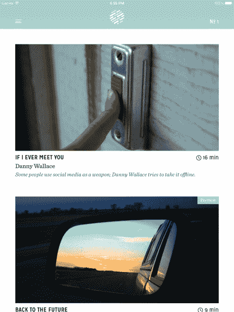
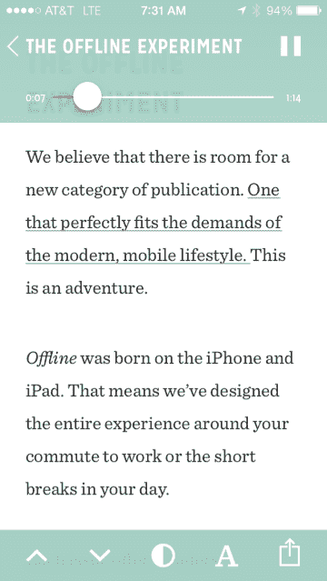
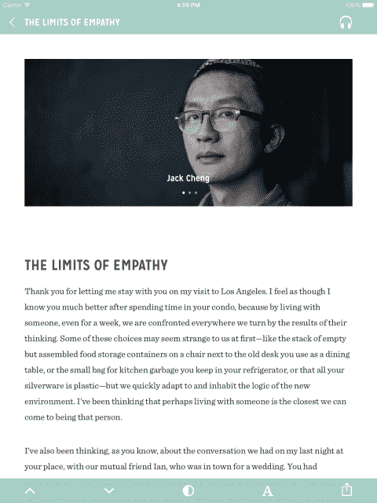

# 离线，一种新的 iOS 出版物，融合了文本、音频和作者授权技术

> 原文：<https://web.archive.org/web/https://techcrunch.com/2013/12/05/offline-blends-text-audio-and-writer-empowerment-to-create-new-kind-of-ios-publication/>

线下是苹果在 iOS 上的报摊发布的新版本，由来自《纽约时报》、《听觉》、《Instagram》、《黑莓》和苹果本身的开发人员和设计人员组成。

线下杂志与 iOS 上的许多其他杂志有几个非常重要的不同之处。首先，它提供了故事的文本版本和专业制作的音频，你可以在文章的任何地方听。它还拥有独特的成本结构，团队希望这能让它支付 2-3 倍于普通自由撰稿人的稿费。

每月一小时的广泛针对性内容，重点是发现和求知欲。这就是联合创始人汤姆·史密斯所说的线下专注于提供的。他把这些内容比作你在《纽约客》或者 TED 的早期所发现的，在那里，发现有趣的东西——在任何话题上——都是对观看的奖励。

过去十年的大部分时间，史密斯都在苹果公司的各种分析岗位上埋头苦干，从 iPhone 发布团队到运营部、R&D、Siri 和 Maps 部门。史密斯于 8 月离开苹果，开始离线工作。他说，他和联合创始人布拉德·弗劳格组建的团队有一个专注于作家授权的可执行产品。

当开发者兼出版商 Marco Arment [推出他的 iOS 应用 Magazine](https://web.archive.org/web/20221003184911/http://thenextweb.com/media/2012/10/11/instapaper-creator-marco-arment-launches-the-magazine-a-different-kind-of-periodical-for-apples-newsstand/) 时，我与他交谈时，他的一个很大的希望是，他能够向投稿人支付比许多自由撰稿人要求的高得多的费用。Arment 卖掉了杂志，但它的新主人 Glenn Fleishman 继续为文章支付高薪。

史密斯说《离线》将继续这种方式，为它的 5 篇月度文章支付可观的费用。支付比例将基于给每个作家 10%的应用程序收入。史密斯说，他希望最终以这种方式为一篇文章支付高达 5000-10000 美元，远高于行业平均水平每字 0.50-2.00 美元。这些文章通常在 1000 字左右，尽管有些较长，有些较短。

线下的作品最初都来自拥有大量在线追随者的作家和名人。因为文章的费用是以收入百分比的形式支付的，所以那些贡献者有动机尽可能多地推广应用程序。这种“观众口碑”正是史密斯最初传播这款应用的原因。老实说，我想还有像这样的作品。

最初的应用程序包括作家丹尼·华莱士、前 NYTimes.com 设计总监 Khoi Vinh、作家郑祖杰、@seinfeldtoday 创作者和喜剧演员乔希·冈德尔曼以及无麸质生活方式作家肖娜·埃亨的文章。

尽管最近苹果对待报刊亭的态度令人悲观，但史密斯仍然押注于这一类别。“这是为杂志和期刊内容服务的完美构建，”史密斯说。他设想线下和其他努力，如杂志和循环杂志一起建立平台。他补充道:“(报刊亭)表现不佳的程度令人瞩目。”。

不过，史密斯称苹果允许用户将报刊亭放入文件夹的决定“令人失望”。但是，他说，苹果仍然在 App Store 上大力推广报摊内容。

该杂志为《离线》提供了部分灵感，史密斯呼应了其中的一些原则。一个专门构建的应用程序，专门用于在设备上提供内容，而不模仿印刷媒体的外观或感觉。正如我所见过的数字杂志的最好例子一样，离线杂志几乎没有修饰，当然它也不是一个简单的杂志页面扫描 pdf 的“浏览器”。

离线应用程序本身很漂亮，排版很棒，界面友好但不霸道。字幕功能是“点击播放”，它允许你点击文本中的任何一句话来切换到文章的音频记录。该应用程序还可以通过一个简单的仪表来跟踪你的阅读进度，如果你切换回来，它会同步你的阅读和听力。

我在健身房开始阅读《离线》的创刊号，当我上车时就把它放在口袋里——在回家的路上通过音频读完了第一篇文章。这正是史密斯所说的可以帮助人们完成一个月一小时工作的情景。你不需要依靠你的眼睛或耳朵来完成一篇文章，你只是用你想要的方式来理解它。

音频内容非常棒。这是专业解说，不是机器翻译。在适当的时候，文章以类似于现代有声书或广播剧的方式用音频效果来修饰。当需要直截了当的叙述时，简单的音乐介绍会引导你进入和退出。

随着时间的推移，线下将会平衡拥有大量社会追随者的作家和那些在网上不太活跃的作家。第二期已经包装好了，将会有不同于第一期的作家组合。

在过去的一年里，我在杂志、The Loop 和 now Offline 等专门出版物上读到的高质量文章比我在任何传统出版物上读到的都多——无论它们是纸质出版物还是“转换”到 iPad 上的。平衡内容将是离线成功的关键。将智力探索与喜剧和悲情一起呈现，强调质量，似乎是一个好方法。

每期 0.99 美元，包含 5 篇文章。第一期已经出版，有一篇免费的预览文章。