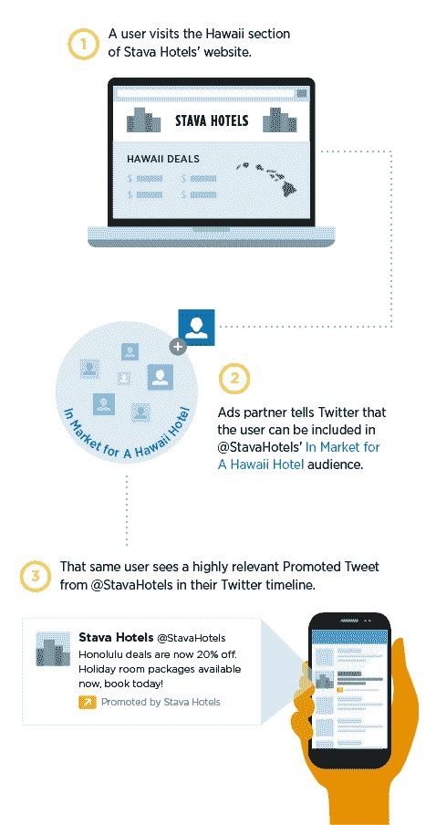

# Twitter 宣布为广告重新定位“量身定制的受众”TechCrunch

> 原文：<https://web.archive.org/web/https://techcrunch.com/2013/12/05/twitter-announces-tailored-audiences-for-ad-retargeting/>

# Twitter 宣布为广告重新定位“量身定制的受众”

Twitter 刚刚发布了一篇博客文章，宣布了一项面向广告商的新产品，名为“量身定制的受众”。基本上，这证实了 [TechCrunch 的 Josh Constine 昨天](https://web.archive.org/web/20221006043828/https://beta.techcrunch.com/2013/12/04/twitter-retargeted-ads/)的报道，称 Twitter 即将正式推出其重新定位产品。

早在 6 月份，Twitter 表示，它正在启动一项实验性的重新定位计划。现在，该公司表示，它可以在全球范围内使用。目前，企业的想法是在 Twitter 上针对那些也访问过他们网站的用户投放广告。Twitter 写道，该计划可以扩大:“我们相信还有许多其他的可能性。你可以把它看作是定义你自己的现有和目标客户群体的方式，并在 Twitter 上与他们联系。”

脸书已经通过其 FBX 项目成功地实现了重新定位，但 Twitter 可能对广告特别有吸引力，因为它可以将重新定位带到移动领域。(该公司的博客帖子没有特别提到移动设备，但正如你可以看到我粘贴在下面的解释性图形，这显然是它的想法。)正如乔希所写，由于没有 cookies，重新定位在移动设备上是一个挑战，但人们经常在电脑和智能手机上使用他们的 Twitter 账户，因此该公司可以“将移动用户的身份与他们在电脑上做的事情联系起来。”

Twitter 的博客帖子还包括一些关于早期广告客户活动的统计数据。例如，营销软件公司 HubSpot 表示，他们的参与度比历史平均水平提高了 45%，体育视频分析公司 Krossover 表示，每位客户的购买成本降低了 74%，应用管理公司 New Relic 表示，转化率提高了 195%。

在隐私方面，Twitter 表示，用户可以通过取消选中设置中的“推广内容”框来选择不参与。该公司还表示，如果用户在其浏览器中启用了“请勿追踪”，它将不会接收用于这种重新定位的基于浏览器的 cookie 数据。

我们之前曾表示，Twitter 可能会直接与广告商合作进行重定向，但实际上，Twitter 表示，广告商应该与众多合作伙伴之一合作，包括 Adara、AdRoll、BlueKai、Chango、DataXu、Dstillery、Lotame、Quantcast、ValueClick 和[x+1]。

