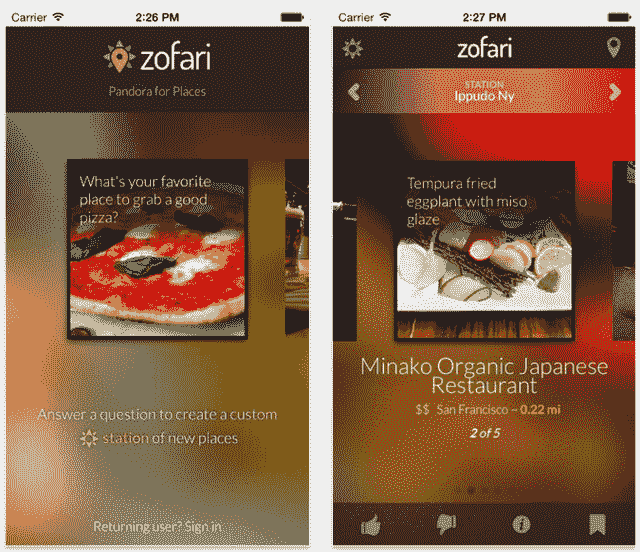

# 佐法里在 iPhone 和 Android TechCrunch 上推出了“Pandora For Places”

> 原文：<https://web.archive.org/web/http://techcrunch.com/2013/12/09/zofari-debuts-a-pandora-for-places-on-iphone-android/>

一些本地推荐应用会告诉你可以去哪里吃饭、用餐或娱乐，比如根据距离、价格或用户评论等因素进行评级。其他的目的是提供更个性化的体验，根据你自己的兴趣帮助你找到你真正想去的地方。 [Zofari](https://web.archive.org/web/20230209132032/http://www.zofari.com/) ，一家新公司，试图建立一个被描述为“地方的潘多拉星球”，就属于后一类。

这家总部位于旧金山的初创公司由前谷歌/YouTube 营销经理内特·温斯坦和老朋友杰森·科比尔卡创立。

温斯坦在美国境外旅行了一段时间后，带着一本无用的指南和寻找他喜欢去的地方的愿望，想到了 Zofari 的想法。“如果我有一个我喜欢的地方，我能利用它找到我喜欢的其他地方吗？，”他思忖着。这个问题导致了后来的佐法里。

该应用在今年早些时候首次推出时，更像是一个用于一次性旅游搜索的基本 alpha 项目。在最初的测试阶段，团队意识到人们很难理解这款应用的工作原理和用途。温斯坦已经自学了如何编写代码来帮助创建 Zofari，他承认后端当时并没有那么好。

为了继续前进，该团队向朋友和家人筹集了少量资金(15 万美元)，这使他们能够雇用更好的工程人才。这是一个明智的举动，因为新的应用程序现在有了更专业的外观和润色。

今天的 Zofari 是从零开始建立的，但它的核心思想仍然是一样的——你可以使用一个你已经喜欢的地方来开始一系列新地方的建议。

为了提出建议并构建这个所谓的“城市基因组”，Zofari 结合了公共数据和从 Factual 和 Foursquare 等第三方来源获得许可的数据。它的算法寻找表明不同地点之间相似性的信号，如附近的人口统计数据、平均租金、商业密度、附近有什么样的其他商业机构(美术馆？潜水酒吧？)，等等，此外还有更传统的数据，比如菜单价格。

温斯坦解释说， 的想法是试图确定一个地方有什么样的“氛围”。这个地方更放荡不羁还是更奢华？通过这种数据分析还可以确定哪些无形资产？

推荐引擎仍处于早期阶段，因为这些信号及其对位置建议的影响仍在微调中。

但是有一点 Zofari 没有考虑到，那就是社交数据——也就是你的朋友喜欢什么。温斯坦说，你的朋友不一定和你有相同的兴趣。

对于最终用户来说，使用 Zofari 的体验现在更容易理解了，这要感谢 Pandora 的类比。首先，你只需回答其中一个提示，比如“你最喜欢在哪里吃到美味的披萨？”或者“最喜欢约会的地方？”佐法里还给出了一些其他的想法供你尝试。根据你所在的位置和特定的口味，你可能会发现佐法里的推荐不是成功就是失败。

目前，该应用程序在纽约、芝加哥、波士顿、旧金山和洛杉矶等主要大都市地区的覆盖范围较好，更多地区正在开发中。与此同时，全美各地的任何人都可以享受这种轻量级体验。

当你翻阅你的建议时，你可以给他们一个“赞成”或“反对”来完善你的位置站。目前，Zofari 更加强调吃饭的地方，因为许多默认提示都集中在餐饮上，而不是娱乐场所。但佐法里开始尝试引入音乐活动，这些活动可以在社区详情页面上找到。在这里，它试图将你与新城市的社区推荐联系起来，基于你今天居住的地方你喜欢的社区。这是大多数推荐应用不具备的。他们会推荐一家餐馆，但不是你想进一步探索的城市的某个特定部分。

Zofari 与 Yelp、Foursquare、Google Places 等其他位置推荐应用和服务以及推荐应用 [Ness](https://web.archive.org/web/20230209132032/http://www.likeness.com/) 等更年轻的初创公司竞争。它与谷歌[于 2011 年收购的推荐应用 Alfred 也有一些相似之处。](https://web.archive.org/web/20230209132032/https://techcrunch.com/2011/12/13/google-acquires-clever-sense-creator-of-local-recommendations-app-alfred/)

现在是一个五人团队，新的 Zofari 移动应用程序刚刚在上周推出了新版本。( [iTunes](https://web.archive.org/web/20230209132032/https://itunes.apple.com/us/app/zofari-city-guides/id647920963?ls=1&mt=8) / [安卓](https://web.archive.org/web/20230209132032/https://play.google.com/store/apps/details?id=com.zofari.android.app&hl=en))。该公司在很大程度上仍是自力更生，但明年将考虑筹集额外资金。

*【图片鸣谢:Shutterstock】*