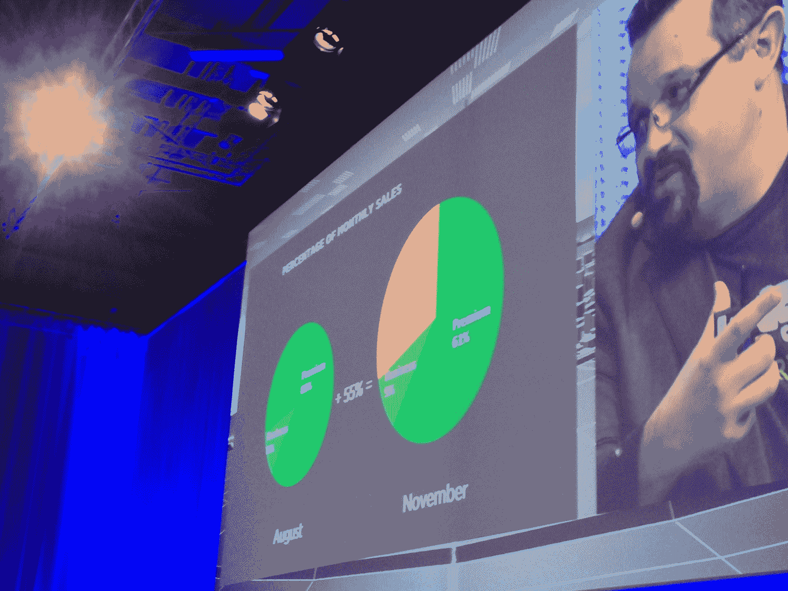
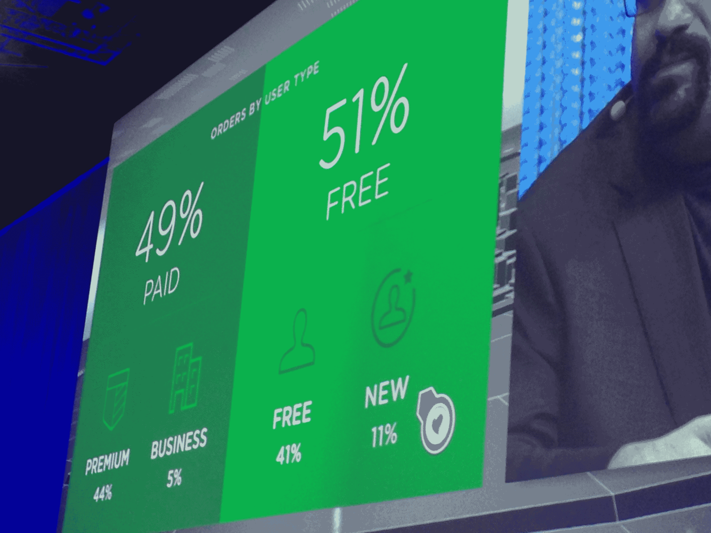

# Evernote 的实体商品市场现在占其月销售额的 30%

> 原文：<https://web.archive.org/web/http://techcrunch.com/2013/12/10/evernotes-market-for-physical-goods-now-accounts-for-30-of-its-monthly-sales/?utm_source=dlvr.it&utm_medium=twitter>

# Evernote 的实体商品市场现在占其月销售额的 30%

Evernote 的首席执行官 Phil Libin 今天在巴黎的 [LeWeb](https://web.archive.org/web/20230129232048/http://leweb.net/) 上披露了该公司的一些最新收入数据。他说，虽然 Evernote 用了大约 16 个月的时间通过其免费增值模式实现了第一个 100 万美元的销售额，但 Evernote 业务花了 5 个月的时间，而[于今年 9 月](https://web.archive.org/web/20230129232048/https://techcrunch.com/2013/09/26/evernote-market/)推出的 [Evernote Market](https://web.archive.org/web/20230129232048/https://www.evernote.com/market) 只用了一个月的时间。

Libin 说，在市场推出后，该公司开始很难保持许多商品的库存。市场为用户提供从便利贴到 Evernote 品牌的袜子和背包的一切商品。然而，对他来说，市场不仅仅是一个销售业务，而是一种主流产品。商店里卖得最好的是背包、 Scansnap Evernote 扫描仪 和 Jot Script 手写笔。他们总共占 Evernote 市场销售额的 30%,而市场本身现在占 Evernote 月销售额的 30%。

在推出之前，premium 占其销售额的 89%，Evernote 业务占其销售额的 11%。现在它们分别占销售额的 61%和 9%。

他说，这里的想法是，这些不同的业务是相互加强的。事实上，11%的市场用户还不是 Evernote 的用户。用户只需将他们的朋友推荐到市场上，这样他们也可以购买 Evernote 背包。同样值得注意的是，Evernote 51%的市场销售额来自其免费用户(占其用户的绝大多数)。虽然该公司的投资者经常告诉李斌，有很多用户使用免费服务而没有升级到付费版本，但他认为市场现在验证了这种模式，因为这些免费用户现在正成为一些公司最有价值的客户。

至于经常谈论 Evernote 上市，利宾指出，他并不急于这样做。他认为该公司还需要几年时间才能上市，但他认为，如果人们相信它能够存储所有这些信息，他们也应该能够拥有一部分信息。