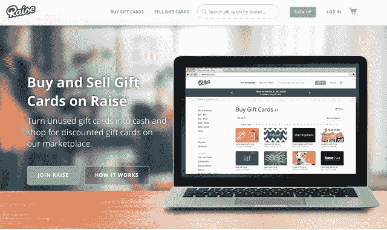
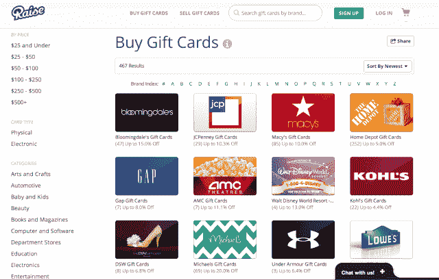

# 礼品卡市场 Raise 获得了 1810 万美元的新资金 TechCrunch

> 原文：<https://web.archive.org/web/https://techcrunch.com/2013/12/11/gift-card-marketplace-raise-com-gives-itself-a-raise-with-18-1-million-in-new-funding/>

根据[提交给 SEC 的一份新文件](https://web.archive.org/web/20230130230924/http://www.sec.gov/Archives/edgar/data/1561175/000156117513000003/xslFormDX01/primary_doc.xml)，总部位于芝加哥的[Raise.com](https://web.archive.org/web/20230130230924/http://www.raise.com/)，一个消费者可以用现金买卖礼品卡的市场，已经筹集了 1810 万美元的资金。该公司拒绝评论谁在最新一轮投资中投资，但我们被告知，在早期的种子和天使轮中已经筹集了 450 万美元。

文件没有披露投资者阵容，只列出了 Raise.com 创始人乔治·鲍西斯和董事会成员[杰森·普利兹克](https://web.archive.org/web/20230130230924/http://www.crunchbase.com/person/jason-pritzker) (Yapmo 创始人)和[杰夫·坎塔卢波](https://web.archive.org/web/20230130230924/http://www.crunchbase.com/person/jeff-cantalupo)(Listen.co 创始人兼首席执行官)。AngelList 展示了 Raise.com 的几轮种子融资，并透露 Apex Venture Partners 的 Lon Chow 是优先投资者。

Raise.com 是芝加哥地区发展最快的创业公司之一。虽然我们今天能够联系到创始人乔治·布西斯(George Bousis)确认加薪，但该公司在披露融资细节时更愿意保持低调，而是希望只专注于发展其盈利业务。

Raise.com 本身是从芝加哥的 CouponTrade派生出来的，coupon trade 是一家优惠券和交易网站，由鲍西斯和联合创始人布拉德利·沃兹于 2010 年创立。今年 2 月，这项业务的礼品卡部分变成了现在众所周知的 Raise.com，这是该公司花了几个月才获得的域名。

“从消费者的角度来看，理解礼品卡、优惠券和交易是如何结合在一起的，这成了一个挑战，”Bousis 说。他说:“我们基本上认定，因为我们的座右铭是‘给自己加薪’，所以这家专注于礼品卡的新公司最自然的名字应该是‘加薪’本身。”

大约两年半前，这家公司在 Bousis 的客厅里成立，头六个月与他的 iPhone 保持联系。如今，它已经发展到拥有 50 多名全职员工，并且正在大举招聘。

它的目标是规模庞大(1150 亿美元)的美国礼品卡行业，每年约有 20%的礼品卡价值未被使用。此外，还有大约 2000 亿美元的商品信用来自商店退货，这是 Raise.com 可以买卖的另一种货币。

## Raise.com 是如何运作的

如今，该公司为折扣礼品卡、电子礼品卡和商店信用提供了一个点对点市场，从沃尔玛、塔吉特或全食超市等日常零售商到 路易威登、内曼·马库斯或古驰等高端品牌。该网站目前为 500 多家商店提供折扣。

“人们可以期望在日常购买各种品牌的商品时节省 5%到 40%甚至更多，”鲍西斯说。“我们希望人们在任何一家商店消费之前，都考虑一下分期付款购物。从情感上来说，我们希望他们在使用我们的网站时，总是感觉自己得到了提升，”他补充道。

在该网站上，用户可以购买礼品卡，或出售他们已经拥有的现金，包括实体卡、电子礼品卡和最低余额为 10 美元的商品信用。这些卡甚至可以部分使用，不需要有一个平衡的余额才能上市。

首先，经过验证的卖家只需创建一个帐户，输入所需的信息，如零售商、序列号和 PIN。对于每笔销售，Raise.com 收取 15%的固定佣金，对于每笔实体礼品卡销售，他们收取额外的 1 美元。实体礼品卡占该公司销售额的 10%左右。该网站将涵盖运输和处理费用，并根据需要提供预付运输标签。卖家然后按照规定通过支票或贝宝支付。买家和卖家都受到 100%退款保证的保护。

该公司鼓励卖家将其卡打折至少 5%，但实际价格由卖家决定，只要不超过礼品卡的价值。正在开发的是一个礼品卡定价工具，它将计算最佳价格，以及一种通过可扫描的条形码访问您购买的礼品卡的方法，您可以通过智能手机向收银员展示该条形码。

由于购买这些礼品卡没有销售税、运费或手续费，所以对于精明的购物者来说，在 Raise.com 上购买礼品卡就像是免费的。这使得该网站受到许多优惠券博主的欢迎，例如著名的[南方储蓄者](https://web.archive.org/web/20230130230924/http://www.southernsavers.com/2013/02/raise-com-discount-gift-cards-5-off-50/)和 [Hip2Save](https://web.archive.org/web/20230130230924/http://hip2save.com/2013/03/21/raise-com-sell-unusedunwanted-gift-cards-for-cash-buy-discounted-gift-cards-to-save-big/) ，他们在最近几个月吹捧了该网站。

该公司将把额外的资金用于增长、营销和广告以及招聘——目前每周增加约三名员工。但 Raise.com 还没有准备好走向国际，因为它想首先确保美国市场。

【Raise.com】【图片鸣谢:T4；Flickr/ [401K 计算器](https://web.archive.org/web/20230130230924/http://401kcalculator.org/)