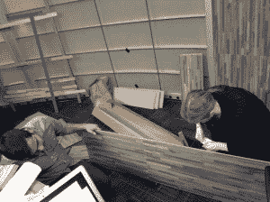
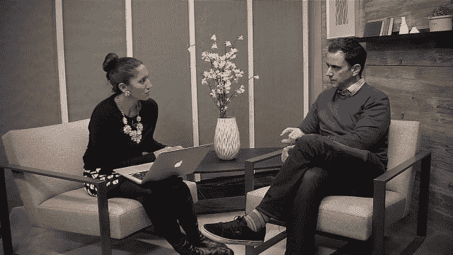
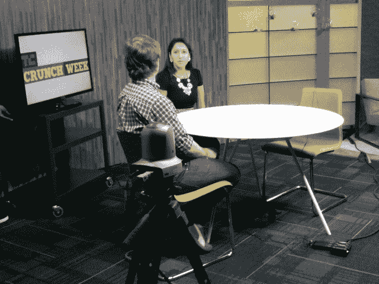
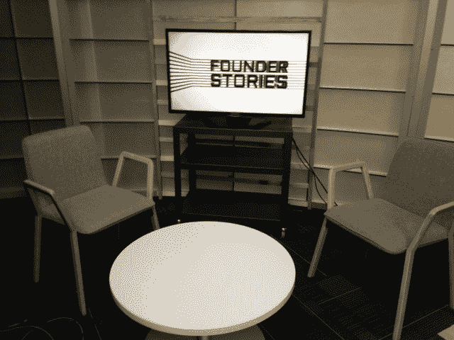
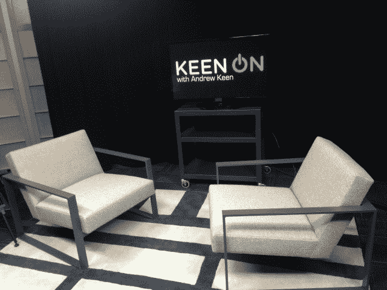

# 电视告别蓝色背景

> 原文：<https://web.archive.org/web/https://techcrunch.com/2013/12/12/techcrunch-tvs-goodbye-to-the-blue-background/>

# TechCrunch 电视告别蓝色背景

众所周知，许多观众已经厌倦了 TechCrunch 电视视频中的蓝色气泡背景(它运行良好，但近三年后，我们也厌倦了。)因此，在感恩节假期，TechCrunch 电视团队拿起一些锤子、锯子和胶枪，给我们简陋的工作室做了一次 DIY 时尚改造。

我们的主要目标是更新我们的布景，使之更加整洁和现代。我们还想给每个节目一个独特的风格和外观，这样忠实的观众可以立即看出一集[问一个风投](https://web.archive.org/web/20221007233822/https://beta.techcrunch.com/video/ask-a-vc/)和一集[热衷于](https://web.archive.org/web/20221007233822/https://beta.techcrunch.com/video/keen-on/)之间的区别。

这个 TCTV 团队项目提醒我们，美国仍有一些斗志昂扬的初创企业。作为摄像师，我们并不经常发现自己被油漆覆盖或钻透砖块。事实证明，在我们把事情做对之前，我们必须用错误的方式做几次。诚然，我们的新摄影棚并不完美，但我们对整体效果很满意。我们仍然有一些设计，摄像机和灯光调整要完成。

在未来几周内，他们新拍摄的 TechCrunch 电视剧集将陆续推出。在那之前，这里有几张照片可以展示这些东西的样子。

问风投

脆饼干周

创始人故事

热衷于