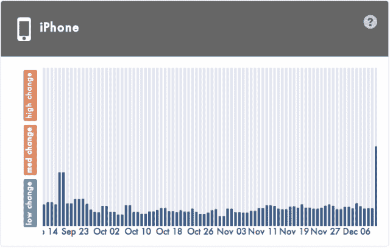

# 苹果应用商店搜索排名的大范围变化使得 iOS 应用平均移动了 40 多位 TechCrunch

> 原文：<https://web.archive.org/web/https://techcrunch.com/2013/12/13/widespread-apple-app-store-search-rankings-change-sees-ios-apps-moved-over-40-spots-on-average/>

苹果再次调整了其 iOS 应用商店算法，这些变化带来了 iPhone 和 iPad 设备上广泛的搜索排名变化。明确地说，这就是*搜索*排名——意思是当用户在 App Store 中搜索特定关键词时，比如“音乐”或“银行”，应用会返回到哪里。换句话说，这不是“排名”，就像一个应用程序在应用商店排行榜上的位置一样。

这一变化首先由应用营销工具提供商 [MobileDevHQ](https://web.archive.org/web/20221209045442/http://www.mobiledevhq.com/) 发现，该公司密切关注影响应用商店优化的因素，或通常所说的 ASO。(基本上就是手机应用商店搜索的 SEO)。

该公司表示，这一变化发生在 2011 年 12 月 11 日和 2012 年 12 月 12 日之间，并且正在影响 iPhone 和 iPad 应用程序。他们看到的平均排名变化是 41.5 个位置，是 iPhone 结果平均每天看到的正常排名变化的 8 倍。典型地，为了比较，通常的每日变化在 5 个位置左右。

iPhone 上的搜索排名变化似乎比 iOS 7 发布期间的变化更大(见下图)，这也很重要。如上所述，它影响的主要是应用商店搜索排名，而不是排行榜，尽管这正在调查中。

一些例子(见下图)显示了这种情况对各种热门应用的影响，包括“银行”、“家庭”、“音乐”和“旅游”。在这里，你会看到一些应用程序只移动了一点点，而另一些则移动了很多。例如，Pandora 在调整后从 8 上升到 5，而 Rdio 从 96 上升到 53。与此同时，在旅游方面，Hipmunk 从 58 上升到 34，Hotwire 从 116 上升到 66。

这些图表有更多的例子，这些图表本身只是 MobileDevHQ 测试的一小部分，涉及 30，000 个关键词搜索。

随着该公司进一步挖掘与关键词排名相关的数据，他们还发现:

*   就每一个关键词而言，62.8%的应用的排名至少变化了 5 位。(通常情况下，大约有 17%的应用程序的某个关键词的排名每天都会发生至少 5 次变化。)
*   就每个关键词而言，40%的应用出现了至少 20 个位置的排名变化。(正常情况下，大约 3%的人每天都会看到如此大的排名变化。)

并且:

*   查看任何关键词的前 5 名应用，31%的应用发生了变化。(通常每天只有 8%左右的变化。)

当然，苹果不断调整其应用商店的算法，但对它来说，大规模改变应用商店搜索结果并不常见。

然而，我们已经看到苹果在最近几周专注于改善其应用商店搜索——例如，11 月[我们确认](https://web.archive.org/web/20221209045442/https://beta.techcrunch.com/2013/11/26/improved-app-store-search-engine-now-corrects-for-users-fat-finger-mistakes-other-misspellings/)应用商店的搜索引擎已经开始纠正拼写错误和其他“胖手指”的拼写错误和错误。在过去，除了下载量和下载速度之外，我们还看到[苹果对](https://web.archive.org/web/20221209045442/https://beta.techcrunch.com/2013/08/23/apples-app-store-rankings-algorithm-changed-to-favor-ratings-and-possibly-engagement/)的评分进行调整。

我们现在不知道的是*为什么*苹果这样做——这是它改变权重因子在搜索排名中的作用的更大测试的一部分吗？这是为了回应苹果公司现在试图纠正的一个特殊问题吗，就像过去常见的那样？(当出版商学会如何利用苹果的结果时，苹果的算法经常会发生变化。)

MobileDevHQ 报告称，通过对一段时间内的结果进行抽样检查，似乎这些变化迄今为止是持续的，这将指向更持久的算法变化，而不是测试。

随着更多数据的涌入，我们将在此添加数据。