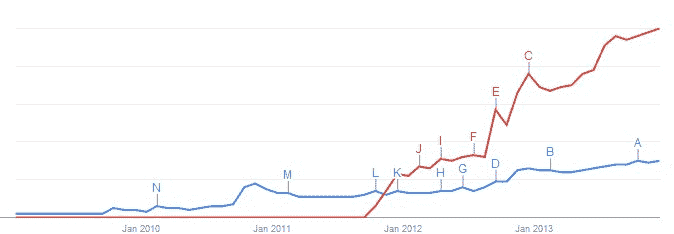

# 为什么微软别无选择只能收购诺基亚智能手机业务一张图| TechCrunch

> 原文：<https://web.archive.org/web/https://techcrunch.com/2013/12/17/why-microsoft-had-no-choice-but-to-buy-nokias-smartphone-business-in-one-chart/>

# 为什么微软别无选择只能收购诺基亚的智能手机业务在一张图中

微软将于 2014 年第一季度完成收购诺基亚大部分手机业务的交易。这笔交易将使这家软件巨头一夜之间成为智能手机 OEM，帮助其进军硬件业务。

然而，选择购买诺基亚的 Lumia 系列智能手机可能没有那么自愿，比之前想象的需要更多的**。**

 **更简单地说，微软可能别无选择，只能放弃超过 70 亿美元的交易。

下图显示了 Windows Phone(蓝色)和 Lumia(红色)的[搜索量](https://web.archive.org/web/20230316071540/http://www.google.com/trends/explore#q=windows%20phone%2C%20lumia&date=1%2F2009%2060m&cmpt=q):

*【该图表以相同的相对比例，追踪了每次查询在谷歌搜索引擎上的全球搜索量。正如你所看到的，Lumia 在发布后很快就开始击败 Windows Phone，尽管从技术上讲它只是该平台的参与者。随着时间的推移，它的受欢迎程度继续超过 Windows Phone，即使 Windows Phone 本身变得更受欢迎。]*

鉴于这种差距的不断扩大，微软可能感觉到其平台和诺基亚衍生品牌之间的紧张关系日益加剧。学生在什么时候成为主人，等等。Windows Phone 这个绰号的不受欢迎事实上导致了时任 Business Insider 的 Matt Rossoff 公开呼吁微软重新命名该产品。

相对而言，Lumia 的搜索量是 Windows Phone 的三倍多。

另一点:鉴于诺基亚已经成为事实上的 Windows Phone 原始设备制造商，并获得了为该系列生产手机的特别许可，可以修改固件并使用自己的服务，微软实际上已经失去了对其手机消费者体验的控制，我认为这是不可接受的。

我敢打赌，必应地图不喜欢在自己开发的平台上竞争。

*向[彼得·布莱特](https://web.archive.org/web/20230316071540/https://twitter.com/DrPizza)致敬，感谢他帮助我从[我的想法](https://web.archive.org/web/20230316071540/https://twitter.com/alex/status/412743786339393537)，到[这个想法](https://web.archive.org/web/20230316071540/https://twitter.com/DrPizza/status/412743936592334848)。***