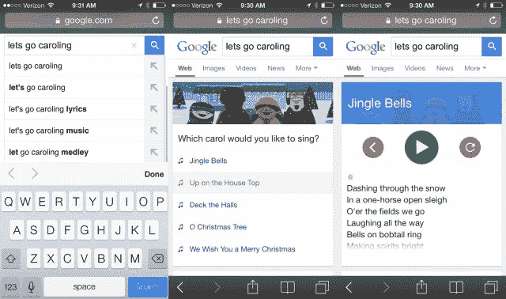

# 用这个谷歌复活节彩蛋 TechCrunch 把你的智能手机变成一台唱颂歌的卡拉 ok 机

> 原文：<https://web.archive.org/web/https://techcrunch.com/2013/12/18/turn-your-smartphone-into-a-caroling-karaoke-machine-with-this-google-easter-egg/>

# 用这个谷歌复活节彩蛋把你的智能手机变成一台唱颂歌的卡拉 ok 机

使用任何移动浏览器，在谷歌中输入“让我们去唱颂歌”。就这样，你的手机会变成一个圣诞颂歌卡拉 ok 机，里面有五首经典节日歌曲的歌词和音乐。在这个令人讨厌的假期里，这是惹恼你的立方伙伴的最佳方式。

这个小小的复活节彩蛋是浏览器不可知的。它可以在我们尝试过的所有浏览器中运行。因为，真的，圣诞颂歌不应该和一个产品捆绑在一起。它们应该为所有人所享受。

谷歌一直在他们的产品中包含隐藏的惊喜。在手机或桌面 Chrome [中输入“做一个桶滚”来获得一些星狐的乐趣](https://web.archive.org/web/20221210033231/https://beta.techcrunch.com/2012/07/03/googles-do-a-barrel-roll-easter-egg-now-spinning-jelly-bean-screens/)。键入“1998 年的谷歌”，将搜索引擎还原成它刚推出时的样子。还有数不清的更多，但这台唱颂歌的卡拉 ok 机是迄今为止最喜庆的。

[https://web.archive.org/web/20221210033231if_/https://www.youtube.com/embed/bVsh6uu9JPg?feature=oembed](https://web.archive.org/web/20221210033231if_/https://www.youtube.com/embed/bVsh6uu9JPg?feature=oembed)

视频