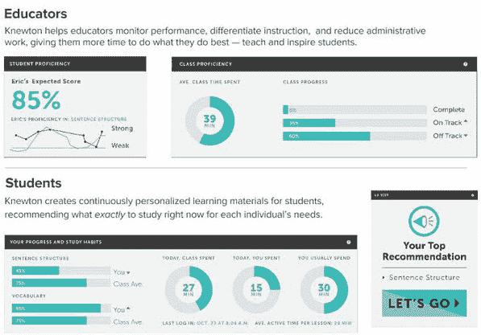

# 为出版巨头提供智能内容，Knewton 斥资 5100 万美元将个性化学习推向全球| TechCrunch

> 原文：<https://web.archive.org/web/https://techcrunch.com/2013/12/19/powering-smart-content-for-publishing-giants-knewton-lands-51m-to-take-its-personalization-engine-global/>

正当看起来[泡沫可能破裂](https://web.archive.org/web/20230310024037/http://edreach.us/2013/11/11/edtech-hype-bubble/#!)的时候，风险资本[对教育的投资](https://web.archive.org/web/20230310024037/http://www.cbinsights.com/blog/trends/ed-tech-2013-venture-capital)停滞不前，教育科技的一年可能在呜咽中结束，看不到任何希望，Knewton 在活跃的 12 月加上了一个感叹号[。](https://web.archive.org/web/20230310024037/https://www.edsurge.com/financing)

在 2013 年对一家教育公司的第五大风险投资中，TechCrunch 获悉，总部位于纽约市的 EdTech 老将刚刚完成了由伦敦风险投资公司 Atomico 牵头的 5100 万美元融资。本轮融资还包括 GSV 资本作为首次投资者加入，以及现有支持者的参与，包括 Accel Partners、Bessemer Venture Partners、First Round Capital、FirstMark Capital 和 Founders Fund，以及硅谷银行的债务融资。

随着新一轮资本总额翻一番，达到 1.04 亿美元，Knewton 有着重大的扩张计划，其中最主要的是成为全球企业的计划。10 月，这家初创公司在伦敦开设了一个办事处，这是它在美国以外的第一个办事处。首席运营官·刘中达说，它将成为其国际业务的总部，因为它希望继续在拉丁美洲、亚洲和中东扩张。

未来一年，该公司还计划在 145 名员工的基础上增加 80 至 100 人，重点是加强其数据科学和工程团队，并搬进纽约更大的新总部。

自 2008 年首次亮相以来，Knewton 一直致力于在全球范围内实现顶级个性化教育的民主化。虽然这听起来可能不切实际，但多年来，该公司已经慢慢地将软件、基础设施、API 拼凑在一起，并收集了庞大的匿名数据集，这些数据集后来成为了其创新的自适应学习引擎的基础。

在实践中，Knewton 的分析引擎能够随着时间的推移映射每个学生的强项和弱项，从而使教师能够识别和预测知识差距，并根据每个学生的个人学习路径个性化教学和定制内容。虽然这听起来像是消费者平台的组成部分，但 Knewton 却选择成为服务提供商，为教育出版商提供适应性基础设施，使他们不仅可以将内容库带到网上，还可以使这些内容更加智能，更加个性化。

由于许多出版商一直在努力适应日益数字化的世界，Knewton 作为技术提供商，看起来处于越来越有利的地位。刘告诉我们，在过去的一年里，该公司已经为学生提供了近 20 亿份个性化推荐。它之所以能够做到这一点，要归功于现在遍布美国大多数主要教育出版商的合作伙伴关系，包括 Houghton Mifflin Harcourt、Macmillan Education、Triumph Learning 和剑桥大学出版社等。

首席运营官表示，这些合作伙伴关系使该公司在 2013 年的收入增加了两倍，随着 Houghton Mifflin 的加入，Knewton 的技术现在正在被美国超过 500 万名学生使用。但是，也许更重要的是，考虑到 Knewton 传统上一直为高等教育合作伙伴服务，Houghton Mifflin 和 Triumph Learning 现在开始让 Knewton 真正渗透到 K-12 市场。

虽然还处于相对早期的阶段，但 Knewton 的另一个潜在有趣的机会领域并非来自旧的出版界，而是过去两年来开始萌芽的越来越多的教育技术平台和新的学习模式。鉴于初创公司传统上难以在 K-12 中生存，由于缓慢的销售周期和地区层面的官僚决策，许多初创公司选择向教师或家长销售。

刘表示，许多人专注于分配方面，MOOCs 已经成为教育领域新兴数字分配模式的一个突出例子。随着 Knewton 试图服务于硬币的另一面——特别是数据挖掘方面——这些新的数字教育平台，MOOC 和 not，最终也可能成为 Knewton 的客户。

无论是 Pearsons 和 Harcourts of the world，还是 Courseras 和 Udacitys，它们的核心竞争力都是提供优秀的内容。他们在不同程度上理解用户界面，刘告诉我们，Knewton 希望成为支持用户界面的基础设施。随着 MOOC 平台不断加强其内容库和课程目录，它们将开始把注意力转向个性化的学生体验。他们似乎还没有到那一步，但是当他们到了那一步，Knewton 想要到达那一步。

虽然你可能不会发现太多的初创公司或企业家渴望进入出版界，更不用说教育出版了，但 Knewton 相信，通过成为自适应 PaaS 提供商，帮助出版商将技术和个性化注入他们的内容，未来可能会有很多绿地。

Knewton 最关注的绿地是什么？它不在美国，刘说。许多发展中国家没有陷入美国遗留的基础设施困境，这意味着它们的政府、州和学校能够从一档跳到五档。自然，Knewton 认为这为适应性技术和大数据公司带来了巨大的机遇。