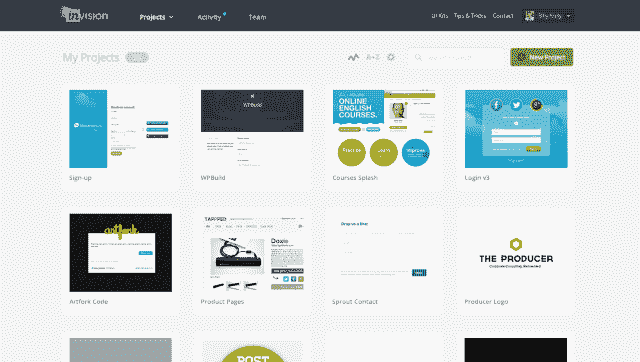

# InVision 从 FirstMark Capital 和 Tiger Global TechCrunch 融资 1160 万美元

> 原文：<https://web.archive.org/web/https://techcrunch.com/2013/12/20/invision-raises-11-6m-from-firstmark-capital-and-tiger-global/>

# InVision 从 FirstMark Capital 和 Tiger Global 融资 1160 万美元

成千上万的网络开发者和设计师的原型工具 InVision 最近完成了 FirstMark Capital 和 Tiger Global 的 1160 万美元的 A 轮融资。

公司[于 2011 年在纽约成立](https://web.archive.org/web/20221127171256/https://beta.techcrunch.com/2011/07/14/invision-ux-prototyping-made-easy/)，其使命是让设计师更容易分享、互动和获得关于他们原型的反馈。用户可以轻松地将 Photoshop 文件上传到网络，并添加交互以形成模拟，所有这些都可以在一个普通的网络浏览器中的一个链接(可以受密码保护)下完成。

2012 年 2 月，InVision [与 FirstMark 一起筹集了 150 万美元的种子资金](https://web.archive.org/web/20221127171256/https://beta.techcrunch.com/2012/02/22/invision-raises-1-5m-for-beautiful-interactive-prototypes/)。这家初创公司此后一直专注于促进围绕这些原型的对话，现在可以与更广泛的人群进行对话。

创始人 Clark Valberg 解释说，传统上，设计师和编码人员之间关于项目最终外观和感觉的交流仅限于一个内部圈子。有了 InVision，整个公司的许多人都可以就设计进行咨询，并异步给出他们的反馈。

这听起来可能像是数据溢出，但人们也可能认为这是在设计部门准备好之前推出真正产品的一种风险较小的替代方法。这毕竟是一个论点。一些创业公司认为，在多份草稿中，设计应该在产品编码之前进行，而其他人认为，你应该尽快推出一个真正的产品，以获得用户(并最终获得他们的反馈)。

瓦尔伯格在之前已经[告诉 TechCrunch，他不反对基于用户反馈的迭代，但是他认为，在你“失去很多控制”之前，最好通过公开你的产品来完成最初的迭代过程。](https://web.archive.org/web/20221127171256/https://beta.techcrunch.com/2012/02/22/invision-raises-1-5m-for-beautiful-interactive-prototypes/)

新的资金将使 InVision 继续获得新的客户，这些客户目前包括小型创业公司和大型企业。该公司还在致力于“一些有趣的合作伙伴关系”，以及一些增强的营销和新功能。

[视频](https://web.archive.org/web/20221127171256/http://vimeo.com/63215902)来自[视频](https://web.archive.org/web/20221127171256/http://vimeo.com/invisionapp)在[视频](https://web.archive.org/web/20221127171256/https://vimeo.com/)上。