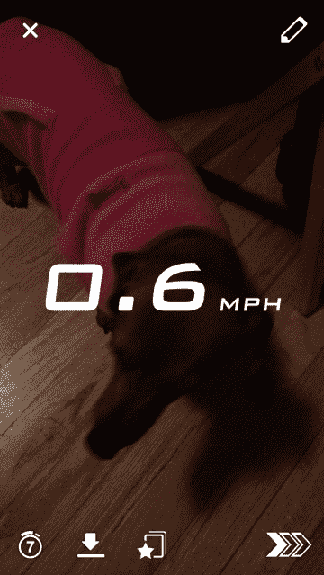
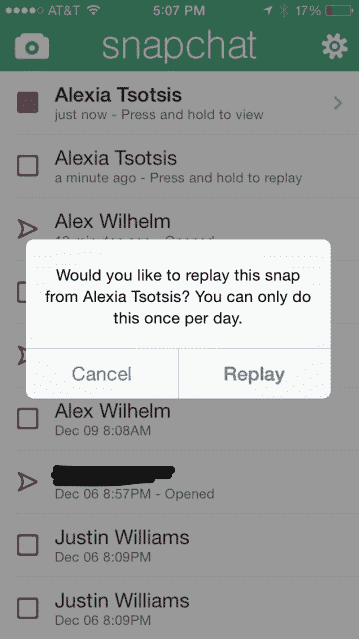

# Snapchat 增加了过滤器、回放功能，无论出于何种原因，时间、温度和速度都会叠加在 TechCrunch 上

> 原文：<https://web.archive.org/web/https://techcrunch.com/2013/12/20/snapchat-adds-filters-new-font-and-for-some-reason-time-temperature-and-speed-overlays/>

# Snapchat 增加了过滤器、回放功能以及时间、温度和速度叠加功能

Snapchat [在假期前的今天发布了其应用程序的更新](https://web.archive.org/web/20221203104012/https://itunes.apple.com/us/app/snapchat/id447188370?mt=8)。新版本的短命信息应用程序包括几个颜色过滤器，一个新的“特殊文本”字体和其他一些附加功能。

主要的更新是“视觉滤镜”,它将为你的图像增加色彩效果。如果你不知道如何激活它们，很可能是因为你已经不是青少年了。我花了 10 分钟才明白，你必须从右向左滑动才能触发过滤器。你有 3 个过滤器，包括两个彩色和一个黑白选择。

奇怪的是，更新还增加了 3 个“智能过滤器”，可以覆盖图像拍摄的时间，拍摄时的温度，以及拍摄时的速度，以英里/小时为单位。我预见到一项全新的运动将由以最高速度发送的快照组成。

现在也有更大的 Helvetica 字体可供选择。你可以在输入信息的时候再次点击文本输入框来激活它，这也是不明显的。

现在还有一个前置闪光灯选项，当你拍摄时，它会在屏幕上闪烁白色，照亮那些自拍。如果你愿意，你现在可以选择 7 个最好的朋友。所有这些选项都是在设置>附加服务>管理部分下启用的，它们都没有向界面添加一个附加的指示 UI 元素。

还有一个重放选项，如果启用了该选项，您可以每天重新查看一次快照。这似乎违背了 Snapchat 的一些主要观点，即消息是一次性的摘要，一旦你看到它们，它们就“永远消失了”。你只能在你的视频流中回放最近的图像或视频——但这是由*接收者，*而不是发送者选择的。因此，如果你收到一张照片，不管发件人愿不愿意，你都可以查看两次。

不过，这是一个有限的使用选项——每天只能使用一次。如果您的手指覆盖了图像中的重要部分，或者如果您因为认为它是静止图像而错过了视频剪辑，这可能会有所帮助。

Snapchat 通过其“故事”功能尝试越来越少的短暂内容，让人们在 24 小时内想看多少次就看多少次。我们的作家 Josh Constine 对 [Replay 如何消除 Snapchat 的一些昙花一现](https://web.archive.org/web/20221203104012/https://beta.techcrunch.com/2013/12/20/selfconsciouschat/)有更多的分析。

在我经常使用的消费者应用中，Snapchat 仍然有一些最差的功能可发现性和用户体验——但也许这就是问题所在？也许因为这些功能是实验性的，一旦它们成为“真正的”功能，用户界面会变得更加完美。这个应用程序仍然很有趣，但我希望这个设计在使用中能保持得更好。无论如何，笛鲷在他们的寒假应该有更多的选择。

*关于 Snapchat 的重大更新，请阅读 [Snapchat 牺牲短暂性，推出新的回放功能](https://web.archive.org/web/20221203104012/https://beta.techcrunch.com/2013/12/20/selfconsciouschat/)*