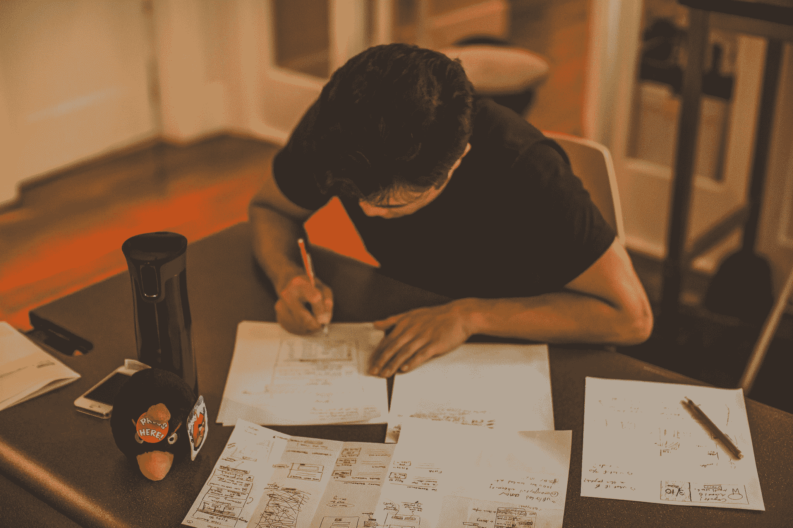
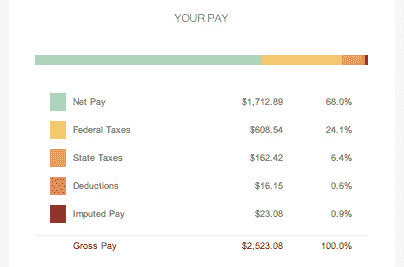
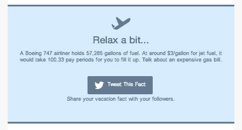

# 在 ZenPayroll 的 Sprint 中重塑你的支付方式

> 原文：<https://web.archive.org/web/http://techcrunch.com/2013/12/23/zenpayroll-design-sprint/>

生活中很少有比发薪日更无聊的事情了。每隔几周，上班族就会收到一个信封，信封上有一堆白色背景的数字，意在显示他们在上一个工资周期赚了多少钱。

但不一定非要这样。这就是为什么几个月前，薪资初创公司 ZenPayroll 花了一周时间重新设计它在发薪日与用户沟通的方式。

ZenPayroll 是一家成立两年的公司，它希望改变人们的薪酬方式，就这么简单。它在等式的两边都做到了这一点，首先是让雇主支付工资变得极其简单，其次是改善员工获得工资的实际体验。

如今，大多数中小型企业都没有一个好的工资单管理系统。事实上，根据 ZenPayroll 首席执行官 Joshua Reeves 的说法，绝大多数人都是手动操作，这最终会导致错误，并因会计差异而被罚款。ZenPayroll 建立了一个系统，他们只需要输入一次员工信息，然后该平台就会处理所有的经常性支付，同时使一次性奖金或时薪也易于输入。

但该公司也看到了改善员工体验的机会。毕竟，发薪日已经很久没有从根本上改变了。今天，许多人把工资直接存入账户，甚至从来不看工资单。如果他们这样做了，他们会看到类似这样的东西:

无聊吧？

“今天，发薪日是一个非个人的、交易性的事件，”里维斯告诉我。因此，该公司开始改变这种状况，让员工收到工资通知成为一种真正愉快的体验。

为了做到这一点，ZenPayroll 借鉴了谷歌风投类似“设计冲刺”的理念多年来，投资者的设计团队一直致力于完善设计冲刺过程的艺术，在这个过程中，初创公司被要求在短短五天内快速重新检查和重建他们的产品。

Google Ventures 与其投资组合公司一起进行了一系列设计冲刺，为他们提供了一个参与超快速迭代的结构。这一过程源于谷歌自己的内部努力，即随着时间的推移快速重新设计各种产品，这家风险部门现在每年与它投资的初创公司进行约 30 次冲刺。

典型的设计冲刺会持续五天，在此期间，团队会经历五个不同的开发步骤。第一天是[了解问题](https://web.archive.org/web/20230326105311/http://www.designstaff.org/articles/product-design-sprint-day-1-understand-2012-10-16.html)，第二天是[想出尽可能多的方法来解决问题](https://web.archive.org/web/20230326105311/http://www.designstaff.org/articles/product-design-sprint-day-2-diverge-2012-10-26.html)，第三天是[选择最好的想法](https://web.archive.org/web/20230326105311/http://www.designstaff.org/articles/product-design-sprint-day-3-decide-2012-11-20.html)继续前进，第四天是[制作新产品或设计的原型](https://web.archive.org/web/20230326105311/http://www.designstaff.org/articles/product-design-sprint-day-4-prototype-2013-01-07.html)，第五天是[通过向其他人展示原型来验证团队已经想出的东西](https://web.archive.org/web/20230326105311/http://www.designstaff.org/articles/product-design-sprint-day-5-validate-2013-03-07.html)。

对于一些初创公司来说，谷歌风险投资采取了一种更实际的方法来设计 sprints。由于 ZenPayroll 有自己的设计团队，GV 的人大多在构建过程中伸出援手。对于 ZenPayroll 来说，目标是改变员工与他们每周收到的无聊工资单之间的关系。

“通过这个项目，我们知道我们想要赋予员工权力，让他们的发薪日成为 ZenPayroll 独有的东西，”Reeves 说。这意味着让它成为员工可以真正庆祝的事情，而不是仅仅与其他无聊的文书工作一起归档，永远不再被看到。

里维斯告诉我，以一种奇怪的方式，正是设计冲刺的限制激发了更多的创造力。“当你有固定的时间周期时……那会让你向前迈进，而不会陷入个别细节中，”他说。

在 ZenPayroll 的例子中，约束意味着两者，以及快速决定包含什么和不包含什么。

第一步，团队花了一整天的时间——分配时间的五分之一——做尽可能多的研究，找出当前工资单的问题所在。考虑到团队的时间很少，这可能看起来很多，但它有助于为过程的下一部分提供信息，即尽可能多地写下他们如何从根本上改变发薪日的想法。

对于设计冲刺团队的公关负责人 Steffi Wu 来说，第二天的分歧阶段——团队在便利贴上写下尽可能多的想法——是这个过程中最重要的部分。或者至少是最有趣的。

“我们思考‘发薪日有哪些可能性？’”她说现在这很可怕也很平庸，但是我们有什么方法可以让它变得快乐和有意义呢？”为了改变这种状况，该团队开始尝试让获得报酬成为一种让人们真正快乐的仪式。

这种仪式和乐趣的一部分只是提供了一种更直观、更漂亮的方式来显示员工的工资明细，以及作为电子邮件通知的一部分，一个人的所有钱都去了哪里。许多人甚至懒得看他们的工资单，但 ZenPayroll 希望通过让它们更容易理解，增加他们打开发薪日通知的可能性。

该公司试图取悦用户的另一种方式是向他们提供关于他们赚了多少钱的有趣事实。比如这个:

总而言之，ZenPayroll 希望继续迭代与用户沟通的方式。毕竟，正如 Reeves 告诉我的，成为一家基于软件的公司意味着总是寻求让你的产品更好。“当我们思考如何构建软件的想法时，你永远不会完成这个过程，”他说。“总有办法变得更好，总有办法改进产品。”

既然已经经历了一次设计冲刺过程，ZenPayroll 更有可能在下一次公司准备重新想象其产品时使用它。