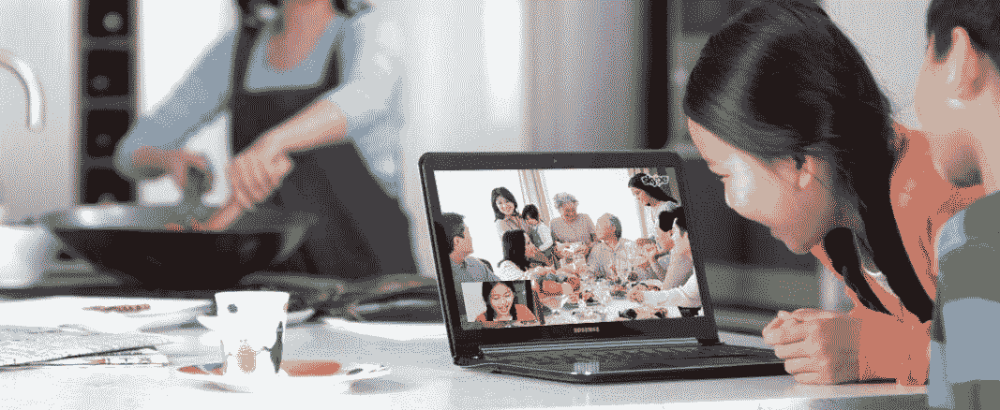
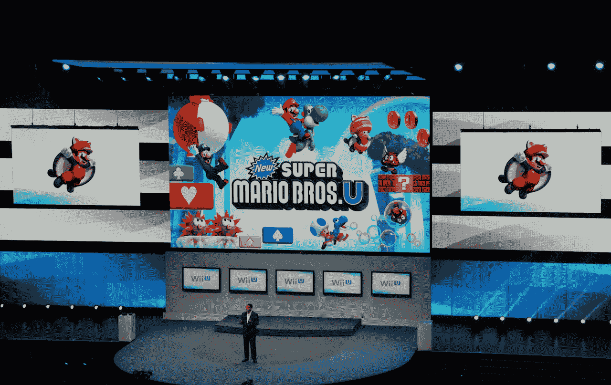
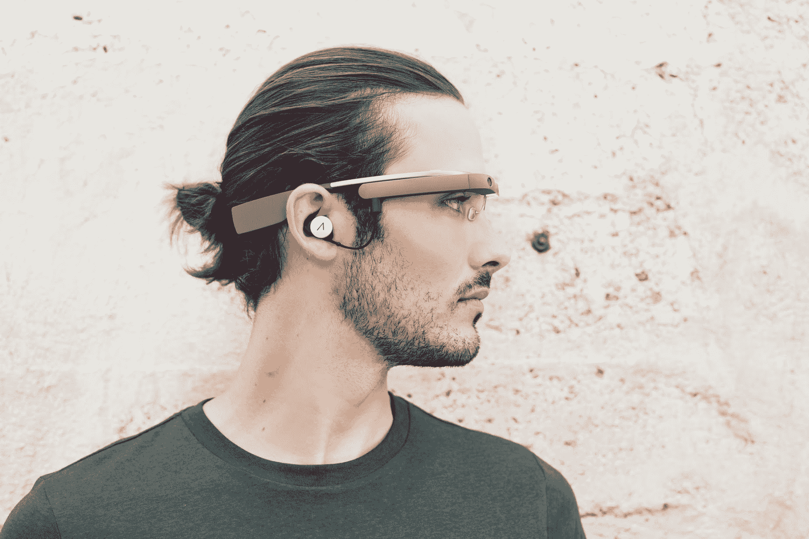
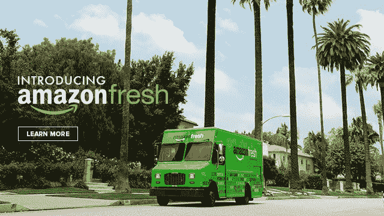
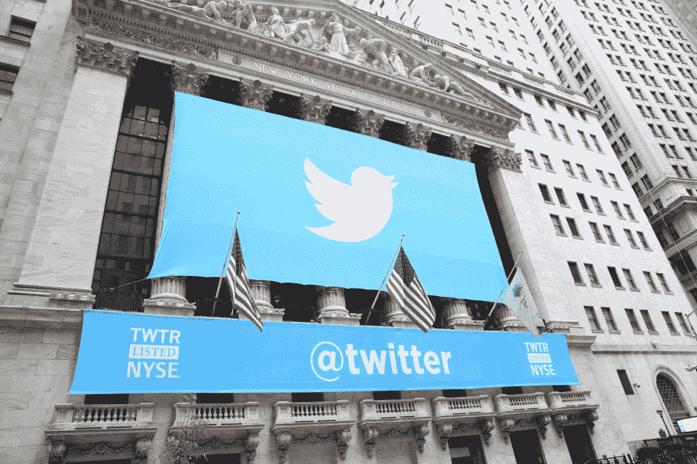
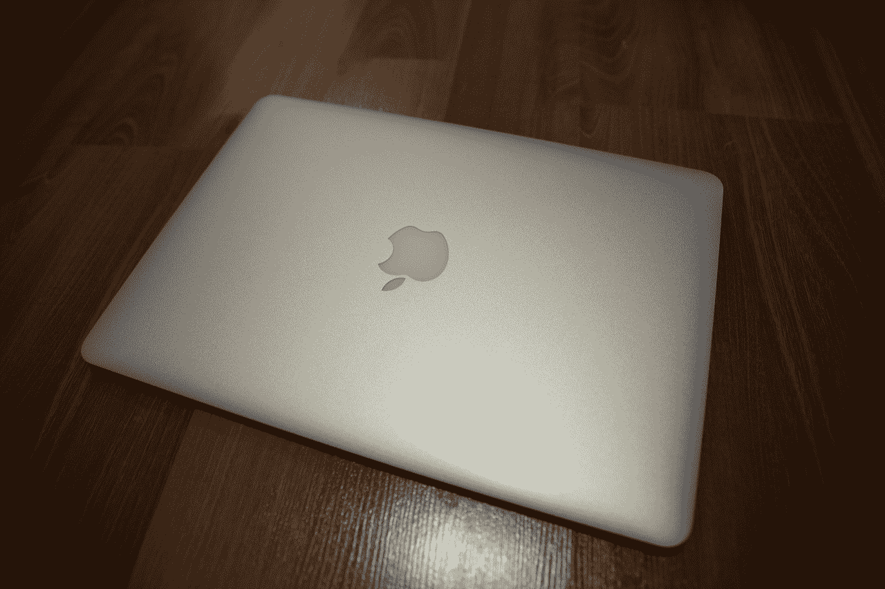

# 明年圣诞节我想从各大科技公司得到什么

> 原文：<https://web.archive.org/web/https://techcrunch.com/2013/12/25/christmas-tech-wish-list/>

这是我的愿望清单。我意识到今年为时已晚，但我希望这些公司已经在为明年做计划，这样他们就有 2014 年的时间来交付。我承认，其中许多都是相当大的要求，但有问题的公司有相当雄厚的资金和获得世界级资源的渠道。所以让我们一起来实现吧。

#### 1.微软

**Skype 被拆，从头重建。** Skype 在每个平台上都很糟糕，但我却被诅咒每天都要使用它。它在 VoIP 中的传输相当可靠，但考虑到它的起源，不如你想象的那么可靠。此外，它在基于文本的聊天交流方面很糟糕，群聊等关键功能被锁在付费墙后面，尽管我已经每年为 Skype Out、语音邮件和 Skype In numbers 向该公司支付一大笔费用。

#### 2.任天堂(日本电子游戏公司及其开发的电脑游戏名称)

**把马里奥(和其他人)放到 iOS 和 Android 上。**我真的希望 [Wii U 是一个秘密阴谋，目的是抛售股票](https://web.archive.org/web/20221207042755/https://beta.techcrunch.com/2013/09/04/nintendont/)，迫使管理层重新考虑其他移动平台的许可权，因为如果是这样的话，真是天才之举。让我们有马里奥，口袋妖怪，大金刚等。，在 iOS 和 Android 上，我们会给你很多钱作为交换。

#### 3.谷歌

**干掉 Glass，专注于让 Android 在手机和平板上做得更好。**谷歌眼镜对我来说没有任何意义，我越了解它，它就越没用。我敢肯定，这将会受到大量粉丝的泡沫和愤怒，但老实说，谷歌在这个项目上投入的任何资源都可以更好地用于帮助智能手机和平板电脑上的 Android，让它不再是你没完没了地查看的东西，而是成为你日常生活的一个无缝部分。换句话说，谷歌眼镜的目标很好，但要专注于人们实际使用的平台。

#### 4.亚马孙

**在全球范围内确定食品杂货配方。**我喜欢[亚马逊生鲜](https://web.archive.org/web/20221207042755/https://beta.techcrunch.com/2013/12/11/amazonfresh-launches-in-sf-bringing-amazons-grocery-delivery-service-to-the-bay/)的想法，我只是讨厌这种煞费苦心的渐进推广。我也明白有很多移动的部分，需要时间来做好，但自私地说，我希望在我购物的大部分时间里，我依靠的同一个公司也能解决杂货店购物的其余不便。

#### 5.脸谱网

**停止试图成为雅虎与推特的混合体。**这种想法听起来很疯狂，但我真的很怀念那些没完没了的婴儿照片和无意义的帖子，这些帖子哀叹一个高中朋友白天遇到的一些小麻烦。[脸书想成为新闻和实时信息的来源](https://web.archive.org/web/20221207042755/https://beta.techcrunch.com/2013/12/02/facebook-news-discovery-2/)，但这不是我想要的。我已经到了可以欣赏一个老朋友张贴他们孩子的第一幅蜡笔画的古雅感伤的年龄，讽刺的是 FB 正试图成熟地超越它。

#### 6.推特

**不断进化的直接消息。**目的地管理者希望超越自我， [Twitter 终于开始认识到这一点，并在此基础上发展](https://web.archive.org/web/20221207042755/https://beta.techcrunch.com/2013/12/10/twitter-updated-with-new-swipeable-design-and-photo-support-in-direct-messages/)。我想要更多，我想这是我 2014 年清单上的一份礼物。希望我不后悔一开始就问了。

#### 7.苹果

**一台配备视网膜显示屏的 MacBook Air。**苹果，你已经为此努力了这么久，但你让视网膜空气只是遥不可及，只是在地平线上。MacBook Air 现在的电池续航时间非常长，在 13 英寸版本中[接近完美，但 13 英寸和 15 英寸 Retina MacBook Pro 的屏幕却让它相形见绌。Retina MacBook Air 是个人计算的圣杯，让我们实现它吧。](https://web.archive.org/web/20221207042755/https://beta.techcrunch.com/2013/06/17/2013-macbook-air-review/)

那些是我的愿望:有些是自私的，有些是现实的，有些是肯定不会发生的；所有这些都是我真心希望在 2014 年从技术领域的主要参与者那里看到的。哦，也许还有一些袜子，我的大部分看起来都很旧了。

*专题图片由 Flickr 上的[gagi las](https://web.archive.org/web/20221207042755/http://www.flickr.com/photos/gagilas/)提供。*