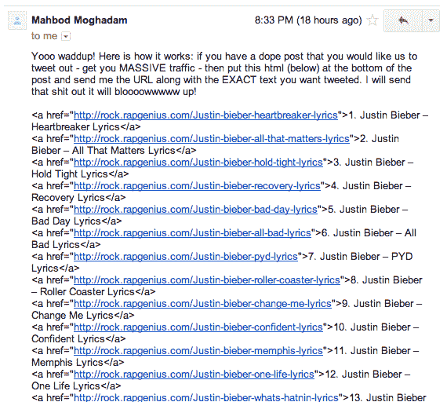
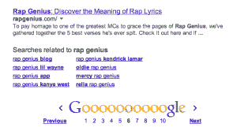
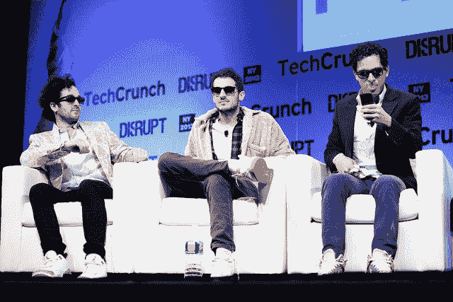

# 谷歌破坏说唱天才的搜索排名作为对搜索引擎优化垃圾邮件的惩罚，但解决方案仍在进行中 TechCrunch

> 原文：<https://web.archive.org/web/http://techcrunch.com/2013/12/25/google-rap-genius/>

今天，谷歌在得知歌词网站[说唱天才](https://web.archive.org/web/20220926012900/http://rapgenius.com/)一直在使用可疑的搜索引擎优化技巧来获得搜索结果的首位后，进行了猛烈的回击。现在，RapGenius.com 不会出现在“说唱天才”搜索结果的第一页，像“Jay-Z 圣杯歌词”这样的热门查询也不会像过去那样带来这家初创公司。[更新:但两家公司正在研究解决方案。]

Rap Genius 成立于 2009 年，是一家歌词和文字注释网站。它允许用户为歌词、宗教文本、法律文件、图像等提供自己的解释，当其他用户悬停在网站上的文本片段上时，他们就会看到这些解释。2012 年底，这家初创公司 lept 获得了由安德森·霍洛维茨[领导的](https://web.archive.org/web/20220926012900/http://www.crunchbase.com/company/rap-genius)[1500 万美元的巨额投资](https://web.archive.org/web/20220926012900/https://beta.techcrunch.com/2012/10/03/rap-genius-andreessen-horowitz/)。

说唱天才的创始人以他们的污言秽语和令人发指的行为而闻名，去年他们的网站在谷歌搜索结果中攀升至显著和有利可图的位置。要想知道这些家伙有多可笑，看看我们在 TechCrunch Disrupt NY 的演讲吧，创始人 Mahbod Moghadam 为告诉马克·扎克伯格“去他妈的”而道歉。

但本周早些时候，说唱天才邀请博客加入其“说唱天才博客联盟”计划。电子邮件过滤初创公司 Glider 的创始人约翰·马巴赫(John Marbach)发邮件询问细节，说唱天才提出在推特上发布他博客的链接，作为交换，他会在自己的博客上发布一系列说唱天才贾斯汀比伯的歌词链接。这些链接旨在欺骗谷歌，让 Rap Genius 在比伯新专辑歌曲的歌词搜索中获得更好的结果排名——这肯定是本赛季最受欢迎的搜索。

马巴赫随后披露了说唱天才的不择手段，他在被广泛阅读的[博客文章](https://web.archive.org/web/20220926012900/http://jmarbach.com/rapgenius-growth-hack-exposed)中发布了他收到的电子邮件，促使谷歌的网络垃圾邮件沙皇马特·卡茨[在黑客新闻上宣布](https://web.archive.org/web/20220926012900/https://news.ycombinator.com/item?id=6957463)“我们正在调查此事。”说唱天才在给谷歌的一封公开信中道歉，要求检查整个歌词网站类别，暗示可疑的搜索引擎优化策略在其竞争对手中很常见。

这种道歉似乎并没有得到太多，因为谷歌今天早上几乎把说唱天才从搜索结果中清除出去。以前，说唱天才出现在流行说唱歌曲和单词“歌词”的搜索结果的顶部或接近顶部，例如“[Kanye West flash Lights 歌词](https://web.archive.org/web/20220926012900/https://www.google.com/search?q=kanye+west+flashing+lights+lyrics&oq=kanye+west+flashing+lights+lyrics&aqs=chrome.0.0j5j0.7748j0j1&sourceid=chrome&ie=UTF-8#q=kanye+west+flashing+lights+lyrics&safe=off&start=40)在简单的艺术家和歌曲名称搜索中，它有时甚至会出现在较高的位置。

现在，在搜索结果的第五页之前，你不会找到 Rap Genius，可能比任何人看的都要远。为了证明这种双关语有多严重，在那个查询的末尾加上“[说唱天才](https://web.archive.org/web/20220926012900/https://www.google.com/search?q=kanye+west+flashing+lights+lyrics&oq=kanye+west+flashing+lights+lyrics&aqs=chrome.0.0j5j0.7748j0j1&sourceid=chrome&ie=UTF-8#q=kanye+west+flashing+lights+lyrics+rap+genius&safe=off&start=50)”实际上会让说唱天才在第六页的结果中出现得更深。

为了确认这一点，谷歌将 RapGenius.com 排在了“说唱天才”搜索结果的第六页底部

变得几乎无法搜索可能会对 Rap Genius 的业务造成巨大打击，因为它依赖于谷歌搜索的推荐流量。如果没有这种流量，它将很难扩大用户群，收集新的注释，并有可能通过广告赚钱。

谷歌的反应是否过于强硬是一个见仁见智的问题。用垃圾搜索引擎优化策略来游戏搜索结果当然是可悲的，但是把 Rap Genius 从包含它自己名字的搜索结果页面上抹去是相当苛刻的。这家初创公司是罪有应得，还是应该得到更轻的惩罚，取决于你对谷歌搜索结果神圣性的看法。我们正在等待 Rap Genius 创始人的回应，并承诺很快会有一份声明。

**更新** : Rap Genius 的创始人提供了这份声明，表明他们正在与谷歌合作，以返回更好的搜索结果排名:

> “我们正在与谷歌合作解决这个问题。他们真的很棒，帮助我们确定我们需要做出的改变，即使是在圣诞节。我们正在尽可能快地工作，并希望很快回到谷歌。
> 
> 对我们和成千上万努力创造最好搜索结果的社区成员来说，离开谷歌是很糟糕的。
> 
> 我们希望看到这篇文章的每个人都能从圣诞节抽出一点时间，到 Rap Genius 网站注册，这样你就可以在你最喜欢的主题上贡献你的知识——成为我们社区的一员会让这个网站更有趣。圣诞快乐"

看起来说唱天才和谷歌可能会达成某种妥协，谷歌至少恢复一些初创公司的搜索结果排名，以换取它清理自己的行为。然而，至少一些下降的能见度可能会持续很长时间，阻碍说唱天才的业务。我们将尽快了解会谈结果的更多细节，我们正在等待谷歌的回应。

*关于说唱天才永无止境的疯狂和冒险，请查看:*

[破坏舞台视频:说唱天才的联合创始人向扎克道歉(然后说他们会比脸书更伟大)](https://web.archive.org/web/20220926012900/https://beta.techcrunch.com/2013/05/01/rap-genius-co-founder-apologizes-to-zuck-then-says-theyll-be-bigger-than-facebook/)

[视频采访:本·霍洛维茨和创始人解释为什么 A16Z 向说唱天才投资 1500 万美元](https://web.archive.org/web/20220926012900/https://beta.techcrunch.com/2012/10/03/rap-genius-andreessen-horowitz/)

[说唱天才正与新闻天才一起进行突发新闻分析](https://web.archive.org/web/20220926012900/https://beta.techcrunch.com/2013/05/01/rap-genius-news-genius/)

[说唱天才揭示其商业模式之一将是“企业天才”协作工具](https://web.archive.org/web/20220926012900/https://beta.techcrunch.com/2013/05/01/rap-genius-enterprise/)