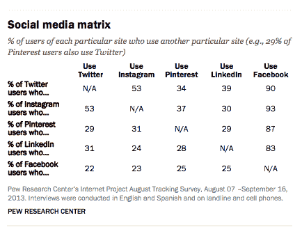

# 73%的美国成年人使用社交网络，Pinterest 的受欢迎程度超过 Twitter，脸书保持领先| TechCrunch

> 原文：<https://web.archive.org/web/http://techcrunch.com/2013/12/30/pew-social-networking/?utm_source=dlvr.it&utm_medium=twitter>

脸书目前可能面临着年轻用户的质疑，但在美国 18 岁以上的用户中，它仍然是社交网络之王。根据皮尤研究中心的研究人员今天公布的[数据](https://web.archive.org/web/20230326065050/http://pewinternet.org/Reports/2013/Social-Media-Update.aspx)，使用脸书、LinkedIn、Pinterest、Twitter 或 Instagram 等社交网络相互交流的成年人比例现已达到 73%，而拥有[11.9 亿用户](https://web.archive.org/web/20230326065050/https://techcrunch.com/2013/12/29/facebook-international-user-growth/)的全球最大社交网络脸书仍是美国最受欢迎的社交网络，有 71%的美国成年人使用该网络。

换句话说，几乎所有回答他们在社交网络上的成年人都在使用脸书。皮尤指出，这比去年的 67%高出了 4 个百分点。它出现在竞争加剧的时代:部分归功于移动应用的兴起——现在在多个网络上的人数占 42%。

在排名前五的电视网中(根据皮尤的图表)，谁排在脸书之后还有很大的回旋余地。LinkedIn 是一个标榜自己为“专业”社交网络的网站，专注于社交、求职和专业信息和新闻，目前排名第二，有 22%的美国成年人使用它，比去年增加了 2%。紧随其后的是 Pinterest——它以 21%的使用率跃居 Twitter 第三位。

Twitter——尽管它推出了不同的服务来增加参与度，如 Twitter 音乐和其他发现服务；尽管围绕其首次公开募股的关注有所增加，但仅增长了两个百分点，达到 18%。紧随其后的是 Instagram，份额为 17%。

Google+没有进入前五名——不是因为它不受欢迎；而是因为皮尤称没有将它包括在调查问题中。

事实上，皮尤的数据揭示了一点，证实了一点我们可能已经猜到的东西，但也留下了一些盲点。虽然多个网站有 42%的使用重叠，但约 36%的受访者表示他们只使用一个社交网络，皮尤指出，“22%的人没有使用我们询问的五个特定网站中的任何一个。”这可能意味着他们使用 Google+、Snapchat 等服务，或者完全使用其他服务，或者什么都不用。

### 多少次和多久一次

对于这些在很大程度上围绕基于广告的商业模式构建的网站来说，临界质量至关重要:如果没有人在使用一个网站，你就不会去访问它。同样，在商业方面，网站及其广告商喜欢关注的一个关键指标是参与度。

因此，有趣的是，当涉及到使用频率时，排名会发生变化。脸书继续保持在每日排名的首位，每天有 63%的人访问它。insta gram——在综合排名中垫底——紧随其后，以 57%的日使用率位居第二。同样，其周利率和“不经常”利率也接近，分别为 22%/20%和 14%/22%。(这在一定程度上解释了为什么脸书热衷于收购它:他们的使用模式非常接近。)

总体而言，Twitter 的使用量可能比 Pinterest 少，但那些使用 Twitter 的人似乎更投入:大约 46%的 Twitter 用户每天都在使用 Twitter，以快速修复制作和接收的讽刺。相比之下，Pinterest 的日使用率相当低，只有 23%的用户每天都会访问。

皮尤称，脸书、Instagram 和 Twitter 也产生了大量的每日多次使用，其中 40%在脸书，35%在 Instagram，29%在 Twitter。

与此同时，LinkedIn 还有很多工作要做，只有 13%的用户每天去那里。那些是在找工作的人吗？无论如何，这是解释为什么 LinkedIn 试图彻底改革其整个内容运营的另一种方式，以创造一些东西来吸引人们更频繁地访问它，而不仅仅是“更少地访问”。

皮尤指出，目前看起来脸书正在部分地赢得胜利，因为它已经成功地吸引了广泛的用户——考虑到它最初只是一个仅限于大学网络的网络，这对于扩大其覆盖范围来说是一个非常令人印象深刻的转变。

其他社交网络的人口统计数据与此形成鲜明对比:Pinterest“对女性用户特别有吸引力”，女性成为 Pinterest 用户的可能性是男性的四倍；LinkedIn 在大学毕业生和高收入家庭的互联网用户中“尤其”受欢迎。Twitter 和 Instagram 在都市人、年轻人和非白人中引起共鸣。(皮尤指出，脸书在白人、西班牙裔和黑人用户中的使用率超过 70%。)除了 LinkedIn 之外，所有这些网站在 18-29 岁年龄段的用户比例最高；LinkedIn 更受 30-49 岁群体的欢迎。

在那些说他们只使用一个社交网站的人中，脸书是明显的赢家，84%的人选择它作为他们的唯一网站，其他人远远落后于他们:8%的人只使用 LinkedIn，4%的人只使用 Pinterest，Instagram 和 Twitter 只占 2%——这使他们在今天的美国市场上稳稳地处于第二位。

