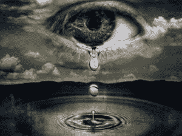

# 为什么 2014 年是你改变的一年

> 原文：<https://web.archive.org/web/https://techcrunch.com/2013/12/31/why-2014-is-the-year-you-change/>

詹姆斯·阿尔图彻撰稿人

More posts by this contributor

**编者按:** *[James Altucher](https://web.archive.org/web/20230326051057/http://jamesaltucher.com/) 是一位投资人、程序员、作者，也是数次[创业者](https://web.archive.org/web/20230326051057/http://www.jamesaltucher.com/2011/01/how-i-screwed-yasser-arafat-out-of-2mm-and-lost-100mm-in-the-process/)。他最近的一本书**是[《选择你自己！](https://web.archive.org/web/20230326051057/http://www.amazon.com/Choose-Yourself-ebook/dp/B00CO8D3G4/ref=cm_cr_pr_product_top)*** *(推特 CEO 迪克·科斯特罗作序)。在 Twitter 上关注詹姆斯 [@jaltucher](https://web.archive.org/web/20230326051057/http://twitter.com/jaltucher) 。*

我不再去上课了。我有一份支付我所有生活费用的奖学金(1200 美元/月)，所以我不想辞职(唉，找份工作？).所以我还是一名学生，但我连续三个学期的每门课都不及格。

最后，院长给我写了一张纸条，上面写着:“我们必须请你离开。等你更成熟了再来。”我还没回去。

—

许多年后，我在一份工作中，在一次会议中，我走出去，走出大楼，再也没有回来，也没有回电话。我不干了。

还有一次我不再来上班，直到 CEO 问我:“怎么回事？”最终他们摆脱了我。

我不是说这是个好建议。我不是“亲爱的艾比”

我确实知道在每种情况下都需要改变，但我不知道为什么，也不知道如何改变。我只知道谁(我)和什么(退出)。

为什么这对创业者很重要？因为每时每刻你都是一个创业者。你内在的改变让你创造丰富和外在的改变。我这样说不是像一些狗屁自助书，而是因为这是对我有用的。

我开始创业，筹集了 50 多万美元。我创造了产品，拥有了用户。每个人都很兴奋。

筹集资金的那天，我醒来时浑身发抖。

我知道这个主意不好。它叫做“140Love”，是我在 Twitter 上建立的一个约会服务。因此，人们不会看到你的个人资料，他们可以看到你的推文，知道你“真正”是谁。

但问题是:在约会服务上，人们希望匿名。这个想法是不可能成功的。

我汇回了所有汇进来的钱。我关闭了网站，吃掉了建设它的所有费用。我继续下一个想法，再也没有回头。顺便说一下，下一个想法和下一个想法也失败了。然后有一个成功了。然后另一个成功了。

当你在一个坏主意上浪费时间的时候，你就没有任何空间或精力留给好主意了。

> 对乞求你的改变说“不”会杀了你。

有时候你的大脑不知道发生了什么。你的思想真的只是一个工具。

到目前为止，大约有 10 次我彻底改变了我的生活。有些地方非常疼，我不得不把塞在喉咙里的所有垃圾都吐出来。这些都是有趣的变化。

不好玩的变化是我没有做的变化。我希望我能为我没有做出的改变道歉。我希望我能在这里找到合适的人。但是太晚了，永远都是。

我怀疑我还有 10-20 个变化。

—

对乞求你的改变说“不”会杀了你。

本杰明·富兰克林说过:“大多数人在 25 岁时死去，但在 75 岁时被埋葬。”

你不能要求世界去改变以适应你的需求…你必须先改变。这是成为企业家的第一步。

当你做出改变时，会发生这样的事情:我不知道你会发生什么。这是发生在我身上的一件非常真实的事情。

## 害怕

我会怎么样？我会破产的！还是寂寞！或者生病！练习应对不确定性是让自己适应这种恐惧的唯一方法。

你可以让恐惧阻止你成长，也可以让恐惧激励你成长。好消息是，你可以选择。

## 争论

老板不会希望你辞职。同事们会感到害怕，因为这意味着他们被迫做出改变。而且取决于你的改变，可能家人不高兴(我被学校开除的时候，家人当然不高兴)。

写你剧本的人会不高兴的。你在改变电影。

**重要:**对与你争论的人来说，没什么*可说的。*

因为他们也是对的。在他们的生活情况下，你不退出是非常正确的。为什么要和他们争论？为你的改变保存你的能量。

## 内疚

假设你要离开一段感情、一份工作或一份协议。我可以告诉你，有人准备让你为此感到内疚。很难不感到内疚，尤其是当有人因为“你对他们所做的事情”而难过的时候。

但更糟糕的是，如果你不做出身体和宇宙告诉你的改变，你会感到内疚。宇宙比另一边的人大得多。逆水行舟，会让你沉沦。

## 眼泪

我不认为我曾经在我的生活中做过一次不涉及我哭的改变，无论是在重大改变的那一天还是那一周的某个时候。

为什么哭？那不是有点懦弱吗？

因为你不知道自己在做什么。这是一个改变！你不应该知道接下来会发生什么。

你说得越快，“我不知道我为什么要这么做，但我知道这是正确的”你就能越快停止哭泣。

你怎么知道这是对的？我可以告诉你，但现实是通过实践你知道的。

改变是很孤独的，但如果你喜欢和你独处的人在一起，你就永远不会孤独。

以上听起来都不怎么好。那么，为什么要改变呢？

**防止肌肉萎缩。**如果一辆车整个冬天都不发动，引擎就会被损坏。两周不走路，腿部肌肉萎缩，需要理疗才能走路。

改变是一种力量。

**陡的感觉很好。当你改变时，你会从一条平坦的学习曲线(你的旧环境)变成一条陡峭的学习曲线(新环境)。陡峭的学习曲线感觉很好。喜欢新欢的感觉。**

拉平学习曲线也是如此，因为你学到了更深的微妙之处。但是颠倒的学习曲线感觉…像做爱。

> 你想成为一件艺术品，而不是赝品或剽窃品。

你写错了剧本。在我们人生的每个阶段，我们周围的人都试图写下我们的剧本。

当我们年轻的时候，你的家庭给你写的剧本可能是:学校、隔间、晋升、管理、首席执行官、退休、死亡。

但你可能会意识到，适合你的剧本不包括“隔间”

你必须重写你的剧本。如果你停留在旧的剧本中，这就像是在扮演一个不是为你而写的角色。最后的制作会是一场灾难。人们会在街上向你扔食物，向你吐口水。

你想成为一件艺术品，而不是赝品或剽窃品。

**进化。**40 万年来，人类擅长狩猎采集。这意味着我们必须了解我们周围的所有地形。我们必须了解所有的食物、毒药、动物和敌人。然后我们会转移到一个新的领域。改变是我们 DNA 的一部分。

但是在过去的 10，000 年里(进化过程中的一个短暂时期)，我们不得不在一个地方专攻一件事并擅长于此。

没人告诉进化论这些。

所以我们的身体垮了，我们的思想生病了，我们需要各种各样的药物，我们死了。进化希望我们不断变化。

**玩。当我们还是孩子的时候，我们总是玩不同的游戏。我们绝不会连续 300 天，连续 20 年玩同一个游戏。**

但是，我们的父母、学校、政党、工作、机构等把我们的“剧本”交给了我们。我们被告知要按照剧本来。但我们从未停止成为想玩的男孩或女孩。

当你不玩了，你就进入了借口的广阔世界。

**统治世界。如果你擅长制造汽车，然后你又擅长设计(一个完全不同的领域)，那么你可能会突然成为世界上最擅长汽车设计的人。**

当你改变和学习新的领域时，你会有理想的性(和理想的高潮)。你的想法有孩子。

你的想法很快会进化很多代。突然，现在你是你变化的指数结果。

你的脸颊因不断的性观念赋予你的新鲜空气而红润。

在某件事情上独一无二地成为世界上最好的是有趣和有价值的。

永远都不会太晚。如果你想要例子，我会给你。但是你永远不会太老，不管谁试图告诉你你已经老了。

善于改变(大的、小的、微小的——每天)意味着善于生活。

不抱期望的去做。不求回报。关心一切。幸福将介于两者之间。

我对 22 年前的奖学金感到难过吗？是的。有时候我会对很多事情感到难过。有时候人们会对你评头论足，这很伤人。

但这就是生活。相信我，你以后有的是时间去死。