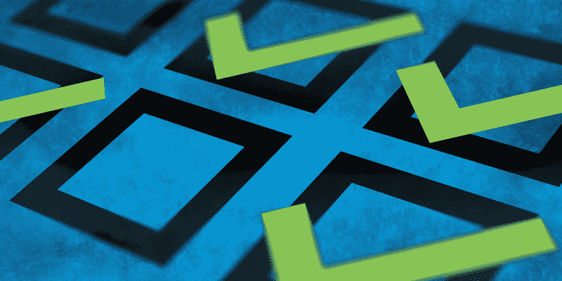
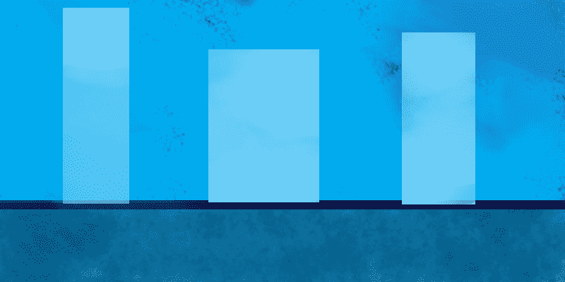
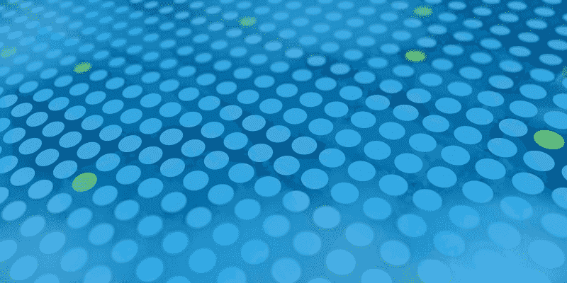

# 量化生活如何帮助你实现新年计划 TechCrunch

> 原文：<https://web.archive.org/web/https://techcrunch.com/2014/01/01/how-the-quantified-life-can-help-you-achieve-your-new-years-resolutions/>

新年健康计划就像舞会之夜:大量的宣传，甚至更多的承诺，以及令人失望的后续行动。斯克兰顿大学的约翰·诺克罗斯教授说，只有微不足道的 19%的健康迷会坚持他们的年度决心。

将你坚定的承诺化为一碗失望的果冻的最快方法是设定一个没有明确目标和不断改进的过程。这就是技术和少量科学方法可以发挥作用的地方。

“量化自我”并不依赖于支离破碎的网络建议和我们脆弱的直觉，而是以学术实验室的严谨态度对待自我改善:进行单独的调整，绘制进度图，积累学习成果。

量化的自我会变得极端。我用我的身体做了一些事情，这些事情不应该让[见不到阳光](https://web.archive.org/web/20221005195841/http://www.webmd.com/digestive-disorders/stool-analysis)也不应该让[被公开谈论](https://web.archive.org/web/20221005195841/https://beta.techcrunch.com/2013/07/05/how-health-trackers-could-reduce-sexual-infidelity/)。幸运的是，更便宜的小工具、诊断初创公司和网络工具已经为日常消费者开启了“[量化自我](https://web.archive.org/web/20221005195841/http://en.wikipedia.org/wiki/Quantified_Self)”运动，这些消费者只想节省时间，在镜子前感觉更性感一点。

所以，以下是如何用科学给你的新年计划充电。

## 设定正确的指标

首先，你需要正确的数字。例如，“减肥”是一条通往性感、性感腹肌的愚蠢道路，因为你可能会想在减掉那些可爱的赘肉的同时增加肌肉。你真正想要的是瘦体重。

与其用标准体重秤，不如买一个测量脂肪百分比的，比如 Withings 智能身体分析仪。我发现 Withings 体重秤[对于测量我的全身脂肪百分比](https://web.archive.org/web/20221005195841/https://beta.techcrunch.com/2013/05/19/how-cheap-genetic-testing-complicates-cancer-screening-for-us-all/)不是很准确，但它通常擅长测量变化，这在分辨率中确实很重要。或者，如果你手头紧，可以花更多时间，就买一些[皮褶卡钳](https://web.archive.org/web/20221005195841/http://www.wikihow.com/Use-Body-Fat-Calipers)(一种手持夹子)。

换句话说，你想要一个尽可能接近你的目标的度量。与其“多去健身房”，不如试试“增加我的最大深蹲”不要“多走路”，试试“每天活动的总小时数”(Nike Fuelband SE 有一个很好的指标，因为整天坐着会抵消预定的锻炼)。

这使得营养目标很难实现，因为没有好的方法来衡量你的身体是否真的吸收了营养。最好坚持注重表现的目标，看看健康饮食是否有助于你实现目标。

## 设置基线和控制变量

慢慢来，渴望的海狸。你不需要在 1 月 2 日让体育馆人满为患。取而代之的是，给你的正常活动和能力设定一周的基线。你的一英里跑是多少？你的深蹲是多少？你一天活动几个小时？你睡了多久？你在吃什么？

就我个人而言，我在谷歌电子表格上记录一切，但所有的健身追踪器都有自己的日常记录方法。

现在，做一个(一个！)显著改善，看看接下来的三周会发生什么。[切出纹路](https://web.archive.org/web/20221005195841/http://www.scientificamerican.com/article.cfm?id=whole-grain-foods-not-always-healthful)(对，所有纹路)。设定一致的就寝时间。为了增加肌肉，[试着每天每磅身体脂肪增加 0.8 克(健康)蛋白质。](https://web.archive.org/web/20221005195841/http://www.marksdailyapple.com/how-much-protein-should-you-be-eating/#axzz2oFGLK3md)

我发现设定实验结果有助于我承诺，因为我知道一个小小的失误会毁掉几周的努力。如果你的实验成功了，那太好了！如果不是，说明有问题，需要重新评估。但既然你只改变了一件事，你就知道什么有用，什么没用。

避免宽泛的改变，比如“健康饮食”相反，试着把你的一餐换成沙拉，但是要有相同的热量(橄榄油或鳄梨是摄入健康脂肪的好方法)。

健康是马拉松，不是短跑。

## 寻找模式和异常

自我实验更像克里斯托弗·哥伦布，而不是加勒比海盗:最好的结果往往是偶然的。例如，在查看了我的杰欧睡眠头带输出后，我得知清晨的光线打乱了我最后一个快速眼动睡眠周期([杰欧破产了，不幸的是](https://web.archive.org/web/20221005195841/https://beta.techcrunch.com/2013/05/22/sleep-tracking-startup-zeo-says-goodnight/))。所以，我买了些遮光窗帘。

我还发现我可以用 30 秒的锻炼来代替咖啡，这是在一天早上睡了一个糟糕的觉之后，我决定做一个快速的 Crossfit 锻炼。

每个身体都是独一无二的；仔细研究你的数据会帮助你发现你从来不知道的有用的东西。

在量化自我之前，我曾经是一个过山车式的节食者，随意拼凑一些建议。这很少奏效。现在，我知道什么适合我的身体，什么不适合。这种控制给自我完善的典型混乱带来了理智。借助一些科学和技术，今年可能会实现你的新年决心。

*【图片:布莱斯·德宾】*