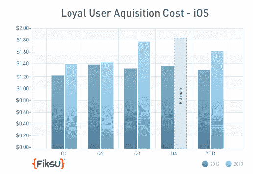
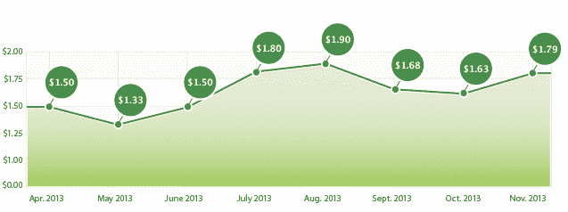

# 2013 年移动应用营销成本创历史新高 TechCrunch

> 原文：<https://web.archive.org/web/https://techcrunch.com/2014/01/03/mobile-app-marketing-costs-hit-record-highs-in-2013/>

随着应用商店的填满，开发者获取新用户的成本越来越高。获得一个忠实用户的成本，或者一个打开应用程序三次的用户，从 2012 年的 1.30 美元增长到 2013 年的 1.62 美元。与此同时，2013 年的应用下载量打破了记录，尽管下载量增长一直在放缓，正如[之前的报告](https://web.archive.org/web/20221003105037/https://beta.techcrunch.com/2013/12/30/flurry-finds-christmas-app-download-spike-continues-but-lessens-as-people-get-used-to-smartphones/)所指出的，这表明一些更成熟的市场正在接近其饱和点。

然而，正如应用营销平台制造商 [Fiksu](https://web.archive.org/web/20221003105037/http://www.fiksu.com/) 指出的那样，尽管今年的百分比放缓可能是准确的，但这是基于更大且不断增长的总下载量的原始数据。例如，2013 年 12 月，该公司根据自己的竞争指数预测日下载量在 660 万到 700 万之间。

该指数代表了前 200 名免费 iPhone 应用程序每天的下载次数。

这大约 700 万的数字将是自 2012 年初苹果禁止自动下载(机器人)以来的最高数量。该公司指出，这些下载也是《Q1 2012》如此之大的原因——很可能许多早期的下载都不是真实的。这或许可以在某种程度上缓和 [Flurry 的早期发现](https://web.archive.org/web/20221003105037/https://beta.techcrunch.com/2013/12/30/flurry-finds-christmas-app-download-spike-continues-but-lessens-as-people-get-used-to-smartphones/)，该发现称，2011 年和 2012 年出现的相当大的圣诞节下载量(与 12 月的前三周相比，圣诞节下载量增长了两倍多)在 2013 年不会再次出现。但这当然不是降温的唯一解释，因为“机器人禁令”是在 2012 年 2 月颁布的——这意味着去年圣诞节已经处于后机器人时代。

Flurry 的数据也可能更偏向于长尾，因为它是基于使用其 SDK 的应用程序，而 Fiksu 的竞争指数使用前 10 名的应用程序，并绘制完整的曲线来获得它们的数字。

随着整体下载量的增加，以及 2013 年圣诞节期间新设备激活量的小幅上升，预计会出现一个平稳期。

今年的应用商店[超过了一百万个应用](https://web.archive.org/web/20221003105037/https://beta.techcrunch.com/2013/10/22/1-million-apps-later-apple-says-developers-have-made-13-billion-on-its-platform/)，智能手机在发达市场几乎无处不在，使得开发者获取新用户的成本越来越高。Fiksu 的忠实用户获取成本指数在 2013 年逐年增长，该指数衡量的是获取会打开一个应用至少三次的新用户的成本。在 Q1 2013 年，用户获取成本约为 1.40 美元，高于 2012 年的 1.25 美元。到 7 月份，[的花费打破了](https://web.archive.org/web/20221003105037/http://www.fiksu.com/company/news-releases/mobile-app-marketing-costs-reach-highest-peak-since-2011)的记录，使得 7 月成为自 2011 年 12 月以来最贵的一个月。

到了 8 月份，成本再次上升，飙升至 1.90 美元，因为营销人员打算在 2013 年假期之前测试他们的策略。到第四季度，成本为 1.84 美元，远远高于 2012 年第四季度的 1.37 美元。当然，假期总是一个昂贵的应用营销时间，但更能说明问题的是同比增长 32 美分(从 2012 年的 1.30 美元到 2013 年的 1.62 美元)。

今年，许多新应用登上了排行榜，包括 FitBit、Candy Crush、QuizUp、Temple Run 2 和其他一些在 2012 年没有出现的应用，每个应用都有数百万的下载量。对于知名的热门制作人来说，达到 100 万次下载是[现在意料之中的事情](https://web.archive.org/web/20221003105037/https://beta.techcrunch.com/2013/02/20/the-app-stores-are-getting-full-only-2-of-iphone-top-publishers-in-u-s-are-newcomers-3-on-google-play/)。

稳定的整体增长可能会引起人们的担忧——至少对于那些希望登上排行榜前列的小开发商来说是这样，对于新来者来说，这是很难进入的[。对于消费者来说，这意味着在 2014 年，我们可能会看到更多更新、更年轻的公司尝试更黑暗的“增长黑客”作为寻找初始牵引力的方式。被警告。](https://web.archive.org/web/20221003105037/https://beta.techcrunch.com/2013/02/20/the-app-stores-are-getting-full-only-2-of-iphone-top-publishers-in-u-s-are-newcomers-3-on-google-play/)