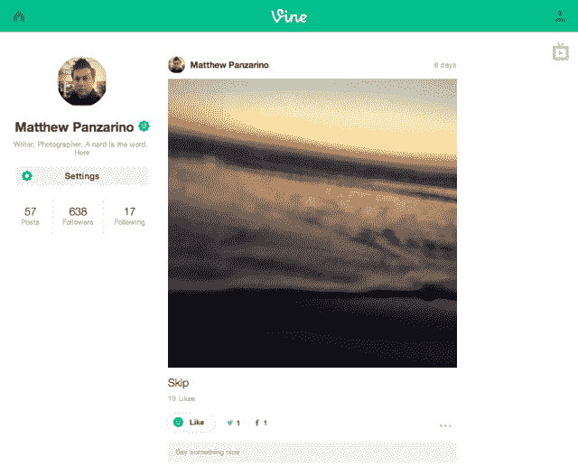
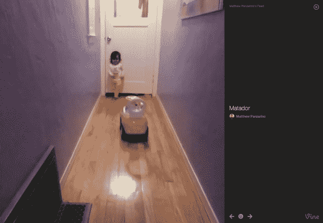

# Vine 在网络和电视模式上引入了完整的个人资料，便于疯狂观看| TechCrunch

> 原文：<https://web.archive.org/web/http://techcrunch.com/2014/01/03/vine-introduces-full-profiles-on-the-web-and-tv-mode-for-full-screen-viewing/?utm_source=dlvr.it&utm_medium=twitter>

# Vine 在网络和电视模式上引入了完整的个人资料以供疯狂观看

今天，Twitter 的 Vine 已经宣布了所有用户的完整网页简介，这是它目前所缺乏的。它还推出了一种新的电视模式，可以让你在电脑上全屏观看视频。

你可以观看视频，浏览用户的旧目录，并在网上与他们互动。这包括查看你的主页、点赞、评论和分享视频。

这些简介与 Instagram 等其他社交服务提供的简介大致相似，应该可以更容易地浏览网络上的多个藤蔓。以前，你可以一次看一个视频，但无法直接从那个视频跳转到用户在网络上的其他作品——但你可以在移动应用上这样做。这给我们留下了深刻的印象，是为了支持 Vine creators——这部分应用用户已经用 6 秒钟的剪辑制作了一件工艺品。

Vine 在去年年底宣布了创建网页简介的计划，并在发布前提供了定制网址的预订。他们现在向所有用户推出。

这不是 Vine for the web 的完整版本，因为您无法使用网络摄像头录制视频，但它确实提供了一种更简单的方法，让人们可以访问您发布的所有 Vine。

新的电视模式非常令人愉快，尽管它会一个接一个地播放您的视频，而不是循环播放。鉴于循环是 Vine 的核心创意工具之一，我希望看到一个开关，让你循环播放视频，直到你看完为止。但是有“后退”和“前进”按钮，键盘箭头也可以做到这一点。

显然，网上的 Vine 简介已经在工作中有一段时间了，但电视模式感觉更像是(干得好)对 YouTube 和其他视频网站上的 Vine 汇编的用户吸引力的阅读。很明显，人们想连续观看一串葡萄藤，这提供了一种方法。举例来说，我不会惊讶地看到专门使用 re-Vine 功能来策划“最佳”汇编的账户有所增加。

鼓励这一点的一个方法是在未来增加一个功能，让用户创建“列表”或从他们的家庭时间表中分离出来的藤蔓集合。这可以让他们按照特定的顺序，围绕特定的主题，用 Vines 制作“汇编”视频。

现在，你有一个 Vine web 个人资料要看，所以去…做吧。