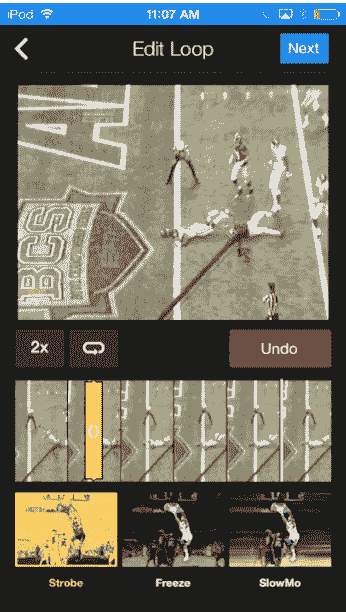
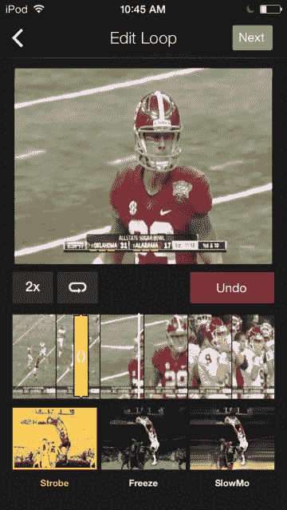

# 雅虎体育获得 iOS 7 重新设计，真棒 Gif 创建工具，用于分享“四大”体育时刻 TechCrunch

> 原文：<https://web.archive.org/web/https://techcrunch.com/2014/01/03/yahoo-sports-gets-ios-7-redesign-awesome-gif-creation-tool-for-sharing-big-4-sports-moments/>

# 雅虎体育获得 iOS 7 重新设计，真棒 Gif 创作工具，分享'大 4 '体育时刻

雅虎体育今天为 iOS 7 做了一个看起来很棒的重新设计，并增加了一个叫做“循环”的新功能。Loops 允许你浏览一个游戏，选择一个小片段，创建一个 gif，包括效果，标题和循环，与朋友或网络分享。

Loop 功能是由雅虎的 IntoNow 技术支持的，它拥有我所见过的最好的在手机上创建 gif 的界面。目前它支持 NFL，NBA，NHL 和 MLB，以及 NCAA 和 NCAAB，但将来可能会扩展到更多的运动。它现在也只有 iPhone，但其他平台也在路线图上。

你投入到你最喜欢的运动中，跳过一场比赛或者选择一场比赛。一旦你选择了一个时间，你就进入了一个可扫描的时间线，让你选择你的时刻。然后，你可以应用定格或慢动作等过滤器，添加标题，并将 gif 导出到社交网络和循环源。

我一直在玩这个编辑工具，负责这个应用的雅虎团队做得非常出色。该工具使用起来快速、简单、有趣，应该会导致体育 gif 的爆炸式增长。

我与移动和新兴产品高级产品经理 Josh Schwarzapel 就新版本进行了交谈，他说这个功能完全是让粉丝控制“精彩片段卷”，而不是由网络或广播公司提供的剪辑。这些游戏是从广播中录制的，并在应用程序中呈现给用户，但他们不能像传统的视频流一样观看它们。我对这种做法的合法性有一点模糊，但看起来成品 gif 的微小长度(几秒钟)应该会限制雅虎在联盟受到攻击时的任何责任。用户能够创建循环并分享它们的网络效应(有登录页面，它们是可嵌入的)对相关的体育运动是一个净积极因素，也应该成为雅虎体育的一张好名片。

这些视频剪辑也在应用程序中的一个新的循环流中呈现，本质上取代了 ESPN 等应用程序中的视频剪辑列表。该流是一个浓缩的叙事，带有粉丝认为是突出时刻的字幕和效果，甚至团队创建的 feed 也已经显示出承诺。每个游戏都有它的时刻，但这不是几个人在 BuzzFeed 上制作一些有趣的 gif，而是让每个粉丝都能感受到乐趣。

总的来说，我是 gif 的超级粉丝，为我的应用评论等创建了不少 gif，但我从未见过一个移动工具能让用户如此轻松地发布好看的材料。当然，幽默是无法解释的，所以我们将会看到一旦它出现在公众的手中，结果会如何，但我认为这应该是对雅虎体育应用的一个很好的补充。

该应用程序也进行了很好的更新，以支持今天在 iPhone 和 iPad 上的 iOS 7 的视觉语言，总体上看起来非常稳定。统计页面和游戏摘要呈现得很好，易于阅读，并配有清晰的图像。它应该可以与 ESPN、MLB 和 NFL 等其他公司的应用相媲美。

图片来源:[丹尼尔·x·奥尼尔](https://web.archive.org/web/20221206123313/http://www.flickr.com/photos/36521980095@N01/5647809356/in/photolist-9B5uXo-a6589K-dQRuse-dQX4vo-7VRv2p-7VRvaH-8tbfCC-bDYc1f-bDYbZ9-bSSVce-bsCG2C-8sSzjx-7DGCBg-io1Ec8-7Z6xyD-8UmcwB-8yYCks) /Flickr CC