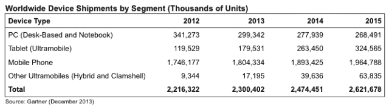
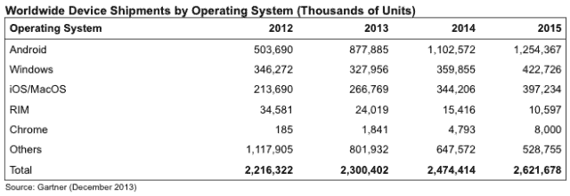

# Gartner:2014 年将有 25 亿台个人电脑、平板电脑和手机出货，其中 11 亿台采用 Android 技术

> 原文：<https://web.archive.org/web/https://techcrunch.com/2014/01/07/gartner-2-5b-pcs-tablets-and-mobiles-will-be-shipped-in-2014-1-1b-of-them-on-android/>

随着通信和技术世界越来越变得以移动为先，传统的台式电脑继续走渡渡鸟的路。Gartner 的分析师今天[发布了](https://web.archive.org/web/20230130231543/http://www.gartner.com/newsroom/id/2645115)他们的年度设备预测，他们预测 2014 年将是移动设备及其最大的玩家 Android 的又一个辉煌之年。今年将有 25 亿台个人电脑、平板电脑和手机出货。其中，19 亿将是手机，11 亿将是基于安卓系统的设备。与此同时，“超级手机”(各种尺寸的平板电脑)的出货量今年将首次超过个人电脑。

虽然 2014 年个人电脑出货量将下降 2.78 亿部，但超级手机——Gartner 对三星 Galaxy Note 和平板电脑等设备的首选术语——将突破 3 亿部大关(平板电脑出货量为 2.63 亿部，而“其他超级手机”的出货量为 4000 万部)。

总体而言，25 亿美元的数字表明，与 2013 年相比，设备出货量增长了 7.6%(2013 年的增长率为 3.8%)，复苏引擎完全由移动设备推动:超移动设备出货量今年将增长 54%；手机 5%；但是个人电脑会下降 7%。

为了给 Android 的崛起提供一些背景——以及“移动”在设备领域扮演的角色——2014 年谷歌的操作系统将占所有设备出货量的近 45%。2013 年是 38%。2015 年，Gartner 预计这一比例将接近 48%。转折点就在眼前，如果你想证明谷歌是今天的微软，这是一个起点。

就安装基础而言，同样的优势也在上演。据首席分析师安妮特·齐默曼(Annette Zimmerman)称，在现有的设备所有者中，2013 年使用安卓系统的设备有 19 亿台，而苹果在 iOS 和 Mac 上的设备有 6.82 亿台。

查看安装基础很重要，原因有几个:它表明哪些设备制造商和平台拥有最主要的生态系统。反过来，这将产生连锁效应，不仅会影响开发商投入资源的地方，还会影响重复购买的消费者可能投入资金的地方。

在饱和的市场中，回头客和品牌/平台忠诚度变得越来越重要。

Gartner 没有列出具体的制造商，但 Gartner 的研究总监 Ranjit Atwal 向我证实了你可能已经猜到的事情:就像 Android 主宰移动一样，三星主宰 Android。

他认为，这可能会让该公司更接近开发自己的定制操作系统，就像亚马逊对其 Fire OS 所做的那样。(事实上，三星最近的开发者大会，为其不同系列的设备发布了[新的 SDK，似乎也指向了这个方向。)这里的想法是，与作为谷歌的合作伙伴相比，三星将希望更好地控制自己的命运。这将包括创造自己的应用程序体验，以及自己将这种体验货币化的方式。](https://web.archive.org/web/20230130231543/http://gigaom.com/2013/10/28/samsung-is-pulling-another-amazon-on-android-but-this-is-even-bigger/)

在排行榜的后面，苹果的总出货量越来越接近 Windows，尽管微软的操作系统(包括 Windows 和 Windows Phone)以 3.6 亿部的销量领先于苹果的 3.44 亿部，占所有出货量的 14%。)

有趣的是，苹果公司安排在今天发布其应用商店的销售图表。它指出，该公司[在 2013 年](https://web.archive.org/web/20230130231543/http://www.apple.com/pr/library/2014/01/07App-Store-Sales-Top-10-Billion-in-2013.html)实现了 100 亿美元的应用销售，自应用商店上线以来，迄今已向开发者支付了 150 亿美元——这意味着开发者在过去六个月从[的应用商店中获得了 50 亿美元。](https://web.archive.org/web/20230130231543/https://techcrunch.com/2013/06/10/apples-app-store-hits-50-billion-downloads-paid-out-10-billion-to-developers/)

潜台词似乎是，即使它在操作系统出货量方面排名第三，它仍然是赚钱的一方——考虑到三星昨天刚刚发布的不太令人鼓舞的利润指引，这是一个恰当的观点。(这也是苹果在 CES 周期间制造一些噪音的一种方式。)

就地理位置而言，阿特瓦尔告诉我，中国正在继续为购买什么和购买多少设定节奏——是的，这部分是因为中国更大，但也是因为它包含了消费电子产品的两个更大的购买趋势:高端、早期采用、大买家；那些对价格明显更加敏感，但对技术的狂热程度丝毫不亚于富裕人群的消费者。

他说，在中国，虽然智能手机继续大量销售，但随着高端产品变得越来越饱和，我们看到越来越多的低价设备(想想 100 美元或更低)被后来的用户所重视。这种情况在发展中国家也在上演:Gartner 称，到 2017 年，超过 75%的 Android 销量将来自新兴市场。与此同时，在智能手机使用方面已经饱和的中国市场正在转向购买更多的平板电脑和其他超级手机。

但从某种程度上来说，Gartner 没有纳入其预测的内容可能比实际情况更有意思。

没有可穿戴设备、汽车或智能电视——其他三个设备类别正变得越来越“智能”,并建立在主导手机、个人电脑和平板电脑等更成熟类别的相同平台上——如果你以 CES 这样的产品作为衡量标准，这些较新的类别是目前最吵的类别。

作为其重要性不断上升的标志，Atwal 告诉我，这些类别很可能在今年晚些时候成为 Gartner 整体设备组合的一部分。

图片: [Flickr](https://web.archive.org/web/20230130231543/http://www.flickr.com/photos/tensafefrogs/2936164402/sizes/l/)