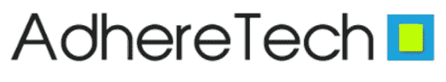
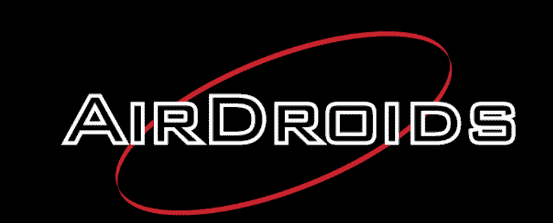
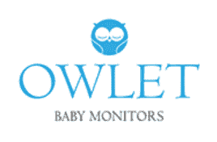
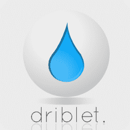
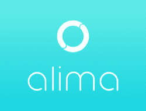
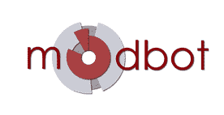

# 认识 2014 年硬件战场的参与者 TechCrunch

> 原文：<https://web.archive.org/web/https://techcrunch.com/2014/01/07/meet-the-2014-hardware-battlefield-entrants/>

我们很高兴地宣布 [2014 硬件战场决赛入围者，](https://web.archive.org/web/20221207182333/https://beta.techcrunch.com/events/hardware-battlefield-2013/)一群来自 11 个国家的国际硬件初创公司即将凭借一些令人惊叹的技术、伟大的想法和独特的商业模式席卷全球。争夺的是 50，000 美元的奖金，有史以来第一个硬件战场奖杯，大量的媒体曝光和新的开放大门。

我们将在 CES 停车场连续三天直播激动人心的演示。您可以在我们的特别直播页面上观看此次活动以及我们对[CES 2014](https://web.archive.org/web/20221207182333/https://beta.techcrunch.com/tag/ces-2014)—[的所有直播报道，如果您在拉斯维加斯，我们会邀请您到我们在 LVCC 停车场的帐篷里来拜访我们。在帐篷里观看节目不需要通行证，我们会全天提供赠品、采访和其他有趣的东西。](https://web.archive.org/web/20221207182333/https://beta.techcrunch.com/events/ces-2014/live-video-coverage/)

也就是说，让我们欢迎十四位硬件战场决赛选手:

* * *

# 星期二上午 11 点

[**Atlas**](https://web.archive.org/web/20221207182333/http://atlaswearables.com/)[[CrunchBase](https://web.archive.org/web/20221207182333/http://www.crunchbase.com/company/atlas)]–Atlas 是一种可穿戴设备，可以追踪和识别特定的活动。现有的产品只能跟踪一个单一的指标，步骤，Atlas 足够智能，可以识别俯卧撑，深蹲，死电梯和其他一切。

**团队:**
李铨，首席执行官
迈克·卡斯帕里安，首席技术官
亚历克斯·谢，首席软件开发人员
迈赫迪·米尔扎，数据科学家

* * *

[health 2 sync](https://web.archive.org/web/20221207182333/http://www.health2sync.com/)——health 2 sync 采用遗留医疗设备，将你的智能手机改造成智能健康监测机；连接用户、爱人和临床医生。我们的第一款产品以智能血糖监测应用和附件的形式出现。

**团队:**
Ed Deng，首席执行官
Erin Chung，产品营销

* * *

* * *

[Adheretech](https://web.archive.org/web/20221207182333/http://adheretech.com/)[[CrunchBase](https://web.archive.org/web/20221207182333/http://adheretech.com/)——Adheretech 制造智能专利药瓶，旨在提高药物治疗的依从性。这些瓶子实时测量瓶中的药物量。如果漏服了一剂，AdhereTech 会通过自动电话或短信提醒患者——还有药瓶上的灯和铃声。

**团队:**
首席执行官乔希·斯坦恩
约翰·朗豪泽，首席技术官
迈克·莫雷纳，首席运营官

* * *

# 星期二下午 3 点

[cube sensors](https://web.archive.org/web/20221207182333/http://cubesensors.com/)[[CrunchBase](https://web.archive.org/web/20221207182333/http://www.crunchbase.com/company/cubesensors)]–cube sensors 是小巧时尚的互联设备，可帮助您了解家中或办公室的每个房间如何影响您的健康、舒适和工作效率。这些立方体监测室内所有可以测量的东西，比如温度、湿度、空气质量、噪音、光线和气压。它们小到可以放在你的手掌中，可以轻松融入任何你想要优化的休闲、睡眠或工作空间。

**团队:**
Ales Spetic，首席执行官
Marko Mrdjenovic，首席技术官

* * *

[Livemap](https://web.archive.org/web/20221207182333/https://livemap.info/)[[CrunchBase](https://web.archive.org/web/20221207182333/http://www.crunchbase.com/company/livemap)——Livemap 是一款独特的高科技摩托车头盔，内置导航系统和语音控制界面。这是摩托车手的抬头显示器。

团队:
安德鲁·阿蒂什切夫，首席执行官

* * *

 [哨兵科学智能步行者](https://web.archive.org/web/20221207182333/http://www.sentryscientific.com/)【[CrunchBase](https://web.archive.org/web/20221207182333/http://www.crunchbase.com/company/sentry-scientific)】哨兵科学正在打造智能辅助技术，让未来更安全。他们的智能助行器旨在通过降低与助行器相关的跌倒伤害的风险来提高老年人的安全性、独立性和机动性。

**团队:**
Wilfrid Ngo，CEO
Parth Dave，硬件工程师
Ray Zhou，硬件工程师

* * *

[Blaze laser light](https://web.archive.org/web/20221207182333/http://www.blaze.cc/)[[CrunchBase](https://web.archive.org/web/20221207182333/http://www.crunchbase.com/company/blaze-2)——Blaze 是一个智能骑行品牌。推出 Laserlight，这是一项突破性的创新，旨在解决骑自行车者死亡的最大原因——被困在“盲点”中以及车辆越过看不见的自行车。

**团队:**
艾米丽·布鲁克，CEO +创始人

* * *

[rhl vision Fin](https://web.archive.org/web/20221207182333/http://www.wearfin.com/)[[CrunchBase](https://web.archive.org/web/20221207182333/http://www.crunchbase.com/company/rhlvision-technologies)]–rhl vision Technologies PVT . ltd .是一群充满激情的个人，他们梦想着一个技术尽在掌握的世界，在那里，只需手指轻轻一点，就能为您带来意想不到的资源和功能。

**团队:**
罗希尔德夫。首席执行官

* * *

[Adheretech](https://web.archive.org/web/20221207182333/http://adheretech.com/)[[CrunchBase](https://web.archive.org/web/20221207182333/http://adheretech.com/)——Adheretech 制造智能专利药瓶，旨在提高药物治疗的依从性。这些瓶子实时测量瓶中的药物量。如果漏服了一剂，AdhereTech 会通过自动电话或短信提醒患者——还有药瓶上的灯和铃声。

**团队:**
首席执行官乔希·斯坦恩
约翰·朗豪泽，首席技术官
迈克·莫雷纳，首席运营官

* * *

[The Eye Tribe](https://web.archive.org/web/20221207182333/http://theeyetribe.com/)[[CrunchBase](https://web.archive.org/web/20221207182333/http://www.crunchbase.com/company/the-eye-tribe)]–The Eye Tribe 软件支持在移动设备和计算机上进行眼睛控制，允许网站和应用程序的免提导航、眼睛激活登录、增强的游戏体验和基于云的用户参与度分析。我们利用标准的低成本硬件组件，这些组件可以集成到下一代智能手机和平板电脑中。

**团队:**
首席执行官苏尼·阿尔斯特鲁普·约翰森
首席技术官马丁·塔尔
哈维尔·圣奥古斯汀
亨里克·斯科夫斯加德

* * *

[air droids](https://web.archive.org/web/20221207182333/http://www.airdroids.com/)[[CrunchBase](https://web.archive.org/web/20221207182333/http://www.crunchbase.com/company/airdroids)——air droids 为消费者和商业应用设计和制造无人机硬件和软件。我们的使命是让先进的无人机技术变得简单，让每个人都可以使用。

**团队:**
Chance Roth，联合创始人兼 CEO
Timothy Reuter，联合创始人兼总裁
TJ Johnson，联合创始人兼 CTO

* * *

[Owlet](https://web.archive.org/web/20221207182333/http://www.owletcare.com/)[[CrunchBase](https://web.archive.org/web/20221207182333/http://www.crunchbase.com/company/owlet)]–Owlet 通过实施新技术来监控、跟踪和提醒婴儿健康状况的变化，让父母安心。Owlet 帮助父母预防婴儿猝死综合症和其他早期婴儿问题。

**团队:**
乔丹·门罗，CMO
扎克·博姆斯塔，首席技术官
库尔特·沃克曼，首席执行官
塔诺·霍奇斯，首席财务官
杰克·科尔文，首席运营官

* * *

[drible t . io](https://web.archive.org/web/20221207182333/http://www.driblet.io/)[[CrunchBase](https://web.archive.org/web/20221207182333/http://www.crunchbase.com/company/driblet)——节约用水的聪明方法。Driblet 是一种创新的智能水消耗管理解决方案，它可以跟踪与水相关的变量，以鼓励人们、企业、组织和政府节约用水和资金。

**团队:**
Rodolfo P Ruiz，首席执行官& CTO
马里奥·加西亚，首席运营官
Carlos Mosqueda，首席设计师

* * *

马阿丽内置高科技传感器，是一款独立的设备，可监控您的室内空气污染，并提供警告和行动建议，以确保您生活空间的安全。

**团队:**
Jacques Touillon，首席执行官
Inouk Bourgon，首席技术官
Olivier Vonet，首席财务官

* * *

[mod bot](https://web.archive.org/web/20221207182333/http://modbot.com/)[[CrunchBase](https://web.archive.org/web/20221207182333/http://www.crunchbase.com/company/modbot)]——mod bot 为消费级组装机器人带来工业精度和动力。想象一下自动化制造和消费机器人触手可及，像乐高一样组装起来。Modbot 是一个负担得起的可重复使用的模块系统，这些模块扣在一起，填补了 100 美元的业余爱好和 20，000 美元的工业运动设备之间的差距。

团队:
亚当·埃里森，首席执行官
丹尼尔·皮扎塔，首席运营官