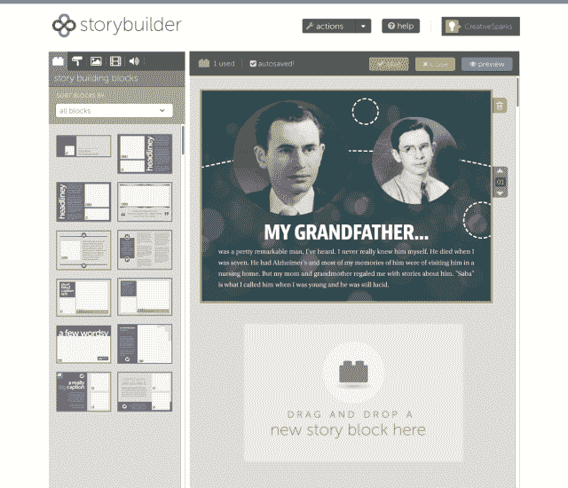

# Memloom 首次推出使用照片、视频、音频和文本讲述故事的新方式 TechCrunch

> 原文：<https://web.archive.org/web/http://techcrunch.com/2014/01/07/memloom-debuts-a-new-way-to-tell-stories-using-photos-video-audio-text/?utm_source=dlvr.it&utm_medium=twitter>

今天新成立的初创公司 Memloom 正在寻找介于博客和照片打印服务之间的利基市场，就像 Shutterfly 提供的那样。这个想法是让消费者不仅分享他们的照片，而且通过照片、视频、音频和文本的组合来讲述他们的故事。由此产生的作品看起来更像杂志风格的文章，可以在线观看，在家打印，或分享到脸书或 Twitter 等社交网络。

该公司成立于一年多前，自豪地将总部设在底特律(创始人 Alyssa Martina 说:“这是一个非常棒的城市，而且正在卷土重来”)，它是从 Metro Parent 杂志讨论的想法中剥离出来的，该杂志也是由 Martina 创办的。作为一名连续创业者、出版高管和记者，Martina 与同样来自 Metro Parent Publishing 的联合创始人 Alexis Bourkoulas 和 Marie Klopf 一起。

Martina 解释说，Memloom 的出现是为了解决分享照片背后的故事这一棘手问题。“有很多很多机会在网上发布图片，但很少有方法捕捉它们并分享它们对我们的真正意义，”她解释道。“每个人都有一个故事要讲……讲故事已经融入了我们的生活。”但是，玛蒂娜补充说，随着父母和祖父母变老，他们的故事也随着他们一起死去。

使用 Memloom web 服务，用户将能够使用一系列主题和“[块](https://web.archive.org/web/20230130234558/http://www.memloom.com/how#third_section)”(如杂志版面)来帮助塑造他们的故事，从而轻松地构建可定制的故事，该服务将在两周后在 iPad 上发布。然后，就是拖放内容、编写文本或录制音频。

用户可以选择在他们的作品中投入多少工作。为了构建一个简单的故事，一些早期的 160 名 beta 测试人员会在 10 分钟左右完成他们的项目。其他人发现自己在为项目写故事时，每个故事花费了大约 30 分钟。你可以想象这些用来记录你父母或祖父母的故事，婚礼幻灯片，与朋友共度的特殊时刻，家庭活动，如假期或出生或聚会，或其他家庭历史。

该产品主要在妈妈中进行测试，因为这是 Martina 可以通过她的杂志接触到的最佳客户群。在 Memloom 发布后，她将通过杂志(她不再每天都在杂志上)以及美国近十几家姐妹出版物和其他较小的育儿杂志推广这款应用程序。

这项服务将是免费的，在[支付](https://web.archive.org/web/20230130234558/http://www.memloom.com/users/sign_up)付费订阅(每月 3-10 美元)之前，你可以存储的故事数量和内容数量有上限。接下来，你可以选择订购一份“硬拷贝”,以固态硬盘的形式运送到你家——这一选择可能有助于缓解人们对一家总体命运尚不明朗的小型初创公司创建如此重要的家庭文件的担忧。

也就是说，考虑这个产品很有趣，因为它提供了一种新的社交分享形式(故事可以是私人的或公开的)，介于在线相册或相册和博客之间。“它真的很受欢迎，”Martina 在谈到早期反馈时说。“人们说现在没有比这更好的了。”然而，时间会证明 Memloom 是否已经建立了一个足够大的利基市场来维持其业务。

Memloom 今天正式发布，但允许用户在交错的基础上慢慢扩大规模。[报名在这里](https://web.archive.org/web/20230130234558/http://www.memloom.com/users/sign_up)。

这家五人公司迄今为止已经从天使投资者那里筹集了 62.5 万美元的种子资金，其中包括大卫·弗莱(David Fry)、鲁迪·帕塔罗(Rudy Pataro)和第一步基金(First Step Fund)等天使集团，但玛蒂娜表示，目标是最终筹集 300 万美元。