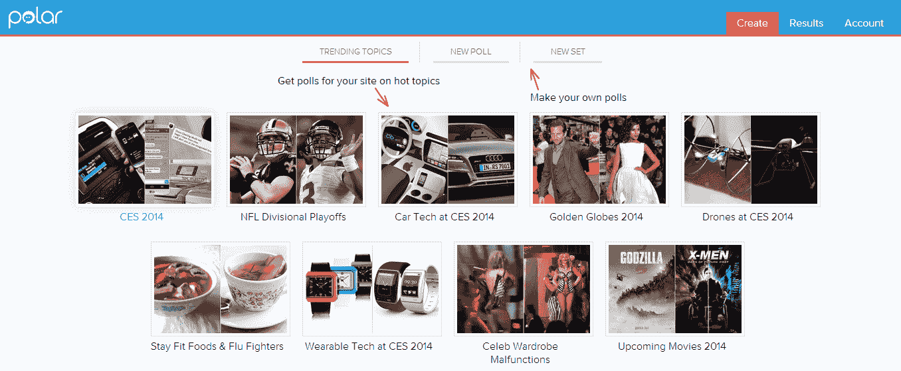

# 社交投票应用 Polar 推出面向出版商的自助式投票工具 TechCrunch

> 原文：<https://web.archive.org/web/https://techcrunch.com/2014/01/07/social-voting-app-polar-launches-self-service-poll-creating-tool-for-publishers/>

# 社交投票应用 Polar 为出版商推出自助式投票工具

社交投票应用 Polar 去年从雅虎创始人杨致远、谷歌的唐道奇和其他知名投资者那里筹集了 120 万美元，今天它将为出版商推出免费的[自助服务解决方案。](https://web.archive.org/web/20221209023744/http://polarb.com/publishers)

我们，就像许多其他出版商一样，过去偶尔会在[我们自己的帖子](https://web.archive.org/web/20221209023744/https://beta.techcrunch.com/2013/10/29/twitter-apps-for-ios-android-and-web-get-in-stream-video-and-image-previews/)中使用 Polar 进行民意调查，但要这样做，我们必须直接与该公司合作。该公司认为，与传统评论相比，使用其民意调查可以帮助出版商成倍增加读者参与度。毕竟，留下评论需要花点功夫，而点击投票却很容易。从 Polar 向我们展示的数据来看，评论与投票参与的比例往往是 1 比 1000。

正如 Polar 创始人卢克·乌鲁布莱夫斯基指出的那样，向手机的转变让读者更难发表评论。“当你浏览网络时，大多数网站依赖于桌面时代创造的工具来参与，”他说。他认为，读者仍然希望与出版商接触，但与传统的评论形式不同，“向移动的转变是寻找其他受众接触解决方案的一个非常令人信服的理由。”出版商也可以利用他们的投票结果来获得更具代表性的读者意见样本。

首先，出版商使用 Polar 的响应式网络应用程序选择一个预先做好的投票或创建自己的投票。要创建投票，用户只需写一个问题和两个答案供选择，并选择每个答案的图片。用户可以上传自己的图片或使用 Polar 的内置工具来搜索 Creative Commons 许可的图片、亚马逊的产品照片和维基百科上的图片。

一旦投票结束，他们需要做的就是将代码嵌入到他们的故事中。使用该公司的发布工具，他们可以实时观看投票过程。

总的来说，使用 Polar 非常简单。每当我们在自己的帖子中使用 Polar 时，我们都会看到非常高的参与度，所以你很可能会在 TechCrunch 上经常看到它们。