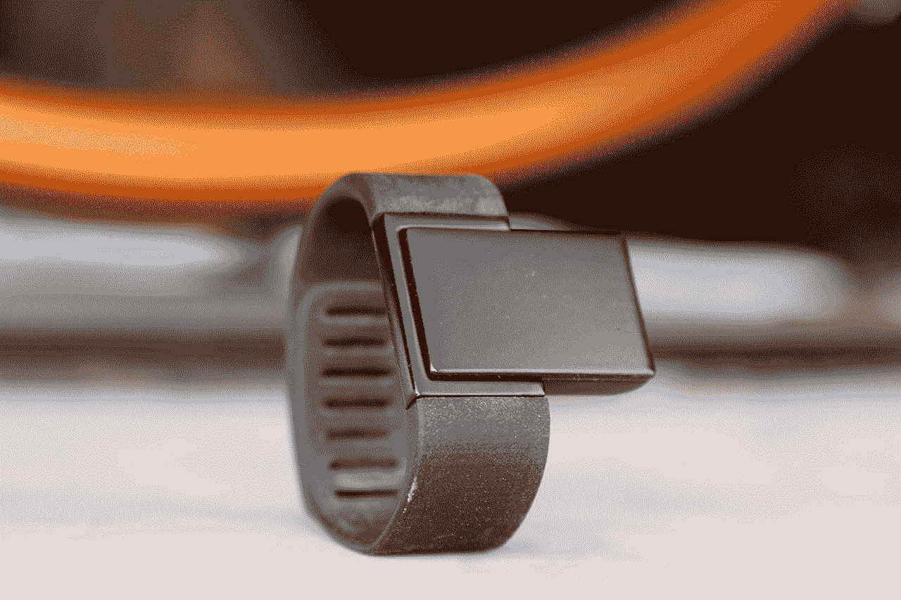
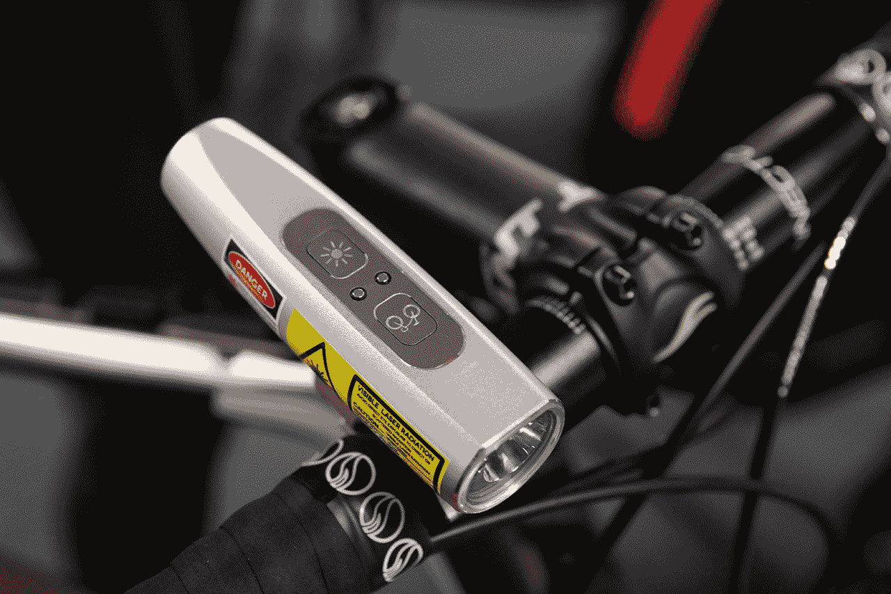
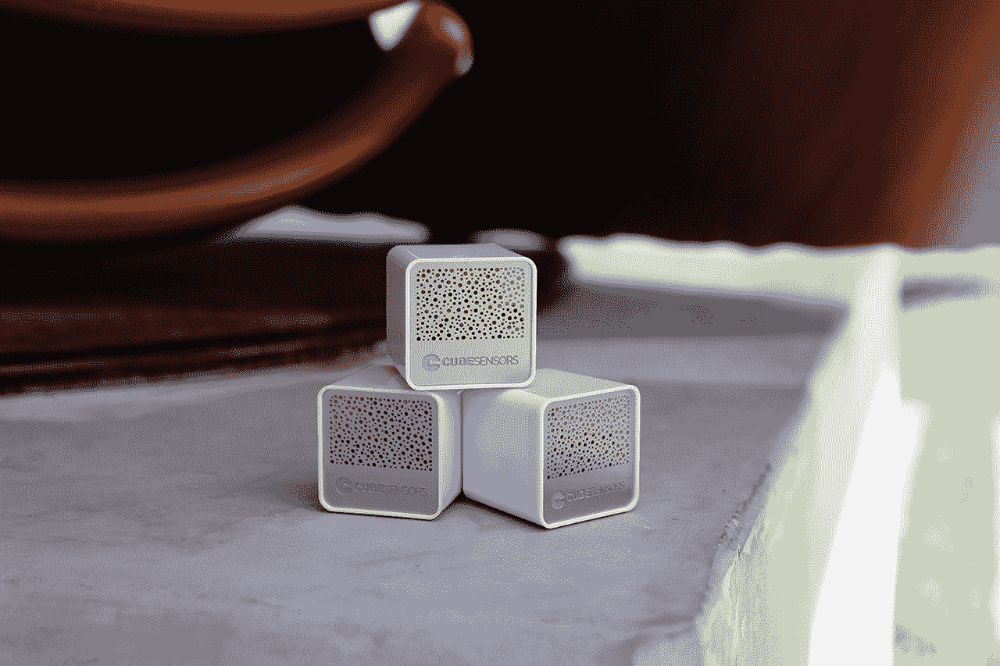
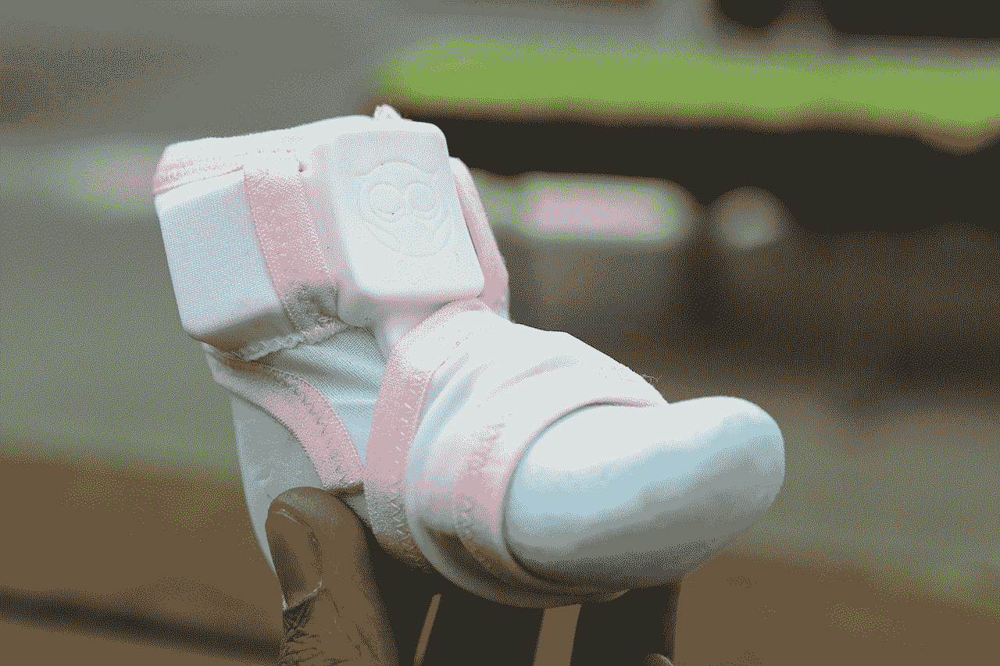

# 宣布硬件战场决赛入围者:Atlas Wearables、Blaze、CubeSensors 和 Owlet Baby Care TechCrunch

> 原文：<https://web.archive.org/web/http://techcrunch.com/2014/01/08/announcing-the-finalists-for-hardware-battlefield-atlas-wearables-blaze-cube-sensors-and-owlet-baby-care/?utm_source=dlvr.it&utm_medium=twitter>

经过两天的演示、数小时的评审和 14 次演示，我们很兴奋地宣布首届硬件战场的决赛入围者: [Atlas 可穿戴设备](https://web.archive.org/web/20230210014301/https://techcrunch.com/2014/01/07/atlas-wearables-takes-on-jawbone-and-nike-with-a-smarter-exercise-tracker/)、 [Blaze](https://web.archive.org/web/20230210014301/https://techcrunch.com/2014/01/07/blaze-seeks-to-save-cyclist-lives-with-a-laser-projection-bike-light/) 、[立方体传感器](https://web.archive.org/web/20230210014301/https://techcrunch.com/2014/01/07/cubesensors-brings-health-and-comfort-monitoring-to-the-whole-home/)和 [Owlet 婴儿护理](https://web.archive.org/web/20230210014301/https://techcrunch.com/2014/01/08/owlet-infant-health-tracker-takes-the-wearable-revolution-into-the-crib/)。

获胜者将在明天下午揭晓，并获得一张 5 万美元的支票和一个机器人顶的奖杯。

十四家公司参加了我们的第一个硬件战场，代表了十一个国家。从医疗设备到定量自我装备到无人机到自行车灯，这些公司在 CES 2014 上首次在我们的舞台上发布，并由全明星评委小组进行评判。

明天，太平洋时间下午 3:00，四位决赛选手将再次向四位评委展示他们的作品，包括 Yves Behar、Bre Pettis、Jen McCabe 和 Matt Turck。获胜者将获得第一个硬件战场杯。

我们所有的公司都很棒。[我们所有的参赛者](https://web.archive.org/web/20230210014301/https://techcrunch.com/2014/01/07/meet-the-2014-hardware-battlefield-entrants/)都已经在他们的领域做了一些令人惊叹的工作，大多数人都在成功众筹的路上。我们很自豪他们能站在我们的舞台上。

* * *

决赛选手是:

[**Atlas**](https://web.archive.org/web/20230210014301/http://atlaswearables.com/)[Presentation](https://web.archive.org/web/20230210014301/https://techcrunch.com/2014/01/07/atlas-wearables-takes-on-jawbone-and-nike-with-a-smarter-exercise-tracker/)——Atlas 是一种追踪和识别特定活动的可穿戴设备。现有的产品只能跟踪一个单一的指标，步骤，Atlas 足够智能，可以识别俯卧撑，深蹲，死电梯和其他一切。

**团队:**
李铨，首席执行官
迈克·卡斯帕里安，首席技术官
亚历克斯·谢，首席软件开发人员
迈赫迪·米尔扎，数据科学家

* * *

[Blaze Laserlight](https://web.archive.org/web/20230210014301/http://www.blaze.cc/) [ [展示](https://web.archive.org/web/20230210014301/https://techcrunch.com/2014/01/07/blaze-seeks-to-save-cyclist-lives-with-a-laser-projection-bike-light/)——Blaze 是一个智能自行车品牌。推出 Laserlight，这是一项突破性的创新，旨在解决骑自行车者死亡的最大原因——被困在“盲点”中以及车辆越过看不见的自行车。

**团队:**
艾米丽·布鲁克，CEO +创始人

* * *

[立方体传感器](https://web.archive.org/web/20230210014301/http://cubesensors.com/) [ [演示](https://web.archive.org/web/20230210014301/https://techcrunch.com/2014/01/07/cubesensors-brings-health-and-comfort-monitoring-to-the-whole-home/)]–立方体传感器是小巧时尚的互联设备，可以帮助您了解家中或办公室的每个房间如何影响您的健康、舒适和工作效率。这些立方体监测室内所有可以测量的东西，比如温度、湿度、空气质量、噪音、光线和气压。它们小到可以放在你的手掌中，可以轻松融入任何你想要优化的休闲、睡眠或工作空间。

**团队:**
Ales Spetic，首席执行官
Marko Mrdjenovic，首席技术官

* * *

[Owlet](https://web.archive.org/web/20230210014301/http://www.owletcare.com/) [ [演示](https://web.archive.org/web/20230210014301/https://techcrunch.com/2014/01/08/owlet-infant-health-tracker-takes-the-wearable-revolution-into-the-crib/)——Owlet 通过实施新技术来监控、跟踪和提醒婴儿健康状况的变化，让父母安心。Owlet 帮助父母预防婴儿猝死综合症和其他早期婴儿问题。

**团队:**
乔丹·门罗，CMO
扎克·博姆斯塔，首席技术官
库尔特·沃克曼，首席执行官
塔诺·霍奇斯，首席财务官
杰克·科尔文，首席运营官